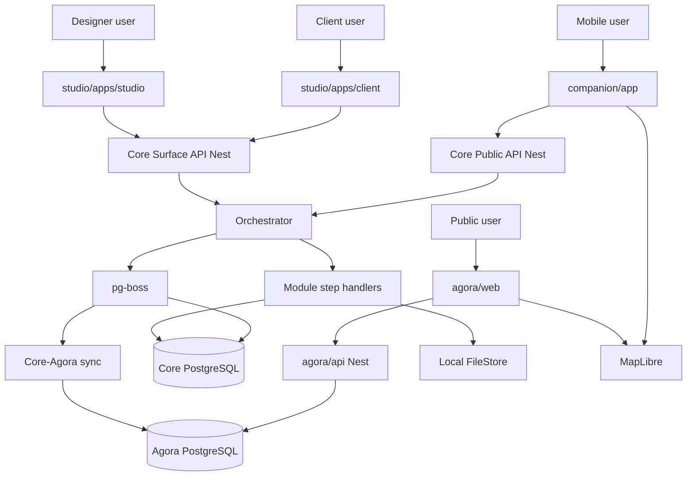

# Erganis Platform — Technology Stack (v1)

Reference for how each layer fits together. See also [erganis_architecture_spec.md](erganis_architecture_spec.md).

## Stack table

| Layer | Component | Technology | Relates to | Swap boundary |
|-------|-----------|------------|------------|---------------|
| Experience | Studio designer + client | React, Next.js, TypeScript | Calls Core Surface API via SDK | App repos |
| Experience | Erganis Agora web | React, Next.js, TypeScript | Calls Agora API | `agora/web` |
| Experience | Companion | React Native, TypeScript, MapLibre | Calls Core Public API | `companion/` |
| Surface | Surface runtime | TypeScript in Core | UI intent → operation envelope | Surface contract |
| API | Core gateway | **NestJS** | Auth, Surface + Public APIs | OpenAPI |
| API | Agora service | **NestJS** | Public vendor search, vendor portal | Agora OpenAPI |
| Orchestration | Orchestrator | Nest module in Core | Envelope, locks, retries, compensation | Operation envelope schema |
| Module domain | Studio modules | Nest dynamic modules + manifest | Step handlers, jobs, UI contributions | Module Contract API |
| Persistence | Core DB | **PostgreSQL 16** | Studio/org data, jobs (pg-boss), outbox | DAL interfaces |
| Persistence | Agora DB | **PostgreSQL 16** | Global vendor catalog | Agora DAL |
| Jobs / queues | Job runner | **pg-boss** | Sync, reminders, reindex, trade match | Job queue interface |
| Events | Outbox | PostgreSQL + poller | Core ↔ Agora sync | Event contract |
| Search | Studio + Agora v1 | PostgreSQL full-text | Findability layer | Search adapter → Meilisearch later |
| Files | Object store v1 | **Local filesystem** (`ERGANIS_DATA_ROOT`) | Drawings, certs, reports | `FileStore` → S3 later |
| Maps | Geo display | **MapLibre** (web + RN) | Agora vendor map | Tile provider adapter |
| Identity | Auth / RBAC | Core (Nest) | Org-scoped roles | All apps |
| Composition | Overrides | Core PostgreSQL | Themes, layouts, module enablement | Composition API |
| Tooling | Updater / migrator | `core/scripts/` | Self-hosted Windows/Linux | CLI |

## Flowchart

## NestJS scaffold plan (`core/services/`)

Planned Nest modules (implement before feature modules):

| Nest module | Responsibility |
|-------------|----------------|
| `AppModule` | Bootstrap, config |
| `AuthModule` | Identity, sessions, RBAC |
| `OrchestratorModule` | Operation envelope execution, locks |
| `ModuleLoaderModule` | Load `erganis.module.json`, register dynamic modules |
| `SurfaceModule` | Surface API routes |
| `PublicApiModule` | Public API routes |
| `JobModule` | pg-boss registration, worker lifecycle |
| `FileModule` | `FileStore` interface + `LocalFileStore` |
| `SearchModule` | Search adapter + PostgreSQL FTS |
| `CompositionModule` | Org overrides, themes, module enablement |
| `OutboxModule` | Event outbox poller |

**Agora API** (`agora/api/`): separate Nest app with `VendorModule`, `SearchModule`, `SyncModule` (consumes Core sync contract).

## PostgreSQL vs Redis

**v1: PostgreSQL only** for persistence, jobs (pg-boss), events (outbox), and search (FTS).

Redis deferred until cache/session load or queue throughput requires it. Runs natively on Windows/Linux without Docker.

## Docker

**Optional.** `core/infrastructure/docker/docker-compose.yml` can start Postgres for local dev. Production and dev may use native PostgreSQL installers instead.

## Local file storage

Set `ERGANIS_DATA_ROOT` (e.g. `C:\erganis-data` or `/var/lib/erganis/data`).

| Content | Path |
|---------|------|
| Documents / certs | `{dataRoot}/{orgId}/documents/` |
| Drawings | `{dataRoot}/{orgId}/drawings/` |
| Presentations | `{dataRoot}/{orgId}/presentations/` |
| Reports | `{dataRoot}/{orgId}/reports/` |

S3-compatible adapter plugs in behind the same `FileStore` interface when cloud storage is available.

## MapLibre

- Web: `maplibre-gl` + free tile source (OpenFreeMap / self-hosted OSM)
- Mobile: `@maplibre/maplibre-react-native` (Companion, future Agora mobile)

One map stack for web and mobile; tile URL configured via environment.
