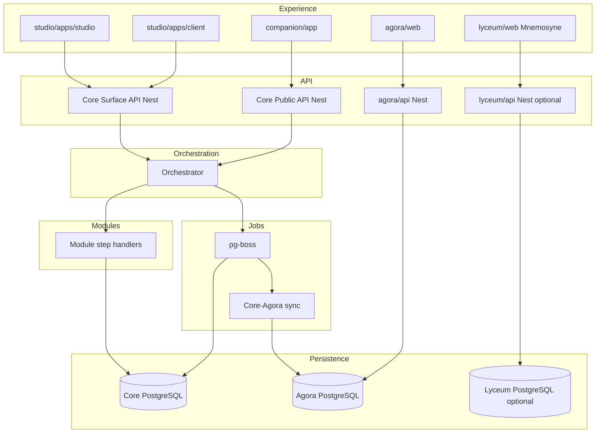
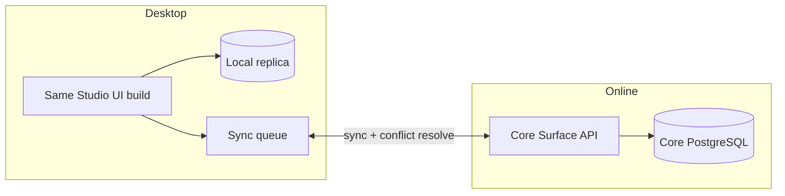
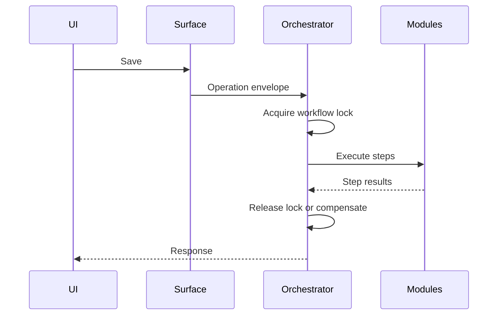
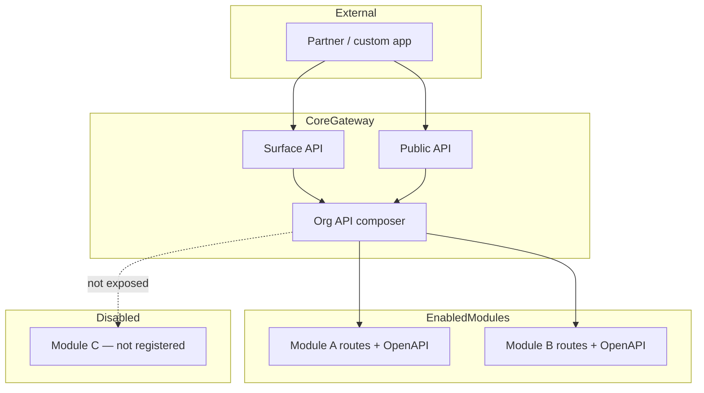
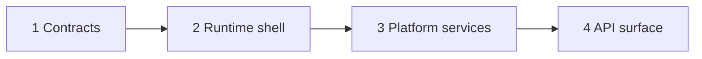
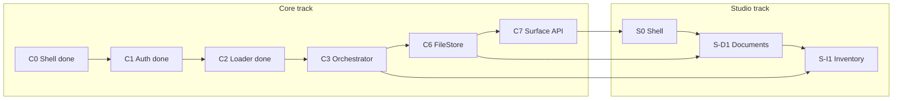

# Erganis Platform — Product Plan (Temporary)

> **Status:** Pre-PRD planning document. Single source of truth until APM-managed documents (PRD, ARCHITECTURE, etc.) are generated from `.apm/templates/`.
>
> **Core kickoff:** **Complete** (Jun 2025). **Core Phases C0–C2 complete** (Jun 2025). **Next:** finish remaining Core platform ([§6 Core remaining](#core-remaining-work)), then Studio modules per [§7 Studio module phases](#studio-module-implementation-phases). Architecture: [`core/docs/temp/CORE-ARCHITECTURE.md`](../core/docs/temp/CORE-ARCHITECTURE.md).
>
> **Do not** edit template output files (`ARCHITECTURE.md`, `PRD.md`, etc.) directly — use APM and fragment workflows. This plan will be broken into fragments when templates are ready.

---

## Table of Contents

1. [Document governance & APM](#1-document-governance--apm)
2. [Executive summary](#2-executive-summary)
3. [Terminology](#3-terminology)
4. [Vision & architectural principles](#4-vision--architectural-principles)
5. [Repository layout](#5-repository-layout)
6. [Core](#6-core)
7. [Studio](#7-studio)
8. [Erganis Agora](#8-erganis-agora)
9. [Companion](#9-companion)
10. [Mnemosyne (Lyceum)](#10-mnemosyne-lyceum)
11. [Module catalog](#11-module-catalog)
12. [Module system & manifests](#12-module-system--manifests)
13. [Operation envelope & orchestration](#13-operation-envelope--orchestration)
14. [API layers & contracts](#14-api-layers--contracts)
15. [Technology stack](#15-technology-stack) — incl. [stack tier → repository map](#stack-tier--repository-map)
16. [Cross-cutting platform capabilities](#16-cross-cutting-platform-capabilities)
17. [Explorations & spikes](#17-explorations--spikes)
18. [Feature backlog](#18-feature-backlog)
19. [Resolved decisions](#19-resolved-decisions)
20. [Open questions](#20-open-questions) — incl. [before Core vs later](#before-core-vs-later)
21. [Core readiness & design backlog](#21-core-readiness--design-backlog) — **start here for implementation**
22. [Core kickoff decisions (reference)](#22-core-kickoff-decisions-reference) — P35–P39
23. [Decision log](#23-decision-log)

---

## 1. Document governance & APM

### Purpose of this document

Consolidates early brainstorming, architecture notes, stack decisions, module ideas, and backlog items into one plan for design work. **Temporary** — content will migrate to APM-managed artifacts via templates in `.apm/templates/`.

### Feature prioritization (how to read this plan)

**Rank implementation iterations by biggest user needs** — not by technical convenience or module order.

When phasing work (v1 / v2 / later, or sprint slices):

1. **User need** — Does this unblock daily designer/firm work? (offline Studio, client proposals, inventory selections, etc.)
2. **Reach** — How many personas and workflows does it touch?
3. **Risk reduction** — Does it validate Core contracts (envelope, sync, modules) early?
4. **Dependency** — What must exist first?

Module backlogs in [§18](#18-feature-backlog) and phased catalogs (e.g. [Design](#design)) are **ideas captured in full**; **delivery order** should be re-sorted against user-need ranking before each planning cycle. APM / PRD fragments should record the ranked iteration when promoted.

### APM workspace rules

| Rule | Detail |
|------|--------|
| **Workspace gitignored** | `.apm/_WORKSPACE/` is **not committed** by default (TODO, fragment staging, IDEAS). APM may opt in per project. |
| **Templates committed** | `.apm/templates/` and `.apm/standards/` **stay in the repo** — they define how APM generates managed docs (`ARCHITECTURE.md`, `PRD.md`, etc.). |
| **Local scratch** | `erganis/.apm/_WORKSPACE/TODO.md` — volatile APM scratch pad (repopulated by APM sessions). |
| **APM tool TODO path** | `C:\Users\croni\Projects\Angels-Project-Manager\.apm\_WORKSPACE\TODO.md` — APM application must be configured to use this (or project-specific) workspace for TODO/scratch workflows. |
| **Fragment staging** | `DOCUMENT_FRAGMENT_STAGING.md` in workspace — APM consumes; do not treat as product spec. |
| **Templates** | Source of truth for generated docs: `PRD.template.md`, `ARCHITECTURE.template.md`, `FEATURES.template.md`, etc. |

### What not to edit directly

AI and contributors should **not** hand-edit APM-generated documents (`docs/ARCHITECTURE.md`, `docs/PRD.md`, …). Edit **this plan** or workspace scratch, then promote through APM fragments.

### Related docs (kept separate)

| Document | Role |
|----------|------|
| [SUGGESTIONS.md](SUGGESTIONS.md) | Build/process improvements — not application design |
| [DEPENDENCIES.md](DEPENDENCIES.md) | Repo reference rules |
| [SUBMODULES.md](SUBMODULES.md) | Git submodule workflow |
| Submodule `README.md` files | Per-repo GitHub orientation — unchanged |

### ADR folder (removed)

**ADR** (Architecture Decision Record) is a standard pattern for logging significant technical decisions. The former `docs/adr/001-operation-envelope.md` content is merged into [§13](#13-operation-envelope--orchestration). Future formal ADRs will be created via **APM** (`ADR.template.md`), not ad-hoc folders.

---

## 2. Executive summary

**Erganis Platform** is a modular, workflow-driven ecosystem for interior design and the broader build environment.

**Five deployable children:** **Core**, **Studio**, **Agora**, **Companion**, **Mnemosyne**. **Core** is the universal foundation — not Studio-only.

**Three pillars:**

- **Surfaces** — workflow boundaries and user intent
- **Modules** — pluggable domain logic and data ownership
- **Orchestration** — coordinates multi-module execution into one operation

**Philosophy:** Contracts over implementation; composition over coupling; workflow-first; stable public IDs; Core builds any Erganis application. **Designers must not be blocked by server outages** — Studio desktop carries a local replica with sync and conflict resolution ([§7](#7-studio)).

**Long-term goal:** First-party modules, third-party modules, internal apps, and external apps share the same contracts and orchestration principles.

---

## 3. Terminology

| Term | Meaning |
|------|---------|
| **Erganis Platform** | The whole ecosystem |
| **Core** | Base runtime (`core/`, `erganis-core`) |
| **Studio** | Designer + client apps + modules (`studio/`) — **web and desktop** |
| **Erganis Agora** | Public vendor website + global catalog |
| **Agora org module** | Org-scoped vendors + trade tracking (lives in `agora/modules/`) |
| **Companion** | Mobile app (`companion/`) — **React Native** |
| **Mnemosyne** | Historical design reference site (`lyceum/`) — memory of styles; *Lyceum* repo folder |
| **Guild** | Optional domain term for vendor collectives — not a repo name |
| **Surface** | Workflow boundary (not a page) |
| **Module** | Pluggable domain unit |
| **Operation envelope** | Standard payload for orchestrated actions |
| **Trigger class** | Core workflow starter — invokes registered handlers on configured events |
| **Public ID** | Stable, API-safe identifier — format `{type}_{ulid}` (see [§22 kickoff reference](#22-core-kickoff-decisions-reference)) |
| **Internal ID** | Module-owned storage identifier |

**Avoid in UX:** "Marketplace" — use **Agora**.

---

## 4. Vision & architectural principles

### Core vision

Erganis is **modular**, not monolithic. Core provides runtime, contracts, orchestration, identity, workflow, composition, and APIs. **Business capabilities** live in **modules**.

### Principles

| Principle | Summary |
|-----------|---------|
| **Contracts over implementation** | Modules interact via contracts, not shared storage |
| **Composition over coupling** | Modules contribute data, validation, UI, workflow, jobs |
| **Workflow first** | Not CRUD-first |
| **Stable IDs** | Public IDs cross modules; internal IDs stay in module boundary |
| **Core is universal** | Studio is flagship; Agora and Companion are first-class consumers |

### Surface model

A Surface defines user intent, workflow boundary, data obligations, and save behavior (e.g. Product, Project, Purchase Order). Surfaces appear in multiple layouts.

### Composition model

Resolution order: **Core defaults → Module defaults → Organization overrides → Runtime**.

**Composition class system (Core):** Core defines **interfaces and base classes** for embeddable UI/data blocks (e.g. presentation line items, priced selections, approval panels). Modules implement these contracts so **Presentations**, dashboards, and Surfaces can compose cross-module content without tight coupling.

### Admin

Admins control composition priorities, layouts, module enablement, and conflict resolution. Core retains ultimate authority.

### Validation

Composable: required fields, budget rules, business rules.

### Draft support

Draft saves, recovery, autosave, session restoration.

### Search

Persistence = source of truth. Search = findability (PostgreSQL FTS v1; dedicated engine later).

### Partial failure

| Class | Behavior |
|-------|----------|
| Required | Blocks operation |
| Optional | Retry per policy; warning if exhausted |
| Advisory | Informational only |

---

## 5. Repository layout

```
erganis/                    # Erganis Platform (parent)
├── core/                   # erganis-core
├── studio/                 # erganis-studio
├── agora/                  # erganis-agora
├── companion/              # erganis-companion
├── lyceum/                 # erganis-lyceum (Mnemosyne)
└── docs/
```

### Data flow

```
studio/apps/*, companion/app  →  Core Surface/Public API  →  Core PostgreSQL
agora/web                     →  Agora API                 →  Agora PostgreSQL
lyceum/web                    →  Lyceum API (optional)     →  Lyceum PostgreSQL (or Core — TBD)
Core ↔ Agora                  →  sync jobs (pg-boss)
Core **Scraper Services**     →  feeds Agora profiles, Mnemosyne, other consumers
```

### System tiers

| Tier | Location |
|------|----------|
| Core | `core/` |
| First-party modules (Studio) | `studio/modules/` |
| Third-party modules | `studio/modules/third-party/` |
| Agora service + org module | `agora/` (`api/`, `web/`, `modules/`) |
| Mnemosyne (Lyceum) | `lyceum/` (`web/`, optional `api/`) |

### Unified application flow



---

## 6. Core

**GitHub:** `erganis-core` · **Role:** Universal foundation for all Erganis applications.

### Folder layout

| Folder | Purpose |
|--------|---------|
| `contracts/` | OpenAPI schemas; generated SDKs in `contracts/sdk/` |
| `services/` | NestJS runtime (orchestrator, APIs, module loader) |
| `data/` | PostgreSQL DAL, migrations |
| `packages/` | Hand-maintained libraries — `packages/typescript/` (v1); `packages/dotnet/` reserved for NuGet |
| `infrastructure/` | Deploy; Docker optional for local Postgres |
| `scripts/` | Setup, migrate, update CLI |
| `tools/` | Developer tooling — contract readers, module connection generators, SDK/codegen helpers |

### Responsibilities

- Runtime lifecycle and **module loader** (runs **module migrations** on enable)
- Identity, org-scoped **RBAC**
- Contract registry and **SDK generation**
- **Orchestrator** and operation envelope execution
- **Workflow engine** — **trigger classes** (config-driven workflow starters), **event handlers**, and workflow locks
- **Event handlers** — Core and modules react to platform events (outbox, triggers, lifecycle)
- **Primary UI toolbox** — composition framework to assemble Erganis UI (layouts, slots, widgets, themes); modules contribute pieces; Studio/Client render via Next.js + shadcn
- **pg-boss** job runner and PostgreSQL **event outbox**
- **FileStore** and Search adapter interfaces
- **Scraper Services** — modular web scrapers for platform-wide enrichment (see below)
- Composition resolution (themes, layouts, module enablement)
- Audit / operation log

### Planned NestJS modules (`core/services/`)

| Nest module | Responsibility |
|-------------|----------------|
| `AppModule` | Bootstrap, config |
| `AuthModule` | Identity, sessions, RBAC |
| `OrchestratorModule` | Operation envelope, locks, retries, compensation |
| `WorkflowModule` | **Trigger classes**, workflow definitions, handler routing |
| `ModuleLoaderModule` | Load `erganis.module.json`; run module migrations on enable |
| `SurfaceModule` | Surface API routes |
| `PublicApiModule` | Public API routes |
| `JobModule` | pg-boss workers |
| `FileModule` | `LocalFileStore` (`ERGANIS_DATA_ROOT`) |
| `SearchModule` | PostgreSQL FTS adapter |
| `CompositionModule` | Org overrides, themes, **UI toolbox** (layout/slot registry) |
| `EventModule` | **Event handlers** — subscribe/dispatch; ties to outbox and trigger classes |
| `OutboxModule` | Event outbox poller |
| `ScraperModule` | **Scraper Services** — modular scrape jobs, XPath configs, metadata extraction |

### Authentication (decided — [§22 P36](#p36-sso-org-login-vs-communications-oauth))

| Item | Decision |
|------|----------|
| **Web (Studio / Client)** | **HttpOnly session cookie** after successful auth |
| **Public API / Companion** | **JWT** access token (issued after login or API key exchange) |
| **Primary org login (v1)** | **OIDC** — Google Workspace, Microsoft 365 / Azure AD, Okta (OIDC), etc. |
| **Local login** | **Minimal fallback** — org bootstrap, dev, break-glass admin — not the primary production path |
| **SAML** | **Not in v1** — architecture **SAML-ready** via pluggable `AuthProvider` (add `SamlAuthProvider` when enterprise need arises) |
| **Provider model** | `AuthProvider` interface: `LocalAuthProvider`, `OidcAuthProvider` (v1); `SamlAuthProvider` (future stub) |
| **Domain JIT** | First successful OIDC login **auto-provisions / links** user when token `email` domain matches org **allowed domains** |
| **Per-org config** | IdP issuer, client credentials, allowed email domains, `authMode` — stored in Core (`platform` schema) |
| **Account linking** | IdP `sub` + `providerType` ↔ Core user Public ID |
| **Roles** | **Admin** default (non-negotiable); other roles **custom-defined in Studio** (permission-based) |
| **Communications mailbox OAuth** | **Separate** from org SSO — Gmail/Graph per-user consent when **Communications** module ships; optional “same email” UX hint after OIDC login |

**Rule:** Org SSO (OIDC) and Communications mailbox OAuth are **two integrations** — different tokens, scopes, and lifetimes.

### Scraper Services (Core)

**Lives in Core** because multiple products consume scraped web data — not only Agora.

**Purpose:** Pull structured information from external websites on a schedule or on demand. **Modular** — each scrape target is a configurable **component** (recipe), not hard-coded per consumer.

| Config field | Use |
|--------------|-----|
| **Source URL** | Page to scrape (vendor site, artist portfolio, designer profile, style reference, etc.) |
| **XPath (or selector) map** | Extract title, body, images, contact blocks, product lists — per field |
| **HTTP header analysis** | `Last-Modified`, `ETag`, cache headers — infer **when the site last changed** |
| **HTML meta extraction** | `description`, `keywords`, Open Graph tags → **tags** and summaries for search/filter |

**Consumers (examples):**

- **Agora** — enrich vendor, artist, or interior-designer public profiles from their website link
- **Mnemosyne** — ingest or refresh reference content from authoritative external pages (where licensed/appropriate)
- **Future** — Inventory vendor pages, Communications signatures, etc.

**Runtime:** pg-boss jobs run scrape recipes; results stored in Core or pushed to consumer DB via contracts; respect robots.txt, rate limits, and legal/ToS constraints (policy TBD).

**Not in Studio modules** — scraping is infrastructure; Studio/Agora/Styles **subscribe** to scrape results via APIs and events.

### Contracts & SDKs

- **Source of truth:** `core/contracts/schemas/core/openapi.yaml`
- **Public API:** Generated subset (`x-audience: public`) in `schemas/public/v1/`, etc.
- **Module manifests:** `schemas/module/` — YAML → JSON compile
- **Generated SDKs:** `core/contracts/sdk/` — **TypeScript first** (Phase 0–1); `sdk/dotnet/` and `sdk/java/` **reserved** (no work until needed)
- **Hand-maintained libraries:** `core/packages/typescript/` (platform helpers); `core/packages/dotnet/` **reserved** for future NuGet (`Erganis.Platform`, etc.)

**Rules:**

- Hand-written HTTP clients do not live in app repos — generate from OpenAPI.
- Core **runtime** stays Nest/TypeScript; .NET integrates via generated clients and optional sidecar modules, not inside Nest.
- Module loader remains registry-agnostic (npm, NuGet, …) for **installed** modules; v1 path config is sufficient.

**Open (later):** Multi-language publish cadence and semver coupling ([§20](#20-open-questions) #5).

### Cross-cutting Core tooling

- **Updater / installer / migrator** — self-hosted Windows/Linux deployments stay current
- **Visual themes** — Core defaults + org overrides
- **Users & roles** — identity, org membership, and **roles** live in **Core** (e.g. drawing approvers, RBAC). Modules reference Core users by Public ID; they do not own the user directory.
- **Trigger classes** — Core-defined workflow starters (e.g. on save, on approve, on schedule). Modules register handlers that trigger classes invoke; config-first pipeline definitions build on these classes.
- **Event handlers** — react to domain and platform events (outbox delivery, module lifecycle, cross-module notifications). Distinct from orchestrator **steps** (synchronous envelope) but may enqueue operations or jobs.
- **Primary UI toolbox** — Core-owned composition system to assemble Erganis UI: layout regions, navigation shell, slot registry, theme tokens, dashboard/widget mounting. Modules contribute React components into slots; **Next.js + shadcn** in Studio render the assembled shell. Joined cross-module dashboards lean on **Reports** ([§11](#11-module-catalog)).

See also: [§21 Core readiness](#core-readiness--start-here) · [Stack tier map](#stack-tier--repository-map) · [Core remaining](#core-remaining-work) · [Studio module phases](#studio-module-implementation-phases)

### Core implementation status

**Domain modules are not in `core/`** — they live in `studio/modules/` (or `agora/modules/`). Core hosts, loads, and orchestrates them.

| Core phase | Status | Delivers | Doc |
|------------|--------|----------|-----|
| **C0 — Shell** | **Done** | Nest app, health, Postgres, layered `services/` + `packages/` | [`PHASE-0.md`](../core/docs/temp/PHASE-0.md) |
| **C1 — Auth** | **Done** | OIDC + local fallback, session, JWT, org/users/roles, domain JIT | [`PHASE-1.md`](../core/docs/temp/PHASE-1.md) |
| **C2 — Loader + orchestrator** | **Done** | DAL, module loader, Core migrator, orchestrator, hello-world envelope smoke | [`PHASE-2.md`](../core/docs/temp/PHASE-2.md) |

### Core remaining work

Finish **Core platform** before stacking Studio module UI. Ordered by dependency — later Studio modules assume these exist.

| Core phase | Repo | Delivers | Blocks |
|------------|------|----------|--------|
| **C3 — Orchestrator hardening** | `core/` | Workflow locks; `409` on conflict; `outcome: partial` tests; `post_commit` step coverage; envelope JSON Schema + worked examples | Multi-step modules (Inventory) |
| **C4 — Migration validation** | `core/` | Third-party mandatory `migrations/`; SQL schema allowlist; reject DDL on `platform.*` / first-party schemas ([§12](#module-migrations-decided)) | Marketplace / third-party enable |
| **C5 — Module lifecycle** | `core/` | Enable/disable per org; `403 MODULE_DISABLED`; granular `contributions.*` disable; dependency graph on disable | Studio admin, production module toggles |
| **C6 — FileStore** | `core/` | `LocalFileStore` (`ERGANIS_DATA_ROOT`); upload/download API; path conventions `{orgId}/…` | **Documents** module |
| **C7 — Surface API** | `core/` | Surface GET — parallel module loaders; namespaced `modules.{key}` response; composed load contract | Studio web shell |
| **C8 — Public API** | `core/` | JWT guard on public routes; API keys (shape TBD); OpenAPI baseline expansion | Companion, integrations |
| **C9 — Platform services** | `core/` | pg-boss jobs; event outbox; search FTS adapter; operation audit log | Communications, Reports, scrapers |
| **C10 — UI toolbox** | `core/` | Layout/slot registry; theme tokens; module UI contribution wiring | Studio composed shell |
| **C11 — Sync API** | `core/` | Desktop offline replica protocol; conflict detection (`expectedVersion`); push/pull endpoints | Studio desktop |

**Not Core:** Documents, Inventory, Design, Planner, etc. — see [§7 Studio module phases](#studio-module-implementation-phases).

### Test plan (decided — [§22 P39](#p39--core-test-plan))

> Formal **TEST_STRATEGY** document generated via APM when **Phase 0** scaffold lands. Matrix and tooling locked below.

#### Platform test stack (one runner)

| Area | Runner / libraries | Notes |
|------|-------------------|--------|
| **Core** (`core/`) | **Jest** + Nest testing utilities | Nest default; Core C0–C11 |
| **Nest backends** (Core, `studio/modules/*`, `agora/api`, module servers) | **Jest** | Same runner everywhere server-side TypeScript runs |
| **Web frontend** (Studio, Client, Agora web, Lyceum web) | **Jest** + **Testing Library** | One platform runner; Next.js-compatible |
| **Companion** (React Native) | **Jest** + Testing Library RN | Same runner family — avoid Vitest/Jest split unless a future constraint forces it |

**Principle:** **Jest** is the **single platform test runner** unless a submodule documents a hard exception.

#### Database in tests

| Context | Approach |
|---------|----------|
| **Local dev** | **Testcontainers** PostgreSQL (real Postgres, isolated per run) |
| **CI (GitHub Actions)** | **Dedicated Postgres service** container in workflow (faster, stable) — same SQL semantics |

#### Deliverable timing

| When | What |
|------|------|
| **Now** | Test matrix + tooling in this plan ([§22 P39](#p39--core-test-plan)) |
| **Phase 0** | Generate **TEST_STRATEGY** from `.apm/templates/TEST_STRATEGY.template.md`; add first tests + CI steps |

#### CI — GitHub Actions (decided)

**Yes** — build and test run as **GitHub Actions workflow steps** (parent repo already has [`.github/workflows/ci.yml`](../.github/workflows/ci.yml)).

| Phase 0 CI steps (minimum) | Detail |
|----------------------------|--------|
| **Checkout** | Submodules recursive |
| **Setup** | Node 20 |
| **Install** | `core/services`, `core/packages`, `core/contracts` as they appear |
| **Lint / typecheck** | When configured |
| **Build** | Nest compile |
| **Test** | `npm test` with Postgres **service** container |
| **Expand per phase** | Auth, orchestrator, loader, Documents tests added as Phases 1–3 land |

Per-submodule repos may mirror the same pattern in their own `.github/workflows/` when split from monorepo parent CI.

#### Minimum cases (Core C0–C2 done; expand through C3–C11)

OIDC + domain JIT + local fallback; session/JWT; orchestrator txn rollback vs `partial` / `failed`; 409 lock conflict; module loader enable/disable; stub envelope smoke; migration validation; FileStore; Surface load; Documents save (Studio S-Documents); 403 disabled module.

#### Locations

`core/infrastructure/tests/` · `core/services/**/*.spec.ts` · `studio/modules/**` · extend [§18 Test plan backlog](#test-plan-required--20-39)

---

## 7. Studio

**GitHub:** `erganis-studio` · **Role:** Designer studio, client portal, first-party and third-party modules.

> **Implementation order:** Complete [Core remaining](#core-remaining-work) **C3–C7** (orchestrator hardening, FileStore, Surface API) before the first real Studio module ships end-to-end in the UI. Module **backend handlers** can start once **C2** is done (hello-world proves the path).

### Studio module implementation phases

Each first-party module ships in **slices** — schema + handlers first (Nest module loaded by Core), then Surface UI contributions in `studio/apps/studio`. Rank slices by user need ([§1](#feature-prioritization-how-to-read-this-plan)).

| Studio phase | Module | Repo path | Slice | Delivers | Core deps |
|--------------|--------|-----------|-------|----------|-----------|
| **Ref** | Hello-world | `studio/modules/hello-world/` | — | Stub handler + envelope smoke (**done**) | C2 |
| **S0 — Shell** | Studio app | `studio/apps/studio/`, `studio/shared/` | 0 | Next.js shell, shadcn tokens, generated API client, login flow to Core auth | C1 |
| **S-D1** | **Documents** | `studio/modules/documents/` | 1 | `documents.*` schema + `migrations/`; upload metadata; vault list API; envelope `save` handler | C2, **C6 FileStore** |
| **S-D2** | Documents | same | 2 | Project-linked attachments; Surface `documents` load; vault UI slot | C7 Surface API, S0 |
| **S-D3** | Documents | same | 3 | Client portal read-only vault view; trade-doc templates | S0 client app, RBAC |
| **S-I1** | **Inventory** | `studio/modules/inventory/` | 1 | Product/material CRUD; `inventory.*` schema; envelope `save` (required `phase: db`) | C2, C6 optional |
| **S-I2** | Inventory | same | 2 | **Product alternatives**; multi-step save with optional `post_commit`; `outcome: partial` | **C3** orchestrator hardening |
| **S-I3** | Inventory | same | 3 | Shipment tracking hooks; Presentations composition blocks | Presentations S-P1 |
| **S-P1** | **Planner** | `studio/modules/planner/` | 1 | Tasks (daily todo); Kanban board; envelope save | C2, C7 |
| **S-P2** | Planner | same | 2 | Calendar / scheduling; iCal consume from Communications | Communications S-C1 |
| **S-C1** | **Communications** | `studio/modules/communications/` | 1 | Mailbox OAuth (separate from org SSO); thread list | C1, C9 jobs |
| **S-Des1** | **Design** | `studio/modules/design/` | 1 | Spaces, palettes, mood boards ([Design v1](#design)) | C2, C7 |
| **S-Pr1** | **Presentations** | `studio/modules/presentations/` | 1 | Proposal builder; Inventory/Design composition blocks | Inventory S-I1, Design S-Des1 |
| **S-B1** | **Build** | `studio/modules/build/` | 1 | Drawing vault refs; Tags on sets; approval envelope | Documents S-D1, C3 locks |
| **S-Bus1** | **Business** | `studio/modules/business/` | 1 | Budgeting skeleton; cost verification hooks | Reports S-R1 later |
| **S-R1** | **Reports** | `studio/modules/reports/` | 1 | Registered data emissions; cross-module dashboards | Multiple modules emitting |
| **S-N1** | **Notes** | `studio/modules/notes/` | 1 | Meeting notes; link to Documents/Communications | C2 |
| **S-Ago1** | **Agora (org)** | `agora/modules/` | 1 | Org vendor list; trade account status; Core sync | Agora API, C2 |
| **S-3P** | Third-party | `studio/modules/third-party/` | — | Mandatory `migrations/`; own schema only; API-first ([§12](#module-migrations-decided)) | **C4** validation |

**Follow-on (not sequenced yet):** Lyceum/Mnemosyne content module, Companion-specific Public API surfaces, Studio desktop offline (depends on Core **C11** + S0).

### Layout

```
studio/
├── apps/studio/           # Designer application (web + desktop shell)
├── apps/client/           # Client portal (web)
├── modules/               # First-party plugins
├── modules/third-party/   # External modules
└── shared/                # shadcn/ui + Tailwind, API clients, sync layer
```

### Studio desktop + web (same build)

Interior designers must **not be blocked when servers are down**. Studio ships as **web** and **desktop** from the **same codebase** — one UI build (`studio/shared` + `apps/studio`), two shells (browser vs desktop host).

| Surface | Role |
|---------|------|
| **Web** | Connected-first; talks to Core Surface API |
| **Desktop** | **Local replica** of org/project data the user needs offline; **syncs to Core** when online |

**Principles:**

- **One build** — No forked desktop UI; desktop wraps or hosts the same Next/React app as web (shell TBD: e.g. Electron/Tauri — [§20](#20-open-questions)).
- **Offline-capable** — Read/write against local store while disconnected; queue mutations for upload.
- **Sync to server** — Desktop pushes local changes to Core when connectivity returns; pulls remote changes from Core.
- **Conflict resolution** — Required when **two writers touch the same entry** (e.g. designer offline on desktop + colleague online on web, or two devices). Must detect concurrent edits (entity version / vector clock / operation log — design in [§21](#21-core-readiness--design-backlog)).
  - Surface conflicts to the user with **compare + resolve** (keep mine, keep theirs, merge fields) — not silent last-write-wins for workflow-critical entities.
  - Align with Core **workflow locks** and operation envelope **expectedVersion** where possible.
- **Scope** — Designer **Studio** app is the primary offline target; Client portal and Companion remain online-first unless ranked later.



### External tools & export (Excel, Pinterest, Instagram, etc.)

Many firms still use **Excel**, **Instagram**, **Pinterest**, and similar tools. Erganis should **meet designers where they are** — not force an all-or-nothing migration.

| Pattern | Examples | Notes |
|---------|----------|-------|
| **Export** | FF&E / selections → Excel, CSV; mood boards → image/PDF; schedules → spreadsheet | High priority for adoption; lowers switching cost |
| **Import** | Excel product lists, pasted schedules, CSV room lists | Validate + map into Inventory / Design / Planner |
| **Connect** | Pinterest boards, Instagram references, Google/Microsoft where APIs allow | OAuth or link/embed; respect platform ToS and API limits |
| **Bridge** | Copy link, embed preview, “open in Erganis” from imported reference | When full API sync is impractical |

Module owners declare what they export/import (manifest TBD). **Design** (reference imagery, mood boards) and **Inventory** (lists, alternatives) are likely first export targets.

### Studio + Client shared database

**`apps/studio` and `apps/client` share the same Core PostgreSQL** via Core Surface API — not separate app databases.

- Client approvals, comments, selections **feed directly** into org/project data designers see
- Same data model; different **roles, layouts, and surfaces**
- **Needs refinement:** auth/RBAC split, allowed operations, orchestrator paths for client mutations, concurrency (see [§20](#20-open-questions))

### UI stack (decided)

| Layer | Choice |
|-------|--------|
| **Server** | **NestJS** (Core, Agora API, module domain handlers) |
| **Web client** | **Next.js** + **React** + **TypeScript** |
| **UI components** | **shadcn/ui** |
| **Styling** | **Tailwind CSS** |

Shared implementation lives in `studio/shared/` (components, tokens, API clients). **Studio** (`apps/studio`) and **Client** (`apps/client`) both use this stack. **Agora web** (`agora/web`) follows the same Next.js + shadcn + Tailwind pattern for consistency.

**Companion** uses **React Native** + TypeScript (decided) — separate mobile stack, not Next.js ([§9](#9-companion)).

**Icons:** Free vector set (e.g. Lucide) from a **separate static host** — not bundled in repos.

### Module install

Enabling/upgrading a module runs manifest-declared **migrations** and **installScripts** via Core migrator.

### Consumes

Core **Surface API** (URL or generated TypeScript SDK).

---

## 8. Erganis Agora

**GitHub:** `erganis-agora` · **Role:** Public vendor catalog + standalone website.

### Layout

```
agora/
├── web/       # Public site (search, MapLibre map)
├── api/       # NestJS + Agora PostgreSQL
├── modules/   # First-party Agora modules (org-scoped Studio bridge, trade tracking)
└── shared/
```

### Agora module ownership (decided)

The **org-scoped Agora module** (vendor list, trade account tracking, sync with public catalog) is **owned by the `agora/` repo**, not `studio/modules/`. Erganis Agora public site and the Studio-facing Agora capability share contracts and stay co-located — avoids duplicating vendor logic across two submodules.

Core still **loads** the module at runtime when enabled for an org (same mechanism as other modules); only the **source repo** changes.

### Dual model (same vendor contracts)

| Surface | Users | Database | Trade accounts |
|---------|-------|----------|----------------|
| **Erganis Agora (web)** | Public, vendors | Agora PostgreSQL (large) | Vendor onboarding links on profiles |
| **Agora module (Studio)** | Design firm staff | Core PostgreSQL (org-scoped) | Manual tracking; Documents; "Already done" |

- **Separate Agora API + database**; **sync jobs** with Core
- Vendors may exist in Studio but not on public Agora initially
- Background job: match org vendors to global Agora; offer sync
- **MapLibre** for vendor map (web; mobile via MapLibre on Companion when needed)
- **Scraper Services (Core)** — optional website link + XPath recipes to enrich vendor/artist/designer profiles (headers, meta tags)

### Vendor onboarding profile (contract)

- `resaleCertificateEmail`
- `resaleCertificateFormUrl`
- `tradeAccountCheckUrl` (optional)

### Agora API (planned Nest modules)

`VendorModule`, `SearchModule`, `SyncModule` — sync contract with Core.

**Conflict rule (proposed):** Agora wins **public vendor fields**; Studio wins **org trade status**.

---

## 9. Companion

**GitHub:** `erganis-companion` · **Role:** Mobile app for field and on-the-go access.

### Stack (decided)

| Layer | Choice |
|-------|--------|
| **Framework** | **React Native** |
| **Language** | TypeScript |
| **Maps** | MapLibre (`@maplibre/maplibre-react-native`) — defer to Agora web first unless needed in v1 |
| **API** | **Core Public API** (generated TypeScript SDK subset) |

Companion is a **native mobile client**, not a web wrapper — separate from Studio’s Next.js stack. Shares contracts and Public API with the platform; does not host business logic (same rule as Studio web: Nest/Core is system of record).

### Use cases

- Consumes **Core Public API** (subset)
- **Primary v1:** Planner **Tasks** (daily todo check-off), field access to projects
- **Later:** additional Public API surfaces as modules expose mobile-eligible routes

### Layout

```
companion/
└── app/       # React Native application
```

---

## 10. Mnemosyne (Lyceum)

**Product name:** **Mnemosyne** · **GitHub:** `erganis-lyceum` · **Path:** `lyceum/` · **Role:** Standalone public website — lean, designer-focused reference for **historical styles** (not a bloated encyclopedia).

### Brand & concept

**Mnemosyne** — Greek muse of **memory** — names what the product is: the memory of design history, available when designers need it on deadline.

The experience is built around what the **Muses** represented (inspiration, craft, and domain knowledge across the arts) and the spirit of the **museum** — curated, trustworthy collections you browse to learn and apply — without becoming a dense academic archive.

**Lyceum** (*lykeion* — the ancient grove and hall of learning, associated with Aristotle’s school) is the **repository folder name**: a place of study, not the consumer-facing brand. In UX: **Mnemosyne**; in the monorepo: `lyceum/`.

| Considered | Outcome |
|------------|---------|
| Erganis Historical Styles | Working title — retired |
| Museion | Contender — shrine of the Muses; mnemonic overlap with “museum” |
| **Mnemosyne** | **Chosen** — memory, muses, museum-adjacent meaning |

### Vision

Help designers of all forms (interior, architectural, decorative arts) with **specific, actionable** style guidance — era characteristics, motifs, palettes, furniture/forms, do/don't pairings — optimized for **practice**, not academic completeness.

Distinct from **Design** module (firm project creativity) and **Agora** (vendors/products). May cross-link from Studio Design and Presentations as reference.

### Layout

```
lyceum/
├── web/       # Public site — Mnemosyne (Next.js + shadcn + Tailwind)
├── api/       # Optional Nest API + dedicated DB if content volume warrants; else Core-backed
└── shared/    # Types aligned with Core contracts
```

### Content & tooling

- Curated style entries (editorial + structured fields) — the “collection”
- Tags, era, region, related movements
- **Core Scraper Services** may refresh or suggest external reference metadata where configured (XPath recipes, meta tags)
- Search and browse tuned for designers on deadline

### Relationship to platform

| Link | Detail |
|------|--------|
| **Core** | Contracts, Scraper Services, optional shared auth |
| **Studio / Design** | Embed or link Mnemosyne style references in exploration work |
| **Agora** | Separate — vendors/products vs design history |

**Open:** dedicated DB vs Core content store, editorial workflow ([§20](#20-open-questions)).

---

## 11. Module catalog

First-party modules live primarily in `studio/modules/`. **Exception:** Agora org module in `agora/modules/`. Third-party: `studio/modules/third-party/`.

| Module | Repo | Summary |
|--------|------|---------|
| **Planner** | studio | Kanban, Gantt, **Tasks** (daily todo list), **calendar/scheduling**, vendor outreach, staff rotations, MEP *project* milestones |
| **Communications** | studio | Email (Gmail/Outlook/etc.), vendor & client correspondence; iCal link emission when enabled (feeds Planner calendar) |
| **Inventory** | studio | Products/materials; **alternatives** for client selections; **shipment tracking**; composable into Presentations |
| **Documents** | studio | Formal file vault — certs, trade docs, attachments; **not** meeting notes |
| **Notes** | studio | Meeting notes, client context, dictation, Zoom/Meet (TBD) |
| **Design** | studio | **Creativity workspace** — spatial/concept exploration, palettes, FF&E intent, adjacency diagrams, room compare; feeds **Presentations** (see [Design catalog](#design)) |
| **Presentations** | studio | **Customizable client proposals** (approvals, tax options); shareable outputs; embeds Inventory/Design via Core composition classes |
| **Build** | studio | Drawings, MEP, **light schedules**, **IBC room planner**, **Tags** on drawing sets (optional **Inventory** links); **drawing approval workflow** (uses Core roles/users) |
| **Business** | studio | Firm operations — **budgeting**, billing, taxes, **cost verification**, CRM/finance (see [Business catalog](#business)) |
| **Reports** | studio | Cross-module analytics; modules **register data emissions** for Reports to consume |
| **Agora (org module)** | **agora** | Org-scoped vendors, trade tracking, sync with public Agora catalog |

**Removed / merged (decided):** standalone Calendar → **Planner**; Day Tracker → **Planner › Tasks**; standalone Email → **Communications**; standalone shipment tracking → **Inventory**; Studio-side Agora plugin repo → **`agora/modules/`**.

**Module API rule:** External apps consume **Surface API** or **Public API** only. Routes appear when the module is **enabled for the org** ([§13](#module-extended-api)).

### Planner (includes Tasks & calendar)

- **Tasks** — daily todo list integrated with Kanban/Gantt (not a separate product; legacy "Day Tracker" name retired).
- **Calendar / scheduling** — showings, openings, events live here (no standalone Calendar module).
- When **Communications** is enabled: email-connected calendars can consume **iCal links** emitted by Communications for better integration.
- **Companion:** quick Task check-off via Public API.

### Communications

- Connect Gmail, Outlook, or other providers (OAuth and sync — module-owned).
- Pulls context from **vendors** (Agora) and **clients** (Business/CRM data as defined).
- Links to **Inventory** (e.g. track correspondence about orders/shipments).
- Links to **Notes** (meeting-related email threads).
- **iCal export/link** for Planner calendar consumption when both modules enabled.

**Email in Core vs module:** **Communications module** owns product behavior (UI, threading, vendor/client linkage). Core may still expose an optional minimal **system mail transport** interface later so apps can send operational email without enabling full Communications — see [§21](#21-core-readiness--design-backlog).

### Inventory (includes shipment tracking)

- Product/material lifecycle.
- **Shipment tracking** (carrier links, aggregator APIs — UPS, FedEx, USPS, AfterShip, etc.) lives here, not a separate module.
- **Product alternatives** — group options for the same selection slot (e.g. three hardware choices with **price** and **lead time** each). Designed for designer → client selection workflows and **Presentations** (see below).
- Optional cross-link: products referenced by **Build** drawing-set **Tags** (see [Build](#build)).
- **Presentations integration:** Inventory items and alternative sets expose **composition blocks** via Core **interfaces / base classes** (e.g. `PresentableSelection`, `PricedLineItem`) so Presentations can embed live product data without duplicating catalog fields.

### Design

**Boundary:** Design = **creative exploration and design intent** (internal design team, iterative). Design **produces assets and intent** that other modules reference or embed.

| Not Design | Module |
|------------|--------|
| Client delivery, approvals, tax options | **Presentations** |
| Products, SKUs, alternatives, pricing | **Inventory** |
| Cost / margin verification | **Business** |
| Construction drawings, MEP, IBC, drawing tags | **Build** |
| Formal vault files | **Documents** |
| Meeting notes | **Notes** |
| Schedule, Tasks, Gantt | **Planner** |

Feeds **Presentations** via Core **composition classes**; links to **Inventory** (product refs), **Build** (spatial intent), **Documents**, **Notes**, **Planner** (design milestones as metadata).

#### Phased roadmap

| Phase | Focus |
|-------|--------|
| **v1** | Spaces, adjacency/circulation, mood boards & palettes, room compare, concepts & iterations, FF&E/finish intent, Presentations export hooks |
| **v2** | Design layouts/blocking, option studies, elevations & vignettes, decisions log, client preference capture (exploration), firm design library |
| **Later** | Render management, kit-of-parts templates, internal design sign-off, sustainability/accessibility intent, typical details library |

#### 1. Project & space structure

| Item | Phase | Notes |
|------|-------|-------|
| Design project / phase (concept, schematic, DD, etc.) | v1 | Design lens; schedule lives in **Planner** |
| Spaces / rooms (type, level, area, program) | v1 | Core spatial unit for Design |
| Zones & groupings | v1 | Kitchen zone, public vs private, suites |
| Space program | v2 | Required functions, min sizes, occupancy intent |
| **Adjacency diagrams** | v1 | Bubble / relationship diagrams |
| Circulation diagrams | v1 | Flow paths, entry sequences |
| Zoning diagrams | v2 | Functional zones on plan sketches |
| Level / stack diagrams | v2 | Multi-floor relationships |

#### 2. Concept & direction

| Item | Phase | Notes |
|------|-------|-------|
| Design concepts (named directions) | v1 | e.g. "Coastal Modern", "Warm Minimal" |
| Concept boards / mood boards | v1 | Visual direction collections |
| Style guides | v2 | Typography, tone, material language |
| Design narratives | v2 | Written concept statements |
| Reference imagery | v1 | Inspiration photos, links, pins |
| Design iterations / versions | v1 | v1, v2, rejected vs active |
| Option studies | v2 | Side-by-side options (not priced client packages) |

#### 3. Spatial layout (design-phase, not construction CAD)

| Item | Phase | Notes |
|------|-------|-------|
| Space plans (design) | v2 | Furniture layout sketches, loose planning |
| **Room side-by-side compare** | v1 | Compare layouts/options for one room |
| Furniture blocking | v2 | Placement intent without full FF&E spec |
| Clearance / ergonomics notes | Later | Design intent; code math → **Build** IBC |
| Sight lines / focal points | v2 | What you see from where |
| Key dimensions | v2 | Design-critical dims, not construction dims |

#### 4. Color, materials & finishes (design intent)

| Item | Phase | Notes |
|------|-------|-------|
| Color palettes | v1 | Room or project palettes |
| Color schemes | v1 | **Presentations** delivers to clients |
| Material palettes | v1 | Stone, wood, metal, fabric families |
| Finish intent | v1 | Intent labels, not vendor SKU |
| Texture / pattern studies | v2 | Swatch groupings |
| Trim / millwork intent | v2 | Profiles, heights — design language |
| Wall / floor / ceiling treatments | v2 | Surface design intent per space |

#### 5. FF&E & fixtures (design spec, not procurement)

| Item | Phase | Notes |
|------|-------|-------|
| FF&E schedule (design layer) | v1 | What goes where — links to **Inventory** when SKU exists |
| Fixture & equipment intent | v2 | Plumbing fixtures, appliances — design selection |
| Loose furniture list | v1 | Pieces by space |
| Built-in / casework intent | v2 | Vanities, closets, banquettes |
| Lighting intent | v2 | Fixture types, layers — not MEP calcs (**Build**) |
| Art & accessory intent | Later | Placement and scale notes |
| Hardware & ironmongery intent | v2 | Design direction; SKUs → **Inventory** |

#### 6. Visual & presentation assets (source art)

| Item | Phase | Notes |
|------|-------|-------|
| Renderings / visualizations | v2 | Design-phase imagery |
| Elevations (design sketches) | v2 | Interior elevations as studies |
| 3D views / vignettes | v2 | Room hero shots for internal review |
| Material boards (digital) | v1 | Composed finish boards |
| Annotation overlays | v2 | Markups on sketches/plans |
| Before / after studies | Later | Transformation concepts |

Export/embed via Core composition classes → **Presentations** (Design does not own client send/approval).

#### 7. Design decisions & traceability

| Item | Phase | Notes |
|------|-------|-------|
| Design decisions log | v2 | What was decided and why |
| Rejected options archive | v2 | History, not deleted |
| Client preference capture (exploration) | v2 | Likes/dislikes during exploration; formal approval → **Presentations** |
| Design assumptions | v2 | Budget band, lead-time assumptions |
| Open design questions | v1 | TBD items per space |
| Internal design sign-off | Later | Designer/lead approval before Presentations |

#### 8. Libraries & reuse (firm design IP)

| Item | Phase | Notes |
|------|-------|-------|
| Firm design library | v2 | Saved palettes, templates, concept starters |
| Room templates / kit-of-parts | Later | Standard bath, kitchen modules |
| Typical details (design) | Later | Design-standard junctions, not construction details |
| Preferred materials list | v2 | Firm defaults; vendor links → **Inventory** / **Agora** |
| Brand / aesthetic tags | v2 | Searchable design taxonomy |

#### 9. Cross-module links (Design as hub)

| Module | Design role |
|--------|-------------|
| **Inventory** | Reference products in layouts; alternatives/pricing stay in Inventory |
| **Presentations** | Export palettes, boards, room compares, visuals |
| **Build** | Pass spatial intent; Build owns drawings, tags, approvals |
| **Documents** | Attach formal refs; Design owns exploratory assets |
| **Notes** | Link meeting context; Design owns design annotations |
| **Planner** | Design milestones as metadata, not Gantt ownership |

**Module definition:** Design is where the firm explores **space, look, and intent** before anything is priced, built, or sent to the client.

### Presentations

- **Customizable client proposals** — templates firms can tailor per project or client type.
- **Client approval workflow** — send proposal to Client portal; comments, selections, sign-off (operation envelope where state changes).
- **Proposal options** — e.g. **include tax vs tax excluded** on line items or summary (org/tax rules from **Business** where applicable).
- Embeds content from **Design** (visuals) and **Inventory** (products, **alternatives** with price/lead time) via Core **composition class system** — module types implement Core-defined presentation interfaces so blocks are pluggable in the proposal builder.
- Not limited to client-only use cases — internal reviews, vendor packages, etc.

**Example flow:** Designer builds a hardware selection in Inventory (3 alternatives, price + lead time each) → adds an Inventory composition block to a Presentations proposal → client sees options in Client portal and approves one.

**Inventory ↔ Presentations ↔ Business:** Presentations displays pricing from Inventory/Business contracts; **cost verification** (are we charging correctly?) is a **Business** concern that validates against cost/margin rules before or during proposal send — see [Business](#business-vs-reports-separate-modules).

### Notes vs Documents (separate modules)

| | Notes | Documents |
|---|-------|-----------|
| **Purpose** | Relational context, meetings | Formal vault |
| **Examples** | Meeting notes, dictation | Resale certs, signed PDFs |
| **Links** | Documents, Surfaces, Communications | Surfaces, Inventory, Agora |

### Design vs Presentations (separate modules)

| | Design | Presentations |
|---|--------|-----------------|
| **Purpose** | Creative exploration | Shareable deliverables & client approval |
| **Audience** | Design team (primarily) | Clients, stakeholders, internal reviews |
| **Examples** | Adjacency diagrams, mood exploration, room compare | Customizable proposals, tax options, Inventory alternative picks |

Design is the **creativity area**; Presentations **assembles and delivers** outputs using Design assets and Inventory composition blocks.

### Build

- Drawings, MEP, **light schedules** (plumbing schedules, etc.).
- **IBC room-size / occupancy planner** — sq ft, furniture, occupancy rules (International Building Code); architect/build workflows.
- **Tags on drawing sets** — label and identify items on plans/elevations/schedules. Drawing sets often specify products **not** in **Inventory**; tags should work standalone *or* **pull from Inventory** and link tagged items to `productPublicId` when a match exists. Goal: clearer drawing sets and smoother **install days** (field teams see what/where without reconciling paper vs spreadsheet).
- **Drawing approval** workflow owned here — uses **Core users & roles** for approvers; orchestrator + operation envelope for sign-off steps.
- Heavy drawing *viewers* remain Experience-layer (Studio); files in Core FileStore.

**Build ↔ Inventory:** Tag-to-product links use Public IDs and orchestrator/contracts — Build does not write Inventory tables directly. Inventory may surface “where used on drawings” via registered references.

### Business

**Boundary:** Run the design **firm** from Studio — money, clients, compliance, and project economics. **Deep dive required** before v1 (workshop). Below is an exhaustive **must-have catalog**; phase by user-need ranking ([§1](#feature-prioritization-how-to-read-this-plan)).

**Not Business:** cross-module analytics dashboards → **Reports**; client-facing proposal assembly → **Presentations**; product catalog → **Inventory**.

#### Phased roadmap

| Phase | Focus |
|-------|--------|
| **v1** | Project budgets, clients/contacts, cost verification, basic invoicing, tax flags, Business dashboard |
| **v2** | Full AP/AR, time-to-billing link (Planner), retainers, multi-currency, trust accounts |
| **Later** | Payroll integrations, advanced job costing, franchise/multi-entity |

#### 1. Budgeting & project economics (priority — needs deep dive)

| Item | Phase | Notes |
|------|-------|-------|
| **Project budgets** | v1 | Overall and by category (FF&E, labor, freight, fees) |
| Budget vs actual | v1 | Roll up from Inventory, Presentations, time (Planner) |
| **Budget sections / cost codes** | v1 | Align with firm chart of accounts |
| Contingency & allowances | v1 | % or fixed holdbacks |
| Change orders (financial) | v2 | Budget revisions with audit trail |
| Fee structures | v1 | Fixed, % of cost, hourly hybrid, milestone billing |
| Markup / margin rules | v1 | Tie to **cost verification** and Presentations |
| Cash flow forecast per project | v2 | Based on schedule + billing milestones |
| Multi-project firm budget view | v2 | Studio principal oversight |

#### 2. Clients & CRM (firm-facing)

| Item | Phase | Notes |
|------|-------|-------|
| Client / company records | v1 | Links to Communications, Notes, Presentations |
| Contacts & roles | v1 | Billing vs design vs site contact |
| Project–client relationships | v1 | Multiple clients per project where needed |
| Client credit / payment terms | v2 | Net-30, deposits required |
| Lead / pipeline (light) | Later | Optional for firms that track sales |

#### 3. Billing, invoicing & AR

| Item | Phase | Notes |
|------|-------|-------|
| Invoices (project & retainer) | v1 | From approved Presentations / milestones |
| Invoice line items | v1 | Tie to Inventory, fees, expenses |
| **Tax included / excluded** | v1 | Rules feed **Presentations** proposal options |
| Sales tax / VAT configuration | v1 | Jurisdiction rules (complexity TBD) |
| Deposits & progress billing | v2 | % complete, milestone triggers |
| Accounts receivable aging | v2 | Who owes what |
| Payment recording | v2 | Manual v1; processor integration later |
| Credit memos | v2 | |

#### 4. Payables, expenses & AP

| Item | Phase | Notes |
|------|-------|-------|
| Vendor bills (link Agora/Inventory vendors) | v2 | |
| Expense capture | v2 | Receipt attach → Documents |
| Purchase orders (light) | Later | Tie to Inventory |
| 1099 / vendor tracking | Later | US tax |

#### 5. Cost verification & pricing integrity

| Item | Phase | Notes |
|------|-------|-------|
| **Cost verification** | v1 | Quoted/charged vs cost basis and margin rules |
| Pre-send proposal checks | v1 | Hook **Presentations** before client send |
| Cost vs list price (Inventory) | v1 | Catch stale pricing |
| Margin alerts | v1 | Below threshold warnings |
| Audit log of price overrides | v1 | Who changed what |

#### 6. Tax & compliance

| Item | Phase | Notes |
|------|-------|-------|
| Tax rules engine (basic) | v1 | Rates, exempt items, by locale |
| Resale / tax-exempt certs | v1 | Link **Documents** |
| Sales tax reporting prep | v2 | Export for accountant |
| 1099 / year-end prep | Later | |

#### 7. Accounting integration & exports

| Item | Phase | Notes |
|------|-------|-------|
| Chart of accounts mapping | v2 | QuickBooks, Xero, etc. |
| Export to Excel / CSV | v1 | Adoption path for firms on spreadsheets |
| Journal entry export | Later | |
| Bank reconciliation support | Later | |

#### 8. Time, labor & Planner link

| Item | Phase | Notes |
|------|-------|-------|
| Billable vs non-billable time | v2 | From **Planner** / Tasks |
| Labor rates by role | v2 | Tie to Core **users/roles** |
| Billable hours → invoice | v2 | |

#### 9. Business dashboard (module-owned)

| Item | Phase | Notes |
|------|-------|-------|
| Firm financial snapshot | v1 | Revenue, outstanding AR, budget health |
| Project profitability | v2 | |
| Widgets in Core **UI toolbox** | v1 | Business-owned; joined analytics → **Reports** |

#### Cross-module links

| Module | Business role |
|--------|----------------|
| **Presentations** | Proposals, tax display, pre-send cost verify |
| **Inventory** | Costs, alternatives pricing, COGS |
| **Planner** | Time → billing (v2) |
| **Documents** | Tax certs, signed contracts |
| **Communications** | Client billing context |
| **Reports** | Registered financial emissions |

### Business vs Reports (separate modules)

| | Business | Reports |
|---|----------|---------|
| **Purpose** | Firm operations — **budgeting**, billing, taxes, **cost verification** | Analytics & dashboards across modules |
| **Dashboards** | Business-owned widgets | Reports-owned widgets |
| **Data** | Own domain tables | Consumes **registered emissions** from other modules |

- Modules that want Reports access expose data via a **registration/emission contract** (manifest TBD). Any app surface may *display* a dashboard widget, but **joined cross-module reporting** flows through Reports.

**Core** provides **UI toolbox** / dashboard **shell/slots**; module content plugs in ([§6](#6-core)).

### Agora org module (`agora/modules/`)

- Org vendor list, trade account status, background match to public catalog.
- Co-located with Agora public site; sync jobs between Agora API DB and Core.

### IBC room-size planner (decided)

Earlier planning considered a standalone **Tools** module. **Decided:** IBC room-size / occupancy planning lives in the **Build** module (code compliance and architect workflows), not Design.

---

## 12. Module system & manifests

- **Authoring:** `erganis.module.yaml`
- **Runtime:** `erganis.module.json` (compiled)
- **Validation:** JSON Schema in `core/contracts/schemas/module/`

On **download, enable, or upgrade**, Core runs (via **Core migrator only** — modules cannot self-apply):

- **migrations** — schema extensions declared in manifest `migrations[]`, executed from the module’s **`migrations/`** folder ([§12 Module migrations](#module-migrations-decided))
- **installScripts** — seed data, indexes (also Core-initiated; no bypass)

Modules may extend surfaces, add validation, contribute UI/workflow/jobs, and **register API routes** (see [§14](#14-api-layers--contracts)). Must **not** mutate another module's storage directly — third-party modules are **forbidden** from DDL or DML against first-party schemas.

Third-party modules: `studio/modules/third-party/`. First-party Agora org module: `agora/modules/`.

**Planned manifest contribution:** `contributions.api` — OpenAPI fragment, route prefix, audience (`surface` | `public`), and required permissions. **v0 shape decided** — see [§22 kickoff reference](#22-core-kickoff-decisions-reference).

### Module packaging & placement (decided)

| Concern | Decision |
|---------|----------|
| **First-party modules** | `studio/modules/` only (enforced by loader + tooling) |
| **Third-party modules** | `studio/modules/third-party/` only |
| **Agora org module** | `agora/modules/` |
| **Dev resolution** | Path config (`ERGANIS_MODULE_PATHS`) loads compiled module entry points from allowed directories |
| **Installed resolution** | Same path rules **or** package artifacts from **any** registry (npm, NuGet, etc.) — Core loader is **package-ecosystem agnostic**; Node modules install to Node-required locations; other ecosystems use their own layout |
| **Third-party data** | Third-party modules integrate primarily via **APIs and orchestration** — not shared first-party tables |
| **Developer tooling** | `core/tools/` — contract-aware generators, **orchestration mapping config**, linkable public contracts for module authors; plugs into **Studio** and orchestrator configuration UIs |

Core libraries **discover, validate, and plug in** modules for Erganis-hosted apps. Developers may use Core libraries differently (e.g. external mobile app calling Public API only) — that path is supported via **contract-first API clients**, not mandatory module hosting.

### Module inheritance (decided — [§22 P37](#p37-module-inheritance))

**Module inheritance** (third-party replaces/extends a first-party module slot) is **deferred** — no current product need. Integration uses **public contracts**, **orchestrator steps**, and **Core-owned mapping tooling** instead.

| Item | Decision |
|------|----------|
| **Inheritance** | **Not planned for v1/v2** unless a concrete customer need appears later |
| **Public IDs** | **Invariant** — stable across integrations; modules and Surfaces link by Public ID + contract; no silent breakage on disable or third-party hooks |
| **Contract validation** | **Core owns** validation at boundaries (envelope, API, Surface load); **modules own** domain implementation that satisfies contracts |
| **Platform contracts** | Authored in **`core/contracts/`** — envelope, Public IDs, manifest schema, Core OpenAPI baseline, Surface/orchestrator rules |
| **Module contracts** | **Authored in module/product repos** (OpenAPI fragments, step I/O, UI contributions); Core **registers, merges, and validates** at runtime via manifest + API composer |
| **Mapping config** | **Core-owned tool** (`core/tools/` + runtime reader) — optional declarative field/step mapping between contracts; configurable; consumed by **Studio** and any UI that edits orchestrator configuration |
| **v1 admin UX** | **Granular disable** of specific `contributions.*` + **dependency graph** warning on module disable (already decided) |
| **Third-party integration** | API + optional orchestrator steps — not replacing first-party module identity |

### Database layout (decided)

| Layer | Convention |
|-------|------------|
| **Per module** | PostgreSQL **schema per module** — e.g. `inventory.products`, `build.drawings` |
| **Per org (preferred)** | Org-scoped data under org-delineated namespaces within module schemas (e.g. `inventory.org_{orgKey}.…` or `org_{orgKey}.inventory.…` — exact naming at scaffold) |
| **First vs third party** | First-party module schemas hold firm data; third-party extensions use separate schemas or API-only integration — avoids commingling tables |
| **Core platform** | `core` schema (or `platform`) for users, orgs, roles, operation log, module enablement |

Migrations run per module on enable/upgrade via **Core migrator only** — see [Module migrations (decided)](#module-migrations-decided) below.

### Module migrations (decided)

**Principle:** Core **owns discovery, validation, ordering, execution, and audit** of all module DDL. Third-party and first-party modules **declare** migration files in the manifest; they **never** apply schema changes themselves (no startup DDL, no bundled `psql`, no bypass of Core). This prevents third-party code from modifying platform or first-party tables outside Core’s controls.

| Concern | Decision |
|---------|----------|
| **Who runs migrations** | **Core only** — `ModuleMigrationService` (loader) on enable/upgrade/startup; records versions in `platform.module_migrations` |
| **Who validates** | **Core only** — manifest compile + migration path checks at load; SQL allowlist / schema guard (**Core C4**) before execute |
| **Manifest contract** | Each migration entry: `{ version, path }` pointing at a file under the module’s **`migrations/`** folder |
| **Platform DDL** | **`core/data/migrations/`** only — modules cannot migrate `platform.*` or other Core schemas |

#### Migration folder rules by module class

| Module class | Location | `migrations/` folder | Notes |
|--------------|----------|----------------------|--------|
| **First-party** | `studio/modules/{name}/`, `agora/modules/` | **Single** `migrations/` directory per module | One folder is enough — you develop these modules; version all DDL there as the module evolves. Folder may start empty for stub-only modules (e.g. hello-world). |
| **Third-party** | `studio/modules/third-party/{vendor}/` | **Mandatory** `migrations/` directory | Must exist at package root before enable. Core **rejects** third-party modules without it. Even API-only integrations ship at least a schema-bootstrap or no-op migration set so audit and ownership rules are uniform. |

#### Schema ownership & forbidden DDL

| Actor | Allowed | Forbidden |
|-------|---------|-----------|
| **First-party module** | DDL in **own module schema** only (e.g. `documents.*`, `inventory.*`) | Direct DDL on `platform.*`, another module’s schema, or cross-module FKs |
| **Third-party module** | DDL in **own dedicated schema** only (separate from first-party firm data) | **Any** DDL touching first-party module schemas, `platform.*`, or schemas not declared as owned by that module |
| **All modules** | Data access to first-party domains via **Public ID + envelope/API** | `INSERT`/`UPDATE`/`DELETE`/`ALTER` on first-party tables — integration is orchestration, not shared-table writes |

Core validation (rolled out incrementally):

| Phase | Migration enforcement |
|-------|----------------------|
| **Phase 2 (done)** | Core runs manifest-listed SQL in order; tracks applied versions; platform migrations run before module migrations |
| **Phase 3+** | Mandatory third-party `migrations/` check; static SQL review (schema allowlist, block `platform` and foreign schemas for third-party); reject enable on violation — **Core C4** |
| **Later** | Signed migration bundles for marketplace; optional dry-run in Studio admin before enable |

See [§6 Core remaining](../../../docs/erganis-product-plan.md#core-remaining-work) · [§7 Studio module phases](../../../docs/erganis-product-plan.md#studio-module-implementation-phases) · [`PHASE-2.md`](./PHASE-2.md) · [§11 Implementation examples](./CORE-ARCHITECTURE.md#11-implementation-examples)

### Cross-module data references (decided)

| Rule | Detail |
|------|--------|
| **Within module** | Normal relational model — internal PKs, FKs, indexes |
| **Across modules** | **Public ID** columns (indexed), orchestrator steps, or HTTP — **no cross-schema FKs** |
| **Third-party own data** | May use **own schema + migrations** for sync logs, mappings, cache |
| **Third-party → first-party** | Public IDs + envelope/API only — never `INSERT` into first-party schemas |
| **Performance** | Index `(org_id, *_public_id)` on reference columns; batch ID lookups for lists |

See [§13 orchestrator transaction library](#orchestrator-transaction-library-decided).

### How NestJS modules work here (plain language)

**NestJS** is the long-running **server** process (Core). Think of it as a host application with a plugin system:

1. **Core starts** one Nest application (`core/services/`).
2. For each org, Core knows which Erganis modules are **enabled**.
3. The **Module Loader** reads `erganis.module.json` and imports each module's **Nest DynamicModule** (`entryPoint` in the manifest).
4. Each Erganis module registers its own handlers: HTTP routes, orchestrator step handlers, pg-boss jobs.
5. When a module is **disabled**, Core does not import it — its routes and steps are absent for that org.

**Module source layout (typical):**

```
studio/modules/inventory/
├── erganis.module.yaml
├── migrations/                # first-party: single migrations folder (all DDL versions)
│   └── 001_inventory.sql
├── src/
│   ├── inventory.module.ts    # Nest DynamicModule export
│   ├── handlers/              # Orchestrator step handlers
│   ├── api/                   # HTTP controllers (Surface/Public routes)
│   └── ui/                    # React components for Studio slots
```

**Cross-repo note:** Most modules live in `studio/`; Agora org module lives in `agora/modules/`. Core must resolve module paths at deploy time (monorepo paths, installer cache, or published packages) — **design in [§21](#21-core-readiness--design-backlog)**.

### Orchestration — not "virtual associates," but the same idea

We are **not** using a product term "virtual associates." Practically:

- The **Orchestrator** runs one **operation** (e.g. Save Product).
- Each **step** calls **one module's handler** in order — like asking specialists in sequence.
- Modules pass **Public IDs and contract-shaped data** only; they never touch another module's database.

Orchestration **solves coordination** (who runs when, locks, rollback). It does **not** solve **packaging** (where module code lives on disk) or **UI loading** (how Next.js imports React components) — those are separate design items in §21.

### Read vs write policy (decided)

| Kind | Path | Why |
|------|------|-----|
| **Writes / workflow** | **Operation envelope** → Orchestrator → module steps | Auditing, locks, compensation, multi-module saves |
| **Reads / queries** | Module **HTTP routes** or composed Surface **`load`** | No state change; no need for full saga |

**Rule:** Anything that **changes persisted state** goes through the envelope. Reads do not bypass security — still org-scoped, module-enabled, RBAC-checked.

### Worked examples (reads vs writes)

#### Example 1 — Save a product (Inventory + optional Finance)

**Write** — operation envelope.

1. Studio UI calls `POST /surface/product/save` with envelope payload.
2. Orchestrator acquires lock on `productPublicId`.
3. Step 1: **Inventory** handler validates SKU, writes product row.
4. Step 2: **Finance** handler (optional) updates cost; failure → warning, not rollback of Inventory if marked optional.
5. Lock released; UI gets success + warnings.

Inventory does **not** call Finance's tables. Finance receives `{ productPublicId, costDelta }` in step input.

#### Example 2 — List products for a project

**Read** — direct module route (no envelope).

1. Studio calls `GET /modules/inventory/products?projectId=…` (route registered because Inventory is enabled).
2. Inventory module queries **its own** tables, returns DTOs with Public IDs.
3. If Inventory disabled → route not registered → `404` / module-not-enabled (exact TBD).

#### Example 3 — Open Project surface (Planner + Documents + Design)

**Read** — Surface **`load`** (composed).

1. Studio calls `POST /surface/project/load` with `{ projectPublicId }`.
2. Core orchestrator or Surface runtime calls each contributing module's **load** handler (read-only steps or dedicated loaders).
3. Response merges fields: Planner tasks, Document links, Design room list — one composed JSON for the UI.

**Open design item:** exact `load` composition API ([§21](#21-core-readiness--design-backlog)).

#### Example 4 — Approve drawing revision (Build)

**Write** — operation envelope; approval owned by **Build**.

1. Client or Studio calls `POST /surface/drawing/approve`.
2. Lock on `drawingRevisionPublicId`.
3. Build step: record revision state.
4. Workflow step: resolve approvers from **Core roles** (users live in Core).
5. Build step: record signatures / approval outcome.

#### Example 5 — Link email thread to shipment (Communications + Inventory)

**Write** — envelope with two module steps (or one module calling Public IDs only).

1. User associates thread in Communications UI.
2. Envelope step 1: Communications stores thread link metadata.
3. Step 2: Inventory stores `shipmentPublicId` ↔ thread reference via orchestrator input — **not** Communications writing Inventory tables directly.

#### Example 6 — Reports dashboard widget (read)

**Read** — Reports module route.

1. Business module **registered** an emission schema with Reports at enable time.
2. Reports `GET /modules/reports/dashboard/business-summary` aggregates registered data contracts.
3. Core dashboard **shell** in Studio layout hosts the widget component from Reports.

### Next.js vs NestJS — one platform, two jobs (decided direction)

| | **NestJS (Core)** | **Next.js (Studio / Client / Agora web)** |
|---|-------------------|-------------------------------------------|
| **Role** | Heavy backend: APIs, orchestrator, modules, jobs, PostgreSQL | UI: pages, forms, shadcn components, layouts |
| **Third-party backend extensions** | Nest **Erganis modules** loaded by Core | — |
| **Third-party frontends** | Consume **OpenAPI** (any stack) | Often Next + shadcn, not required |

**Do not** put orchestration, module domain logic, or job workers in Next API routes — Next is not the system of record.

**Why keep both:** Companion and external apps need a **stable Nest API** independent of any web deployment. Next's "light backend" fits session/cookie proxy or SSR data fetch, not the full Erganis platform server.

**Third-party clarity:** Document that **server plugins = Nest Erganis modules**; **clients = HTTP consumers** (Next recommended for Studio ecosystem because of shadcn). One OpenAPI contract; two intentional runtimes.

### Manifest gaps (revisit after catalog decisions)

Plain-language summary of what the manifest will eventually declare beyond today's schema:

| Contribution | Meaning |
|--------------|---------|
| `surfaces` / `operations` | Which workflows this module joins |
| `api` (planned) | HTTP routes + OpenAPI fragment |
| `ui` | React slots in Studio (sidebar, dashboard, etc.) |
| `jobs` | Background workers |
| `reports` (planned) | Data emissions for Reports module |
| `migrations` | DB tables this module owns |

Full schema work is **deferred** until Core design workshop ([§21](#21-core-readiness--design-backlog)).

---

## 13. Operation envelope & orchestration

**Priority contract** for all significant mutations.

### Decision

All mutations flow through a **standard operation envelope** executed by the Core **Orchestrator**. Modules register step handlers and compensators via manifest. Orchestrator manages **workflow locks**, **failure classes**, **optional retries**, and **compensation** (saga-lite).

### Envelope shape (summary)

```typescript
interface OperationEnvelope {
  operationId: string;
  surfaceId: string;
  action: 'load' | 'save' | 'draft' | 'archive' | 'approve' | 'sync';
  entityPublicId?: string;
  entityVersion?: number;
  initiatedBy: string;
  orgId: string;
  timestamp: string;
  payload: Record<string, unknown>;
  steps: OperationStep[];
  lock?: WorkflowLock;
  outcome?: 'success' | 'partial' | 'failed';
}
```

Steps carry `failureClass`: `required` | `optional` | `advisory`. Optional steps support **retry**; exhausted retries recorded — no silent drift.

**Action enum (decided):** full set from day one — `load` | `save` | `draft` | `archive` | `approve` | `sync`. Note: **`load` on Surface read path** typically uses the Surface composition API (parallel module loaders); envelope `load` remains available for orchestrated read workflows where needed.

### Partial vs full failure (decided — [§22 P35](#p35-envelope-partial-success-vs-full-failure))

**Hybrid rollback:** required **`phase: db`** steps share **one PostgreSQL transaction** per operation (orchestrator-managed). Optional/advisory and external steps run **`post_commit`** — failures produce warnings, not rollback of required work. **`outcome`:** `success` | `partial` | `failed`. HTTP: **200** for `success`/`partial`, **422** for `failed`. **409** remains lock/`expectedVersion` conflicts only.

Module authors **do not** open/commit transactions themselves for envelope steps — see **Orchestrator transaction library** below.

### Orchestrator transaction library (decided)

Core **`core/packages/`** (orchestration + persistence helpers) provides transaction scope so module developers **never hand-roll** `BEGIN`/`COMMIT` for envelope steps:

| Capability | Responsibility |
|------------|----------------|
| **`OperationContext`** | Injected into every step handler: `orgId`, `operationId`, `entityPublicId`, `entityVersion`, authenticated user |
| **`DbUnitOfWork` / `TransactionScope`** | Orchestrator opens one txn for all **`phase: db`** + **`failureClass: required`** steps; passes a shared client/repository factory to handlers |
| **Module repositories** | Handlers call DAL methods bound to the injected scope — writes only against **own module schema** |
| **Phase enforcement** | `phase: db` steps run inside scope; `phase: post_commit` runs after successful commit |
| **Rollback** | Any required step failure → orchestrator **ROLLBACK** — handlers do not catch-and-commit independently |
| **Compensators (v1 optional)** | For rare post_commit undo paths; manifest-declared; not required for v0 |

**Developer rule:** Step handlers are **pure domain logic on an injected unit of work**. Cross-module references use **Public IDs** (indexed columns) — not cross-schema FKs or cross-module SQL. Integrity across modules is enforced by orchestrator + contracts, not PostgreSQL FKs between schemas.

**Manifest step fields (v0):**

```yaml
steps:
  - module: inventory
    handler: saveProduct
    failureClass: required
    phase: db
  - module: business
    handler: updateCost
    failureClass: optional
    phase: post_commit
    maxRetries: 2
    onExhaustedRetries: warn   # warn | escalate_to_failed
```

**v1 constraint:** **`failureClass: required`** steps must use **`phase: db`** only.

### HTTP operation response (decided)

| `outcome` | HTTP | When |
|-----------|------|------|
| `success` | 200 | All required steps OK; no optional/advisory warnings |
| `partial` | 200 | All required OK; one or more optional/advisory warnings |
| `failed` | 422 | Any **required** step failed; DB txn rolled back |

Response body includes `steps[]` (`status`, `message`, optional `code`) and top-level `warnings[]` so Experience layers and module authors can implement custom UX.

### Lock acquisition

Pessimistic lock on entity + version during active workflow. Concurrent edits → `409 Conflict`.

### Cross-module interaction

Modules hook through orchestrator step I/O and contract events — **Public IDs only** in envelope. No cross-module SQL. Reference columns (e.g. `product_public_id`) are **indexed** within each module schema; cross-module integrity is **contract + orchestrator**, not cross-schema FKs. Hot paths use module-local queries and batch Public ID lookups — not live JOINs across module schemas.

### Examples

**Save Product:** Inventory (required) → Finance (optional) → Sustainability (advisory).

**Drawing approval:** Build submit → workflow assign reviewers → Build sign-off.

### Save orchestration sequence



**Next:** JSON Schema in `core/contracts/schemas/`; worked examples for Save Product and drawing approval.

---

## 14. API layers & contracts

| API | Consumers |
|-----|-----------|
| **Surface API** | Studio apps (studio, client), **external apps** integrating with an org's Erganis instance |
| **Module Contract API** | Core runtime ↔ modules (internal only — orchestrator step handlers, not HTTP for third parties) |
| **Public API** | Companion, partners, **external apps** (stable, narrower subset) |
| **Agora API** | Agora web, vendor portal |

| Contract type | Purpose |
|---------------|---------|
| Data | Entity schemas |
| Command | Mutations |
| Event | Notifications |
| UI | Composition contributions |

**Integrations:** Inbound (external → Erganis) and outbound (Erganis → external) via Surface/Public API and webhooks.

### Contract ownership (platform vs module)

| | Platform (Core) | Module / product |
|---|-----------------|------------------|
| **Authors** | Core team | Module teams (Documents, Inventory, Build, …) |
| **Core's role** | Registry, validation at boundaries, API composer, orchestrator policy, SDK generation | Load manifest, merge OpenAPI, enforce RBAC |
| **Examples** | Operation envelope, Public ID format, manifest JSON Schema, Core OpenAPI baseline | `contributions.api` OpenAPI fragment, orchestrator step handlers, domain entity schemas |
| **Physical location** | `core/contracts/schemas/` (platform) | Module repo — e.g. `studio/modules/inventory/openapi/inventory.yaml` |

Core **manages** the contract system; products **develop** domain contracts that plug into it. Studio/tools expose **linkable** contract surfaces when authoring modules.

### Module-extended API

Core exposes a **composed, org-scoped API** — not a single fixed OpenAPI document for every deployment.

When a module is **enabled for an organization**, Core:

1. **Registers** the module's HTTP routes (Nest dynamic modules via module loader)
2. **Merges** the module's OpenAPI paths and schemas into the API surface visible to that org
3. **Enforces** org RBAC and manifest-declared module permissions on those routes

When a module is **disabled** (or not installed), its routes are not registered, its paths are omitted from org-visible API discovery, and calls to those endpoints fail (e.g. `404` or explicit *module not enabled* — exact behavior TBD).

This is how **modules add functionality to the API** without every capability living in Core itself. First-party Studio modules, third-party modules in `studio/modules/third-party/`, and future marketplace modules all use the same mechanism.

**External apps** — custom tools, partner integrations, or separate deployables that "plug into" an org's Erganis instance — consume **Surface API** and/or **Public API** like first-party apps. They only receive endpoints and contract shapes for modules **enabled for that org**. A partner building against Inventory cannot call Inventory routes until the design firm enables the Inventory module.



**Mutations** from external apps still flow through the **operation envelope** and orchestrator where applicable — modules extend commands and surfaces, not bypass Core workflow rules.

**SDK implication:** Generated SDKs may be **core baseline + optional module packages**, or a composed spec per org at build time — see open questions.

---

## 15. Technology stack

### Decided

| Tier | Stack |
|------|-------|
| **Server** | **NestJS**, TypeScript, PostgreSQL 16, pg-boss |
| **Web client** | **Next.js**, React, TypeScript, **shadcn/ui**, **Tailwind CSS** |
| **Desktop client** | **Same Studio build** as web; local replica + sync (shell TBD) |
| **Mobile (Companion)** | **React Native**, TypeScript, MapLibre |

### Stack table

| Layer | Component | Technology | Swap boundary |
|-------|-----------|------------|---------------|
| Experience | Studio designer + client | React, Next.js, TS, shadcn/ui, Tailwind | `studio/shared` |
| Experience | Studio desktop | Same UI build; local DB + sync layer | `studio/apps/studio` + `studio/shared` |
| Experience | Agora web | Next.js, React, TS, shadcn/ui, Tailwind | `agora/web` |
| Experience | Mnemosyne (Lyceum web) | Next.js, React, TS, shadcn/ui, Tailwind | `lyceum/web` |
| Experience | Companion | React Native, TypeScript, MapLibre | `companion/` |
| UI icons | Icon assets | Lucide (TBD); separate static host | CDN / asset URL |
| Surface | Surface runtime | TypeScript in Core | Surface contract |
| API | Core gateway | **NestJS** | OpenAPI |
| API | Agora service | **NestJS** | Agora OpenAPI |
| Orchestration | Orchestrator | Nest module in Core | Operation envelope |
| Module domain | Studio modules | Nest dynamic modules | Module Contract API |
| Persistence | Core DB | **PostgreSQL 16** | DAL interfaces |
| Persistence | Agora DB | **PostgreSQL 16** | Agora DAL |
| Jobs | Job runner | **pg-boss** | Job queue interface |
| Events | Outbox | PostgreSQL + poller | Event contract |
| Search | v1 | PostgreSQL full-text | Search adapter → Meilisearch |
| Files | v1 | **Local filesystem** (`ERGANIS_DATA_ROOT`) | FileStore → S3 |
| Maps | Geo | **MapLibre** | Tile provider adapter |
| Identity | Auth | Core Nest, org RBAC | All apps |
| Composition | Overrides | Core PostgreSQL | Composition API |
| Tooling | Updater | `core/scripts/` | CLI |

### Stack tier → repository map

Use this table to decide **which repo owns what**. Rows follow **stack order** (Experience → Persistence → Jobs). **Building block** rows are shared libraries or assets that support a layer but are not a vertical tier themselves. **Core libraries** (last rows) summarize where platform building blocks live in `erganis-core`.

**Reference rows** as **§15 map #N** (e.g. §15 map #12 = Agora service). Core kickoff resolutions: [§22 kickoff](#22-core-kickoff-decisions-reference).

| # | Stack tier / role | Repo (path) | Decided | Open questions |
|---|-------------------|-------------|---------|----------------|
| 1 | **Experience** — Studio designer app | `studio/` (`apps/studio/`) | **Next.js**, React, **TypeScript**, **shadcn/ui**, **Tailwind CSS**. Web-first; same build targets desktop shell. Consumes Core **Surface API** (or generated TS SDK). UI only — **not** system of record ([§19](#19-resolved-decisions)). | Desktop shell: **Electron vs Tauri vs other** ([§20](#20-open-questions) #29). Offline scope and conflict UX ([§20](#20-open-questions) #30, [§21](#21-core-readiness--design-backlog)). |
| 2 | **Experience** — Client portal | `studio/` (`apps/client/`) | Same stack as Studio (`studio/shared/`). Shares **Core PostgreSQL** via Surface API — same data model, different roles/layouts. | RBAC split, allowed envelope actions, concurrency ([§20](#20-open-questions) #8). |
| 3 | **Experience** — Studio desktop offline | `studio/` (`apps/studio/` + `shared/`) | **Same UI build** as web; **local replica** + sync queue when disconnected; pushes/pulls Core when online. Designers must not be blocked by server outages ([§7](#7-studio)). | Sync protocol, version vectors, conflict **compare + resolve** UI ([§21](#21-core-readiness--design-backlog) H). Core **Sync API** shape ([§18](#18-feature-backlog)). |
| 4 | **Experience** — Erganis Agora (public site) | `agora/` (`web/`) | **Next.js**, React, TypeScript, shadcn/ui, Tailwind — same web pattern as Studio. Consumes **Agora API** (not Core DB directly). **MapLibre** for vendor map. | Agora ↔ Core sync conflict rules ([§20](#20-open-questions) #2). |
| 5 | **Experience** — Mnemosyne (public site) | `lyceum/` (`web/`) | **Next.js**, React, TypeScript, shadcn/ui, Tailwind. Brand **Mnemosyne**; folder **`lyceum/`**, repo **`erganis-lyceum`**. Lean style-reference browse/search. | Dedicated Lyceum DB vs Core content store; editorial workflow ([§20](#20-open-questions) #32). |
| 6 | **Experience** — Companion (mobile) | `companion/` (`app/`) | **React Native**, **TypeScript**. Consumes **Core Public API** only — native client, not a web wrapper; no hosted business logic. **MapLibre** when maps ship. | Maps in v1 vs defer to Agora web ([§20](#20-open-questions) #4). Which Public API surfaces ship first. |
| 7 | **Building block** — Shared web UI & API clients | `studio/` (`shared/`) | shadcn/ui components, Tailwind tokens, Surface/Public API clients, **sync layer** for desktop. Swap boundary for all Studio web experiences. | Module UI import strategy (build-time vs dynamic) affects third-party modules ([§20](#20-open-questions) #24). |
| 8 | **Building block** — Icon assets | External static host | Free vector set (e.g. **Lucide** — TBD). **Not** bundled in app repos. | Self-hosted vs CDN; Lucide vs Tabler vs Phosphor ([§20](#20-open-questions) #6). |
| 9 | **Building block** — Drawing viewers | `studio/` (Experience) | Files in Core **FileStore**; **viewers render in Studio** (selectively Client). Approvals via operation envelope + locks. | 2D DXF vs BIM first; spike options in [§17](#17-explorations--spikes) — not final. |
| 10 | **API** — Core Surface API | `core/` (`services/`) | **NestJS**, TypeScript. Primary gateway for Studio apps and **external apps** integrating with an org instance. Org-scoped RBAC. | Org **API composer** — merge enabled-module routes/OpenAPI ([§21](#21-core-readiness--design-backlog) E). Disabled-module response shape ([§20](#20-open-questions) #20). |
| 11 | **API** — Core Public API | `core/` (`services/`) | NestJS subset of Core OpenAPI (`x-audience: public`). JWT after OIDC/session or API key exchange (keys TBD). | External **API keys** shape ([§20](#20-open-questions) #19) |
| 12 | **API** — Agora service | `agora/` (`api/`) | **NestJS**, TypeScript. Own OpenAPI; serves public vendor catalog and vendor portal flows. | Nest module breakdown (`VendorModule`, `SearchModule`, `SyncModule`) — planned, not fully specced. |
| 13 | **API** — Lyceum service (optional) | `lyceum/` (`api/`) | **NestJS** if content volume warrants a dedicated service; else Mnemosyne reads Core-backed APIs. | Whether `lyceum/api/` is needed at all ([§10](#10-mnemosyne-lyceum)). |
| 14 | **Surface** — Surface runtime & contracts | `core/` (`services/` + `contracts/`) | **Surface** = workflow boundary (Product, Project, PO) — not a page. TypeScript runtime in Core; save/load semantics. Writes route to orchestrator; reads may use composed **`load`**. | **`load` composition** API for multi-module screens ([§21](#21-core-readiness--design-backlog) D). Draft vs save vs approve semantics ([§21](#21-core-readiness--design-backlog) A). |
| 15 | **Orchestration** — Operation envelope & workflow | `core/` (`services/` + `packages/`) | **NestJS** `OrchestratorModule`, `WorkflowModule`. **Hybrid rollback** — orchestrator-managed shared txn for required `phase: db` steps; `DbUnitOfWork` in `core/packages/`. **Trigger classes** + **event handlers**. ([§13](#13-operation-envelope--orchestration)) | Envelope **JSON Schema** + worked specs (Save Product, drawing approve) |
| 16 | **Orchestration** — Module Contract API (internal) | `core/` + module repos | Core runtime ↔ module **step handlers** — not public HTTP. Modules pass **Public IDs** and contract-shaped data only. | — (direction set; implement with envelope v0). |
| 17 | **Module domain** — First-party Studio modules | `studio/` (`modules/`) | **Nest dynamic modules** loaded by Core: handlers, HTTP routes, jobs, migrations. Each module **owns its tables** and domain rules. YAML manifest → JSON at build ([§12](#12-module-system--manifests)). | Module **packaging** — monorepo paths vs published packages ([§21](#21-core-readiness--design-backlog) B). Table naming: prefix vs schema-per-module. Per-module product scope (e.g. Business budgeting v1) ranked by user need. |
| 18 | **Module domain** — Third-party modules | `studio/` (`modules/third-party/`) | Same mechanism as first-party; marketplace path for external authors. | UI loading and signing/trust model ([§20](#20-open-questions) #24). |
| 19 | **Module domain** — Agora org module | `agora/` (`modules/`) | Org-scoped vendors, trade tracking, sync with public Agora. **Source repo is Agora**, not Studio — Core still loads at runtime when enabled ([§8](#8-erganis-agora)). | Trade sync vs public field ownership ([§20](#20-open-questions) #2). |
| 20 | **Building block** — Module UI contributions | Module repo (`…/ui/`) + `studio/shared/` | Modules contribute **React** components into Core **UI toolbox** slots; Studio **Experience** renders assembled shell (Next + shadcn). | Build-time workspace graph vs dynamic imports for third-party UI ([§21](#21-core-readiness--design-backlog) F). |
| 21 | **Building block** — Module-extended HTTP routes | Module repo + Core loader | Enabled modules **register** Surface/Public routes; Core **merges** OpenAPI per org ([§14](#14-api-layers--contracts)). | `contributions.api` manifest shape ([§20](#20-open-questions) #20). SDK: composed spec vs core + module packages ([§20](#20-open-questions) #21). |
| 22 | **Persistence** — Core database | `core/` (`data/` + `services/`) | **PostgreSQL 16**. DAL interfaces; migrations in `data/`. **Source of truth** for org/project/module data on Core. Studio + Client share this DB via API. | Engagement model details for Studio + Client ([§20](#20-open-questions) #8). |
| 23 | **Persistence** — Agora database | `agora/` (`api/` + data layer) | **PostgreSQL 16**. Separate large public vendor catalog; sync jobs to Core via **pg-boss**. | Sync lag handling; conflict policy ([§20](#20-open-questions) #2). |
| 24 | **Persistence** — Lyceum database (optional) | `lyceum/` or Core | TBD — dedicated PostgreSQL if content volume warrants; else Core-backed store. | DB vs Core store ([§20](#20-open-questions) #32). |
| 25 | **Persistence** — Studio desktop local replica | `studio/` (`apps/studio/` + `shared/`) | Local store for offline designer work; not authoritative — **Core PostgreSQL** wins after sync + conflict resolve. | Entity versioning strategy; which entities replicate offline ([§21](#21-core-readiness--design-backlog) H). |
| 26 | **Jobs & events** — Job runner | `core/` (`services/`) | **pg-boss** on PostgreSQL. Modules register workers via manifest. **Redis deferred** v1 ([§15](#15-technology-stack)). | — |
| 27 | **Jobs & events** — Event outbox | `core/` (`services/`) | PostgreSQL outbox + poller (`OutboxModule`, `EventModule`). Distinct from synchronous orchestrator steps. | Event contract shapes for cross-module notifications — flesh out with envelope v0. |
| 28 | **Jobs & events** — Core ↔ Agora sync | `core/` + `agora/` | Background sync workers; proposed rule: Agora wins **public vendor fields**, Studio wins **org trade status**. | Confirm conflict rule ([§20](#20-open-questions) #2). |
| 29 | **Jobs & events** — Scraper Services | `core/` (`services/ScraperModule`) | Modular scrape **recipes** (URL, XPath, headers, meta tags); pg-boss jobs. Consumers: Agora, Mnemosyne, future. Infrastructure — not Studio modules. | Legal/ToS, rate limits, scraped content storage ([§20](#20-open-questions) #33). |
| 30 | **Cross-cutting** — Contracts & schemas | `core/` (`contracts/`) | **OpenAPI-first**; JSON Schema for data. Core OpenAPI source of truth; Public API subset; module manifest schema + YAML→JSON compile. **Hand-written SDKs do not live in app repos.** | Multi-language SDK pipeline — TS, C#, Java ([§20](#20-open-questions) #5). Codegen tool, publish, semver coupling. |
| 31 | **Cross-cutting** — Identity & RBAC | `core/` (`services/AuthModule`) | **Users, orgs, roles in Core.** **OIDC v1** primary SSO; minimal **local** fallback; **domain JIT**; **SAML-ready** `AuthProvider` (SAML deferred); **session** (Studio/Client web) + **JWT** (Public API / Companion); **admin** default; **custom permission roles** defined in Studio. Modules reference users by **Public ID**. ([§6 Authentication](#authentication-decided--22-p36-sso-org-login-vs-communications-oauth)) | Public API **API keys**; Build/client portal permission matrix ([§21](#21-core-readiness--design-backlog) C) |
| 32 | **Cross-cutting** — Composition & UI toolbox | `core/` (`services/CompositionModule`) | Core defaults → module defaults → org overrides → runtime. **UI toolbox**: layout regions, nav shell, slot registry, theme tokens. **Composition interfaces** for cross-module embeddable blocks. | Composition **class catalog** ([§20](#20-open-questions) #27). Reports data-emission manifest ([§20](#20-open-questions) #25). |
| 33 | **Cross-cutting** — Files | `core/` (`services/FileModule`) | **LocalFileStore** v1 under `ERGANIS_DATA_ROOT`; S3 adapter later behind same interface. | — |
| 34 | **Cross-cutting** — Search | `core/` (`services/SearchModule`) | **PostgreSQL full-text** v1; dedicated engine (e.g. Meilisearch) later via adapter. Persistence = truth; search = findability. | — |
| 35 | **Cross-cutting** — Maps (geo) | `agora/web`, `companion/` | **MapLibre** — web: `maplibre-gl`; mobile: `@maplibre/maplibre-react-native`. Free tiles (OpenFreeMap / self-hosted OSM). | Companion maps in v1 ([§20](#20-open-questions) #4). |
| 36 | **Cross-cutting** — Email | `studio/modules/communications/` (+ optional Core transport) | **Communications module** owns email UX and vendor/client correspondence ([§20](#20-open-questions) #9). iCal feeds **Planner**. | Optional Core **EmailTransport** for system mail vs Communications-only ([§20](#20-open-questions) #26). |
| 37 | **Cross-cutting** — External tool bridges | Module repos + Experience | Export/import/connect patterns (Excel, CSV, Pinterest, Instagram, etc.) declared per module; adoption path for legacy workflows ([§7](#7-studio)). | Per-module export/import manifest shape (TBD). |
| 38 | **Cross-cutting** — Deploy & tooling | `core/` (`infrastructure/`, `scripts/`) | **Windows and Linux native**; Docker optional for local Postgres only. **Updater / installer / migrator** for self-hosted deployments; module migrations on enable. | — |
| 39 | **Core library** — `contracts/` | `core/` | Schemas, OpenAPI, module manifest tooling, **SDK generation** output (`contracts/sdk/`). Single contract source for all repos. | SDK strategy ([§20](#20-open-questions) #5, #21). |
| 40 | **Core library** — `packages/` | `core/` | Hand-maintained libs: **`packages/typescript/`** (envelope helpers, DAL interfaces, platform errors — no Nest runtime); **`packages/dotnet/`** reserved for future NuGet. Building blocks for `services/` and integrators. | Package names/boundaries at Phase 0 scaffold |
| 41 | **Core library** — `data/` | `core/` | SQL migrations, DAL implementations, PostgreSQL-specific persistence code. | Table ownership convention for module tables ([§21](#21-core-readiness--design-backlog) B). |
| 42 | **Core library** — `services/` | `core/` | **NestJS** application — layered server template: API controllers, orchestration, platform domain, infrastructure adapters. Hosts Core Nest modules ([§6](#6-core)). | Layered folder naming inside Nest app — align at scaffold ([§21](#21-core-readiness--design-backlog)). |
| 43 | **Core library** — `infrastructure/` | `core/` | Deploy configs, Docker Compose (optional), env examples — runtime hosting, not business logic. | — |
| 44 | **Core library** — `scripts/` | `core/` | Setup, migrate, update, dev CLI — updater/installer/migrator entry points. | — |
| 45 | **Core library** — Generated SDKs | `core/` (`contracts/sdk/`) | **TypeScript first** in `sdk/typescript/`; **`sdk/dotnet/`** and **`sdk/java/`** reserved. Consumed by Studio, Companion, external apps — not hand-maintained in app repos. | Publish/semver when .NET/Java codegen starts ([§20](#20-open-questions) #5) |
| 46 | **Shared library** — Studio | `studio/` (`shared/`) | Web UI kit + API clients + desktop sync — **not** Core; Experience building blocks only. | — |
| 47 | **Shared library** — Agora | `agora/` (`shared/`) | Types and clients aligned with Agora API contracts. | — |
| 48 | **Shared library** — Lyceum | `lyceum/` (`shared/`) | Types aligned with Core / optional Lyceum API contracts. | — |

**Naming reminder:** **Experience** = client apps only (Next.js / React Native). Do not label Nest controllers inside `core/services/` as Experience — that is the **API** tier. **Business** (capital B) is a **module name**, not a stack tier; domain rules live in **Module domain** (server-side Nest).

### PostgreSQL vs Redis

**v1: PostgreSQL only** (pg-boss, outbox, FTS). Redis deferred. Native Windows/Linux; Docker optional.

### Deploy

Windows and Linux native; optional Docker Compose for local Postgres only.

### Local file storage (v1)

| Content | Path |
|---------|------|
| Documents / certs | `{dataRoot}/{orgId}/documents/` |
| Drawings | `{dataRoot}/{orgId}/drawings/` |
| Presentations | `{dataRoot}/{orgId}/presentations/` |
| Reports | `{dataRoot}/{orgId}/reports/` |

S3 adapter later behind same `FileStore` interface.

### MapLibre

Web: `maplibre-gl` + free tiles (OpenFreeMap / self-hosted OSM). Mobile: `@maplibre/maplibre-react-native`.

---

## 16. Cross-cutting platform capabilities

| Capability | Notes |
|------------|-------|
| **Scraper Services** | Modular web scrape recipes (URL, XPath, headers, meta) — Agora, Mnemosyne, future consumers |
| **Studio offline & sync** | Desktop local replica; sync to Core; **conflict resolution** when same entry changed in two places |
| **External tool bridges** | Export/import/connect to Excel, Pinterest, Instagram, and similar — adoption path for legacy workflows |
| **Feature iteration ranking** | Prioritize implementation by **biggest user needs** (see [§1](#1-document-governance--apm)); backlogs are exhaustive, delivery order is ranked separately |
| **Updater / installer / migrator** | Version check, install, schema/data migration for self-hosted |
| **Visual themes** | Core defaults + org overrides |
| **Drawing approval** | Pipeline workflow — module vs Planner/Build TBD |
| **Jobs** | Core infrastructure; modules register handlers in manifest |
| **Failure modes** | Manifest compatibility, validation, lock conflicts, partial outcomes, Agora sync lag |

### Golden path

User → Surface → Operation envelope → Orchestrator (lock) → Module steps → Result (unlock)

---

## 17. Explorations & spikes

### Architecture drawing viewers

**Status:** Exploration — not final.

| Stack | Notes |
|-------|-------|
| three.js + @three/dxf-loader | WebGL DXF in browser |
| dxf-parser + SVG | Lighter 2D |
| xeokit-sdk | BIM/3D |
| Autodesk Forge Viewer | Hosted alternative |

- Files in `FileStore` at `{dataRoot}/{orgId}/drawings/`
- Viewers in Studio (selectively Client)
- Approvals use operation envelope + locks

**Next steps:** Evaluation criteria; spike 2D DXF first; defer Forge unless acceptable.

### Architecture drawing spikes (backlog)

- [ ] three.js + @three/dxf-loader
- [ ] dxf-parser + SVG
- [ ] xeokit-sdk
- [ ] Note Autodesk Forge Viewer as hosted alternative

---

## 18. Feature backlog

> **Prioritization:** Items below are captured ideas — **not** delivery order. Rank each iteration by **biggest user needs** before scheduling ([§1](#feature-prioritization-how-to-read-this-plan)).

### Core — platform (C0–C11 complete)

See [§6 Core remaining](#core-remaining-work):

- [x] **C0** — Nest shell, Postgres, layered `core/services/` + `core/packages/typescript/`
- [x] **C1** — OIDC + local fallback, session, JWT, org, custom roles — [`PHASE-1.md`](../core/docs/temp/PHASE-1.md)
- [x] **C2** — DAL + module loader + orchestrator + hello-world envelope smoke — [`PHASE-2.md`](../core/docs/temp/PHASE-2.md)
- [x] **C3** — Orchestrator hardening (locks, partial/failed, envelope JSON Schema) — [`PHASE-C3.md`](../core/docs/temp/PHASE-C3.md)
- [x] **C4** — Migration validation (third-party mandatory folder, schema allowlist) — [`PHASE-C4.md`](../core/docs/temp/PHASE-C4.md)
- [x] **C5** — Module enable/disable per org; granular contributions disable — [`PHASE-C5.md`](../core/docs/temp/PHASE-C5.md)
- [x] **C6** — FileStore (`LocalFileStore`, upload/download API) — [`PHASE-C6.md`](../core/docs/temp/PHASE-C6.md)
- [x] **C7** — Surface API (parallel module loaders, composed load response) — [`PHASE-C7.md`](../core/docs/temp/PHASE-C7.md)
- [x] **C8** — Public API JWT guard — [`PHASE-C8.md`](../core/docs/temp/PHASE-C8.md)
- [x] **C9** — Outbox, job queue, operation audit log — [`PHASE-C9.md`](../core/docs/temp/PHASE-C9.md)
- [x] **C10** — UI toolbox / composition slot registry — [`PHASE-C10.md`](../core/docs/temp/PHASE-C10.md)
- [x] **C11** — Sync API stub (pull/push, optimistic concurrency) — [`PHASE-C11.md`](../core/docs/temp/PHASE-C11.md)

### Studio — modules (per-module slices)

See [§7 Studio module phases](#studio-module-implementation-phases):

- [x] **Ref** — hello-world stub (`studio/modules/hello-world/`)
- [ ] **S0** — Studio web shell + shared API client + login
- [ ] **S-D1–D3** — Documents (schema, vault save, Surface UI, client portal)
- [ ] **S-I1–I3** — Inventory (CRUD, alternatives/multi-step, Presentations hooks)
- [ ] **S-P1–P2** — Planner (Tasks/Kanban, calendar)
- [ ] **S-C1** — Communications (mailbox OAuth)
- [ ] **S-Des1** — Design v1 (spaces, palettes, mood boards)
- [ ] **S-Pr1** — Presentations (proposal builder)
- [ ] **S-B1** — Build (drawings, tags, approvals)
- [ ] **S-Bus1** — Business (budgeting skeleton)
- [ ] **S-R1** — Reports (data emissions)
- [ ] **S-N1** — Notes
- [ ] **S-Ago1** — Agora org module (`agora/modules/`)

### Test plan (decided — [§22 P39](#p39--core-test-plan))

- [x] **Tooling locked** — Jest (Core, Nest, web, RN); Testing Library for UI
- [x] **DB** — Testcontainers (local) + Postgres service container (GitHub Actions CI)
- [x] **CI** — build + test steps in `.github/workflows/ci.yml` from Phase 0
- [x] Generate **TEST_STRATEGY** (APM template) when Phase 0 scaffold exists — draft in [`core/docs/temp/TEST_STRATEGY.md`](../core/docs/temp/TEST_STRATEGY.md)
- [x] Auth tests — OIDC mock, domain JIT, local fallback, session, JWT
- [ ] Orchestrator tests — txn rollback, `outcome: partial` vs `failed`, 409 lock conflict
- [ ] Module loader tests — enable/disable, manifest compile; migration validation (mandatory third-party `migrations/`, schema allowlist, block first-party DDL)
- [ ] Documents module integration tests — envelope save, FileStore paths
- [x] Stub module envelope smoke (Phase 2)

### Platform / Studio
- [ ] Studio **desktop** shell — same build as web
- [ ] Local replica + **offline** read/write for designers
- [ ] **Sync** desktop ↔ Core when online
- [ ] **Conflict resolution** UI when same entry changed in two places
- [ ] **Excel** export/import (Inventory, Design FF&E, schedules)
- [ ] **Pinterest** / **Instagram** connect or reference import (Design mood/reference boards)
- [ ] Generic CSV/image/PDF export hooks per module

### Planner
- [ ] Kanban, Gantt, vendor outreach, staff rotations
- [ ] **Tasks** — daily todo list (Companion check-off)
- [ ] Calendar / scheduling (showings, openings, events)
- [ ] iCal consumption from Communications when both enabled
- [ ] MEP project milestones, responsibility + room layering

### Communications
- [ ] Gmail / Outlook (or provider) connection
- [ ] Vendor & client correspondence views
- [ ] Inventory thread association
- [ ] Notes / meeting email linkage
- [ ] iCal link emission for Planner

### Inventory
- [ ] Product/material tracking
- [ ] **Product alternatives** — grouped options (price, lead time) for client selections
- [ ] Composition blocks for Presentations (Core presentation interfaces)
- [ ] Shipment / carrier tracking (aggregator API research)

### Documents
- [ ] Document vault — resale certs, trade docs
- [ ] Formal files only — not meeting notes

### Notes
- [ ] Meeting notes, client context, audio dictation
- [ ] Zoom / Google Meet integration (scope TBD)
- [ ] Meeting workspace — quick access to Presentations, floor plans, Documents

### Design

Full catalog: [§11 Design](#design). Phased backlog:

**v1**
- [ ] Spaces / rooms, zones, design phases
- [ ] Adjacency & circulation diagrams
- [ ] Mood boards, color palettes & schemes, material palettes
- [ ] Design concepts, iterations, reference imagery
- [ ] Room side-by-side compare
- [ ] FF&E schedule (design layer), loose furniture list, finish intent
- [ ] Digital material boards
- [ ] Open design questions per space
- [ ] Presentations export hooks (composition classes)

**v2**
- [ ] Space program, zoning & level/stack diagrams
- [ ] Style guides, narratives, option studies
- [ ] Space plans, furniture blocking, sight lines, key dimensions
- [ ] Texture/trim/surface treatments, fixture & casework intent
- [ ] Renderings, elevations, vignettes, annotations
- [ ] Decisions log, rejected archive, client preference capture (exploration)
- [ ] Firm design library, preferred materials, aesthetic tags

**Later**
- [ ] Clearance/ergonomics notes, art & accessory intent
- [ ] Before/after studies, kit-of-parts, typical details
- [ ] Internal design sign-off, sustainability/accessibility intent

### Presentations
- [ ] **Customizable client proposals** (templates per firm/project)
- [ ] Client approval workflow (Client portal)
- [ ] Proposal options — **tax included vs excluded**
- [ ] Embed Inventory alternatives & Design assets via Core composition classes
- [ ] Client / stakeholder delivery

### Build
- [ ] Drawings, MEP, light schedules (plumbing schedules, etc.)
- [ ] IBC room-size / occupancy planner
- [ ] **Tags** on drawing sets — standalone labels or linked to Inventory products; install-day clarity
- [ ] Drawing approval pipeline (Core roles for approvers)

### Business

Full catalog: [§11 Business](#business). Phased backlog — **budgeting deep dive required**:

**v1**
- [ ] **Project budgets** — overall + by category/cost code
- [ ] Budget vs actual (Inventory, Presentations rollups)
- [ ] Contingency & allowances; fee structures; markup/margin rules
- [ ] **Cost verification** + Presentations pre-send checks
- [ ] Client/company & contacts (CRM light)
- [ ] Invoices, line items, tax included/excluded
- [ ] Sales tax / VAT rules (basic)
- [ ] Excel/CSV export
- [ ] Business dashboard widgets

**v2**
- [ ] AR aging, deposits, progress billing, payment recording
- [ ] AP, expenses, vendor bills
- [ ] Change orders (financial); multi-project firm view
- [ ] Billable time from Planner; labor rates
- [ ] Chart of accounts / accounting export (QuickBooks, Xero)
- [ ] Cash flow forecast; project profitability

**Later**
- [ ] Payroll integrations, POs, bank recon, 1099/year-end, leads pipeline

### Reports
- [ ] Cross-module report definitions
- [ ] Module data-emission registration
- [ ] Reports-owned dashboards; joined analytics

### Agora org module (`agora/modules/`)
- [ ] Org vendor list, trade tracking, background vendor match
- [ ] Profile enrichment via Core **Scraper Services** (website link + XPath)

### Mnemosyne (`lyceum/`)
- [x] Submodule stub (`lyceum/web`, optional `api/`, `shared/`)
- [ ] Lean style reference content model (era, motifs, palettes, pairings)
- [ ] Public browse/search site — **Mnemosyne** branding (Next.js + shadcn)
- [ ] Integration with Core **Scraper Services** for external reference metadata
- [ ] Cross-links from Studio **Design** module
- [ ] DB strategy + editorial workflow (workshop)

### Erganis Agora (web)
- [ ] Public vendor search, profiles, MapLibre map

### Core
- [ ] Updater, installer, migrator (incl. module DB migrations)
- [ ] **Scraper Services** — modular recipes (URL, XPath, headers, meta tags); pg-boss jobs
- [ ] Visual themes, **UI toolbox**, composition shell
- [ ] **Trigger classes** and workflow routing
- [ ] **Event handlers** (outbox, lifecycle, cross-module)
- [ ] **Composition interfaces** for cross-module UI blocks (Presentations, dashboards)
- [ ] **Sync API** for Studio desktop push/pull + conflict metadata (pairs with [§7](#studio-desktop--web-same-build))
- [ ] Users, orgs, roles (approvals, RBAC)
- [ ] Multi-language SDK pipeline

### Studio shared UI
- [x] Next.js + shadcn/ui + Tailwind CSS (`studio/shared/`)
- [ ] Icon asset host

### Studio + Client
- [ ] Refine shared DB engagement model

### APM / process
- [ ] Fragment update/versioning support for managed fragment workflows

---

## 19. Resolved decisions

| Area | Decision |
|------|----------|
| Ecosystem name | **Erganis Platform** |
| Base layer | **Core** (`core/`, `erganis-core`) |
| Submodules | `core/`, `studio/`, `agora/`, `companion/`, `lyceum/` |
| Studio apps | `apps/studio/`, `apps/client/`; `modules/`; `modules/third-party/` |
| Public vendor site | **Erganis Agora**; avoid "marketplace" in UX |
| Agora architecture | Separate Agora API + DB; sync jobs; **org module in `agora/modules/`** |
| Trade accounts | Manual in Agora org module; Documents; background match from public Agora |
| Manifest | YAML authoring → JSON runtime |
| Stack | NestJS (server), Next.js + shadcn + Tailwind (web client), PostgreSQL, pg-boss, LocalFileStore v1, MapLibre, OpenAPI-first |
| Core role | Universal foundation — not Studio-only |
| Studio + Client data | Same Core PostgreSQL (**engagement model TBD**) |
| Module install | DB migrations on enable via **Core migrator only**; third-party mandatory `migrations/`; forbidden first-party/`platform` DDL ([§12](#module-migrations-decided)) |
| Studio UI | Next.js + shadcn/ui + Tailwind in `studio/shared/` |
| Business scope | **Budgeting**, billing, taxes, cost verification, CRM/finance — full catalog §11; deep dive TBD |
| Scraper Services | **Core** — modular URL/XPath scrape recipes; Agora, Mnemosyne, future |
| Mnemosyne | Product name; repo **`erganis-lyceum`**, path **`lyceum/`** — historical styles reference |
| Companion | **React Native** + TypeScript; Core Public API |
| Icons | Hosted separately from code repos |
| Schemas | OpenAPI-first; JSON Schema for data |
| Permissions | Org-scoped RBAC |
| Workflows | Config-first; visual builder deferred |
| Rollback | Saga-lite + optional retry + workflow locks |
| Jobs/events v1 | pg-boss + PostgreSQL outbox; Redis deferred |
| Module API extension | Modules register Surface/Public routes when enabled per org; external apps consume composed API |
| Read vs write | Writes → operation envelope; reads → module routes or Surface `load` |
| Planner scope | Tasks (daily todos), calendar/scheduling, Kanban, Gantt — one module |
| Communications | Email module; vendor/client comms; iCal for Planner |
| Inventory scope | Includes shipment tracking |
| Business vs Reports | Separate modules; Reports consumes registered data emissions |
| Design vs Presentations | Separate; Design = creativity, Presentations = shareable outputs |
| Build scope | Drawings, MEP, light schedules, **IBC room planner**, **drawing-set Tags** (optional Inventory links), drawing approval workflow |
| Users & roles | Owned by **Core**; modules reference by Public ID |
| Dashboard shell | Core **UI toolbox** + composition framework; module widgets; joined data via Reports |
| Core workflows | **Trigger classes** + **event handlers** for config-driven automation |
| Nest + Next split | Nest = Core/server/modules; Next = web UI (shadcn); not dual business logic |
| Studio surfaces | **Web + desktop** — same UI build; desktop offline + sync + conflict resolve |
| External tools | Export/import/connect — Excel, Pinterest, Instagram, etc. |
| Prioritization | Rank iterations by **biggest user needs**; backlogs are exhaustive catalogs |
| Presentations | Customizable client proposals; tax options; Inventory alternatives via composition classes |
| Business cost verify | **Cost verification** for accurate charging; ties to proposals and Inventory |
| Inventory alternatives | Grouped product options (price, lead time) embeddable in Presentations |
| Design scope | Full catalog in §11 — creativity/intent; not client delivery or construction docs |
| **Core kickoff — module loader** | Path config v1 + **multi-registry packages** (npm, NuGet, …); first-party `studio/modules/`, third-party `studio/modules/third-party/`; `core/tools/` contract generators; **Core-owned migrator** — third-party **mandatory** `migrations/`, first-party **single** `migrations/` folder; third-party **forbidden** from first-party/`platform` DDL ([§12](#module-migrations-decided)) |
| **Core kickoff — DB layout** | **Schema per module** + org delineation; third-party via API/orchestration, separate from first-party tables |
| **Core kickoff — Public IDs** | Prefixed **ULID**: `{type}_{ulid}` (e.g. `prod_01J…`) |
| **Core kickoff — envelope actions** | Full action enum: `load`, `save`, `draft`, `archive`, `approve`, `sync` |
| **Core kickoff — lock conflicts** | Concurrent edit → **409 Conflict** (`expectedVersion`) |
| **Core kickoff — auth** | **Session** (web) + **JWT** (Public API); **OIDC v1** primary SSO + minimal local fallback; **domain JIT**; **SAML-ready** `AuthProvider`; custom Studio roles; admin default ([§22 P36](#p36-sso-org-login-vs-communications-oauth)) |
| **Core kickoff — Surface load** | Parallel module loaders; namespaced `modules.{key}` response; composed UI shell — not client-side N+1 merge |
| **Core kickoff — disabled modules** | **403** `MODULE_DISABLED`; disabled contributions **omitted from UI composition**; dependency graph + warning on disable |
| **Core kickoff — `contributions.api`** | v0 manifest shape decided (audience, basePath, openApiFragment, permissions) |
| **Core kickoff — SDK / API clients** | **Contract-first** generated clients from OpenAPI; `core/tools/` generators; per-module npm packages optional — most consumers use composed API + core tools, not `@erganis/sdk-inventory` |
| **Core kickoff — Nest layout** | Hybrid: platform Nest modules with `controllers/`, `application/`, `domain/`, `infrastructure/` inside each |
| **Core kickoff — email** | **Core email libraries** implement transport; Communications module **uses** them; password reset / ops mail **without** enabling Communications |
| **Core kickoff — envelope rollback (P35)** | **Hybrid:** shared txn for required `phase: db` steps; optional `post_commit`; `outcome` success/partial/failed; HTTP 200/422; **Core libraries manage transactions** — modules use injected unit of work |
| **Core kickoff — SSO (P36)** | **OIDC in v1** (primary); minimal **local** fallback; **domain JIT** provisioning; **SAML-ready** provider interface (SAML deferred); Communications mailbox OAuth separate |
| **Core kickoff — initial implementation (P38)** | Core **C0–C2 done**; Core **C3–C11** remaining; Studio **per-module slices** — Documents = **S-D1** ([§6](#core-remaining-work), [§7](#studio-module-implementation-phases)) |
| **Core kickoff — module inheritance (P37)** | **Deferred** — use contracts + orchestrator + Core **mapping tool**; Public IDs invariant; Core validates, modules implement |
| **Core kickoff — test plan (P39)** | **Jest** platform-wide; Testcontainers (local) + Postgres service (CI); GitHub Actions build/test steps from Phase 0; TEST_STRATEGY at Phase 0 scaffold |

---

## 20. Open questions

### Status key

| Symbol | Meaning |
|--------|---------|
| **Open** | Needs design discussion |
| **Partial** | Direction set; details remain |
| **Answered** | Decided — see [§19](#19-resolved-decisions) or [§22](#22-core-kickoff-decisions-reference) |

### Before Core vs later

| Category | Blocks Phase 0? |
|----------|-----------------|
| **Kickoff (P35–P39)** | **No** — complete |
| **Refine during Core C3–C11 / Studio S0+** | No — decide while building ([below](#refine-during-core-phases-not-blocking-start)) |
| **Core platform (later)** | No — [below](#core-platform--later-not-blocking-phase-0) |
| **Product / other repos** | No — [below](#product--other-repos-not-blocking-core) |

### Refine during Core / Studio build (not blocking start)

| # | Topic | Status | When needed |
|---|-------|--------|-------------|
| 1 | Envelope JSON Schema + worked examples | **Partial** | **Core C3** |
| 3 | Documents v1 — vault vs project-linked | **Open** | Before **Studio S-D1** |
| 8 | Studio + Client RBAC paths | **Partial** | Studio S0+ |
| 19 | Public API keys | **Partial** | **Core C8** |

### Core platform — later (not blocking Phase 0)

| # | Topic |
|---|-------|
| 24 | Module UI loading in Next |
| 25 | Reports data-emission manifest |
| 27 | Composition class catalog |
| 30 | Offline sync & conflict resolution |
| 33 | Scraper legal/ToS policy |

### Product & other repos (not blocking Core)

| # | Topic |
|---|-------|
| 2 | Agora sync conflicts |
| 4 | Companion maps v1 |
| 5 | Multi-language SDKs |
| 6 | Icon asset host |
| 7 | Drawing viewer stack |
| 15 | Planner naming |
| 28 | Proposal tax rules |
| 29 | Desktop shell |
| 32 | Mnemosyne DB / editorial |
| 34 | Business budgeting v1 |

### Answered (index)

#9–18, #20–23, #26, #32a, #35–39 — see [§19](#19-resolved-decisions), [§22](#22-core-kickoff-decisions-reference).

Use `Ex: TODO` in specs where behavior is not yet finalized.

---

## 21. Core readiness & design backlog

> **Start here for Core implementation.** Kickoff decisions **P35–P39** are **complete** (Jun 2025). Nothing in kickoff blocks **Phase 0**. Full narratives: [§22](#22-core-kickoff-decisions-reference).

### Core readiness — start here

**Verdict:** **Core C0–C2 complete.** Finish **Core C3–C7** (orchestrator hardening, FileStore, Surface API), then **Studio S0 + S-D1** (Documents backend). See [`CORE-ARCHITECTURE.md`](../core/docs/temp/CORE-ARCHITECTURE.md) for implementation examples.

| Area | Status | Reference |
|------|--------|-----------|
| Core C0 shell | **Done** | [`PHASE-0.md`](../core/docs/temp/PHASE-0.md) |
| Core C1 auth | **Done** | [`PHASE-1.md`](../core/docs/temp/PHASE-1.md) |
| Core C2 loader + orchestrator | **Done** | [`PHASE-2.md`](../core/docs/temp/PHASE-2.md) |
| Core C3–C11 remaining | **Next** | [§6 Core remaining](#core-remaining-work) |
| Studio module slices | **After Core C6–C7** | [§7 Studio module phases](#studio-module-implementation-phases) |
| Envelope rollback & HTTP | **Decided** (P35) | [§13](#13-operation-envelope--orchestration), [§22 P35](#p35-envelope-partial-success-vs-full-failure) |
| SSO / auth | **Decided** (P36) | [§6 Authentication](#authentication-decided--22-p36-sso-org-login-vs-communications-oauth), [§22 P36](#p36-sso-org-login-vs-communications-oauth) |
| Module integration model | **Decided** (P37) | [§12](#module-inheritance-decided--22-p37-module-inheritance), [§22 P37](#p37-module-inheritance) |
| Initial implementation phasing | **Decided** (P38) | [§6 Core remaining](#core-remaining-work), [§7 Studio modules](#studio-module-implementation-phases), [§22 P38](#p38-first-core-vertical-slice) |
| Test plan | **Decided** (P39) | [§6 Test plan](#test-plan-decided--22-p39--core-test-plan), [§22 P39](#p39--core-test-plan) |
| Loader, Public IDs, DB, API composer, email | **Decided** (kickoff #1–#11) | [§12](#12-module-system--manifests), [§19](#19-resolved-decisions) |

### What's left

**Core (platform):** [§6 Core remaining](#core-remaining-work) — C3 through C11.

**Studio (modules):** [§7 Studio module phases](#studio-module-implementation-phases) — S0 shell, then Documents S-D1 as first real module.

| Item | Status | When to decide |
|------|--------|----------------|
| TEST_STRATEGY (APM doc) | Draft in [`TEST_STRATEGY.md`](../core/docs/temp/TEST_STRATEGY.md) | Promote via APM when ready |
| Core OpenAPI baseline | Partial | C8 |
| Envelope JSON Schema + worked examples | Partial | **C3** |
| Public API keys shape | Partial — JWT-only OK initially | C8 |
| Documents v1 scope — org vault vs project-linked attachments | **Open** | **Before S-D1** |
| Studio + Client RBAC detail (roles → envelope actions) | Partial | S0 / C5 |

Everything else in [§20](#20-open-questions) is **product/platform backlog** — not gating the next Core slice.

### Implementation track (Core vs Studio)

| Track | Done | Next |
|-------|------|------|
| **Core** | C0 shell, C1 auth, C2 loader + orchestrator | **C3** orchestrator hardening → **C6** FileStore → **C7** Surface API |
| **Studio** | hello-world ref module | **S0** shell → **S-D1** Documents backend (after C6) |

Legacy P38 “Phases 0–3” map: C0–C2 = Core done; old “Phase 3 Documents” = **Studio S-D1** + Core **C6** FileStore.

### Design layers (ongoing)



| Layer | Deliverables |
|-------|--------------|
| **1 — Contracts** | Envelope JSON Schema; Public ID registry; Core OpenAPI; manifest v1 |
| **2 — Runtime shell** | Auth; module loader; orchestrator + locks; migrators |
| **3 — Platform services** | FileStore; pg-boss; search adapter; UI toolbox; triggers/events |
| **4 — API surface** | Surface API; Public API subset; org API composer; SDK via `core/tools/` |

### Design backlog — workshop topics

| Topic | Status | Notes |
|-------|--------|-------|
| **A. Operation envelope** | **Partial** | Rollback/HTTP decided (P35); JSON Schema + worked specs in Phase 2–3 |
| **B. Module loader & packaging** | **Resolved** | Path config + multi-registry; schema-per-module — [§12](#12-module-system--manifests) |
| **C. Identity & authorization** | **Partial** | OIDC + roles decided (P36); flesh out Build approvals, client portal, API keys |
| **D. Surface runtime** | **Resolved** | Parallel loaders, namespaced merge, composed UI — [§19](#19-resolved-decisions) |
| **E. API composer** | **Resolved** | `contributions.api` v0; 403 `MODULE_DISABLED` — [§12](#12-module-system--manifests) |
| **F. UI toolbox & composition classes** | **Open** | Layout slots, embeddable blocks, Next dynamic imports — [§20 #24, #27](#core-platform--later-not-blocking-phase-0) |
| **G. Trigger classes & event handlers** | **Open** | Taxonomy + manifest registration — refine with first real workflows |
| **H. Studio offline sync & conflicts** | **Open** | Local replica, conflict UX — [§20 #30](#core-platform--later-not-blocking-phase-0) |
| **I. Communications vs Core email** | **Resolved** | Core transport libraries; Communications consumes — [§19](#19-resolved-decisions) |
| **J. Cross-cutting services** | **Partial** | FileStore, outbox, search FTS v1 — Core **C6–C9** |
| **K. First vertical slice** | **Partial** | Core C0–C2 done; Documents = Studio S-D1 + Core C6 — [§7](#studio-module-implementation-phases) |
| **L. Scraper Services** | **Open** | Recipe schema, legal/ToS — [§20 #33](#core-platform--later-not-blocking-phase-0) |

### Kickoff quick reference (#1–#11)

Compact index — full P35–P39 narratives in [§22](#22-core-kickoff-decisions-reference).

| # | Topic | Decision (one line) |
|---|-------|---------------------|
| 1 | Module loader | Path config now; multi-registry packages later; `studio/modules/` + `third-party/` |
| 2 | Database | Schema per module; org-delineated data within schemas |
| 3 | Public IDs | `{type}_{ulid}`; type registry in Core |
| 4 | Envelope | Full action enum; hybrid txn rollback (P35); 409 on lock conflict |
| 5 | Auth | Session (web) + JWT (Public API); OIDC v1 (P36); custom roles in Studio |
| 6 | Surface load/save | Parallel loaders + composed UI; envelope orchestration for writes |
| 7 | API composer | 403 `MODULE_DISABLED`; granular disable v1 |
| 8 | SDK | Contract-first via `core/tools/`; dynamic web module loading |
| 9 | Nest layout | Hybrid — platform modules with controllers/application/domain/infrastructure |
| 10 | Vertical slice | Core C0–C2 done; Studio S-D1 Documents + Core C6 FileStore next |
| 11 | Email | Core transport libraries; Communications consumes |

### Suggested next steps

1. **Core C3** — orchestrator locks, partial/failed tests, envelope JSON Schema
2. **Core C6** — FileStore (unblocks Documents)
3. **Core C7** — Surface API parallel loaders
4. **Studio S0** — web shell + login against Core auth
5. **Studio S-D1** — Documents schema + envelope save handler
6. Documents v1 scope workshop (vault vs project-linked — before S-D1 UI)

### Plain-language reminder

| Term | Means |
|------|-------|
| **Core** | The server brain — auth, database orchestration, module hosting |
| **Module** | Plugin (Nest + optional React) adding a business domain |
| **Surface** | A workflow screen contract (e.g. Project, Product) — not one React page |
| **Operation envelope** | Standard "do this action" package for **writes** across modules |
| **Orchestrator** | Core component that runs envelope steps in order with locks |
| **Trigger class** | Core-defined starter that kicks off a workflow when something happens |
| **Event handler** | Code that reacts to a platform or domain event (often async) |
| **UI toolbox** | Core system that assembles layouts and slots where module UI plugs in |
| **Composition class** | Core interface/base type modules implement so other modules can embed their UI/data |
| **Public ID** | Stable ID modules use to reference each other's entities |
| **Surface API** | HTTP API Studio/Client call |
| **Public API** | Smaller HTTP API for Companion and partners |
| **Local replica** | Desktop copy of project data for offline Studio work |
| **Sync conflict** | Same record changed in two places — user must resolve before merge |

---


## 22. Core kickoff decisions (reference)

> **Purpose:** Reference archive for **P35–P39** and kickoff workshop decisions (Jun 2025). **Kickoff complete** — not a pending queue. For what remains before/during Core, see [§21](#21-core-readiness--design-backlog). Future decisions promoted here should move summaries to [§19](#19-resolved-decisions) and [§23](#23-decision-log).

Cross-reference: [§20 open questions](#20-open-questions) #35–#39.

### How to use

| Step | Action |
|------|--------|
| 1 | **Kickoff complete** — proceed to **Phase 0** ([§21](#core-readiness--start-here), [§6](#initial-core-implementation-scope-decided--22-p38-first-core-vertical-slice)) |
| 2 | Use P35–P39 blocks below as implementation reference |
| 3 | New kickoff-style decisions: add block here, then promote to §19 / §23 |

### Status key

| Status | Meaning |
|--------|---------|
| **Open** | Not decided — needs discussion |
| **Decided** | Locked — see Decision field |

---

### P35 — Envelope partial success vs full failure

**§20 #35** · **Kickoff #4b** · **Status:** **Decided** (2025-06-12)

**Context:** The operation envelope supports `failureClass` per step (`required` | `optional` | `advisory`). We must define what happens when optional steps fail vs when required steps fail — including **rollback**, **compensation**, and what the **client receives** (HTTP status + body). This blocks multi-step stories (e.g. Save Product: Inventory required → Finance optional).

**Related (decided):** Lock conflict → **409 Conflict** on `expectedVersion` mismatch. Full action enum includes `load`, `save`, `draft`, `archive`, `approve`, `sync`.

#### Decision summary

| Area | Choice |
|------|--------|
| **Rollback** | **Hybrid (C)** — required **`phase: db`** steps in **one orchestrator-managed PostgreSQL transaction**; optional/advisory/external steps **`post_commit`** |
| **HTTP** | **200** + `outcome: success \| partial`; **422** + `outcome: failed` for required step failure |
| **`partial` outcome** | First-class — distinct from `success` when optional/advisory warnings exist |
| **Developer txn handling** | **Core libraries** (`OperationContext`, `DbUnitOfWork` / `TransactionScope`) — module handlers **do not** open their own transactions for envelope steps |
| **Cross-module refs** | Public IDs (indexed); no cross-schema FKs; shared txn does not require cross-schema JOINs |
| **v1 rule** | `failureClass: required` → `phase: db` only |

Full specification: [§13 — Orchestrator transaction library](#orchestrator-transaction-library-decided).

#### Step failure behavior (mental model)

| `failureClass` | On step failure | Effect on prior steps in same operation |
|----------------|-----------------|----------------------------------------|
| **required** | Operation **fails** | Rolled back or compensated |
| **optional** | Warning recorded; operation may still succeed | Prior required steps **kept** |
| **advisory** | Informational only | Prior steps **kept** |

#### Rollback options

| Option | How it works | Pros | Cons |
|--------|--------------|------|------|
| **A — Single DB transaction** | All DB steps share one PostgreSQL transaction; any required failure → `ROLLBACK` | True atomicity; simplest mental model | Long locks; cannot wrap external APIs (email, webhooks, Agora sync) |
| **B — Saga-lite (compensators)** | Each step may commit; on required failure, run **compensate** handlers in reverse order | Works with external side effects | Modules must implement compensators; more code and testing |
| **C — Hybrid (recommended)** | **DB steps** in one transaction per operation; **external/optional** steps outside txn with compensate or “warning only” | Practical for v1; matches Inventory + optional Finance | Two behaviors to document clearly |

#### HTTP response options

| Option | Behavior | Pros | Cons |
|--------|----------|------|------|
| **A — 200 + `outcome` in body (recommended)** | `200` for `success` and `partial`; `422` for `failed` (required step failed) | Clear partial success UX; axios-friendly | Clients must read `outcome`, not status alone |
| **B — 207 Multi-Status** | Per-step HTTP semantics | Explicit | Poor SDK ergonomics; uncommon in REST clients |
| **C — 422 on any failure** | No distinct partial HTTP signal | Simple failure path | Cannot return “saved inventory, finance warning” cleanly |

#### Proposed response contract (if A + hybrid rollback)

| `outcome` | HTTP | When |
|-----------|------|------|
| `success` | 200 | All required steps OK; no optional warnings |
| `partial` | 200 | All required OK; one or more optional/advisory warnings |
| `failed` | 422 | Any **required** step failed; DB changes rolled back (or compensated) |

Response body always includes `steps[]` with per-step `status`, `message`, and optional `code` so **developers can implement custom UX**.

#### Developer extensibility

Module step handlers declare `failureClass` in manifest. Orchestrator enforces policy; modules should not implement their own cross-step rollback. Optional: per-step `onExhaustedRetries` behavior (warn vs escalate to failed).

**Recommendation:** **Hybrid rollback (C)** + **HTTP 200/422 with `outcome` (A)**. ~~Document in envelope JSON Schema and §13.~~ **Adopted** — see [§13](#13-operation-envelope--orchestration).

| Field | Value |
|-------|-------|
| **Decision** | Hybrid rollback; orchestrator-managed shared txn for `phase: db` required steps; Core `DbUnitOfWork`/`TransactionScope` in `core/packages/`; HTTP 200/422; `outcome` includes `partial` |
| **Date** | 2025-06-12 |

---

### P36 — SSO: org login vs Communications OAuth

**§20 #36** · **Kickoff #5 follow-up** · **Status:** **Decided** (2025-06-12)

**Context:** Auth direction is **session cookie** (Studio/Client web) + **JWT** (Public API / Companion). Org login SSO and Communications mailbox access are **separate problems**.

#### Decision summary

| Area | Choice |
|------|--------|
| **Org login v1** | **OIDC** as **primary** SSO (Google Workspace, Microsoft 365 / Azure AD, Okta OIDC, etc.) |
| **Local login** | **Minimal fallback** — org bootstrap, development, break-glass admin — not default for production orgs |
| **SAML** | **Deferred** — not built in v1; architecture **SAML-ready** via `AuthProvider` (`SamlAuthProvider` added when enterprise need appears) |
| **Provider model** | `AuthProvider` interface in Core: `LocalAuthProvider`, `OidcAuthProvider` (v1); stub/extension point for `SamlAuthProvider` |
| **Domain JIT** | On first OIDC login, auto-provision or link Core user when token **email domain** matches org **allowed domains** |
| **Per-org config** | IdP issuer, client id/secret, allowed domains, `authMode` in Core platform schema |
| **After login** | Same session cookie (web) / JWT issue (Public API) regardless of provider |
| **Communications** | **Mailbox OAuth** (Gmail/Graph) is a **Communications module** milestone — separate consent, separate tokens; optional UX prompt when email matches SSO identity |

Full specification: [§6 Authentication](#authentication-decided--22-p36-sso-org-login-vs-communications-oauth).

#### Two separate concerns (reference)

| Concern | Purpose | Typical mechanism |
|---------|---------|-------------------|
| **Org SSO** | Firm user signs into Studio/Client | OIDC or SAML via IdP (Okta, Azure AD, Google Workspace) |
| **Mailbox OAuth** | App reads/sends user email in Communications | OAuth2 **per user** (Gmail API, Microsoft Graph) — **not** org SSO |

**Recommendation:** Keep them **separate in architecture**. Communications OAuth does **not** replace org login.

#### Org SSO options

| Option | Approach | Pros | Cons |
|--------|----------|------|------|
| **A — OIDC in v1** | Core `AuthModule` supports OIDC providers | Covers Google, Azure AD, Okta via OIDC | SAML-only enterprises need bridge later |
| **B — OIDC + SAML in v1** | Full enterprise IdP support | Fewer “we can’t use Erganis” objections | Heavier implementation and test matrix |
| **C — Local login v0 + OIDC-shaped extension points (recommended for Core start)** | Email/password (or invite link) first; `AuthProvider` interface; OIDC plugged in next | **Does not block Core scaffolding**; ship auth shell fast | Firms with mandatory IdP wait one iteration |
| **D — Defer all SSO** | Local only until post-MVP | Fastest | May block enterprise pilots |

#### Communications OAuth (when Communications module ships)

| Item | Decision direction |
|------|-------------------|
| Storage | Refresh tokens encrypted per user in Core DB (`communications` schema) |
| Scope | Module-owned; Core provides secure token storage interface if needed |
| Link to org SSO | Optional “same email domain” hint only — **not** same token |

#### Complexity check

Session + JWT is **moderate** complexity. OIDC adds **provider config UI**, callback URLs, token validation, and account linking (local user ↔ IdP subject). **Does not require** Communications to be enabled.

**Recommendation:** ~~**C** for Core v0~~ **Superseded** — adopt **Option A (OIDC in v1)** with SAML-ready providers and minimal local fallback.

| Field | Value |
|-------|-------|
| **Decision** | **OIDC in v1** (primary org SSO); **domain JIT**; minimal **local** fallback; **SAML-ready** `AuthProvider` (SAML not implemented until needed); Communications **mailbox OAuth** separate |
| **Date** | 2025-06-12 |

---

### P37 — Module inheritance

**§20 #37** · **Kickoff #7 follow-up** · **Status:** **Decided** (2025-06-12)

**Context:** When disabling or replacing modules, two ideas were in play: **granular disable** vs **module inheritance** (third-party replaces Inventory, etc.).

#### Decision summary

| Area | Choice |
|------|--------|
| **Module inheritance** | **Deferred** — no current need; not committed for v1/v2 |
| **Public IDs** | **Invariant** — must remain stable and resolvable; integrations link via contracts + IDs, not module slot replacement |
| **Contract validation** | **Core owns** validation at orchestrator/API/Surface boundaries |
| **Implementation** | **Modules own** domain logic and storage that fulfills contracts |
| **Authoring** | `core/tools/` + **Studio** expose **linkable public contracts** when designing modules |
| **Mapping** | **Core-owned mapping tool** — optional declarative config for step/field wiring between contracts; plugs into Studio and orchestrator configuration editors |
| **v1 instead of inheritance** | **Granular disable** of `contributions.*` + **dependency graph** warnings; third parties use **API + orchestrator steps** |

Full specification: [§12 Module inheritance](#module-inheritance-decided--22-p37-module-inheritance).

#### Comparison (reference — inheritance not adopted)

| | **Module inheritance** | **Granular contributions disable** |
|---|------------------------|--------------------------------------|
| **Description** | One module slot; loader picks “effective” implementation (first-party or inherited) | Module stays enabled; specific `contributions.*` hooks toggled off |
| **Pros** | Clean “replace Inventory” story for advanced integrators | Safer default; smaller blast radius; first-party keeps working |
| **Cons** | Loader versioning, security review, support burden, manifest conflicts | More manifest surface; admins need dependency graph UX |
| **Third-party fit** | Rare — most third parties use **APIs**, not table replacement | Matches API-first third-party model |

#### Advanced inheritance sub-options (if ever built)

| Option | Behavior | Risk |
|--------|----------|------|
| **Extend** | Third-party adds handlers alongside first-party | Handler ordering conflicts |
| **Replace** | Third-party fully substitutes module id | Data migration, broken Surfaces |
| **Override step** | Replace single orchestrator step only | Narrower; easier to reason about |

**Recommendation:** ~~Defer module inheritance to v2+~~ **Adopted** — inheritance **deferred indefinitely** until concrete need; ship granular disable + contract/mapping integration model.

| Field | Value |
|-------|-------|
| **Decision** | **No module inheritance** for foreseeable roadmap; **Public ID invariant**; Core **contract validation** + **mapping tool**; modules **implement**; Studio/tools for linkable contracts |
| **Date** | 2025-06-12 |

---

### P39 — Core test plan

**§20 #39** · **Status:** **Decided** (2025-06-12)

**Context:** Kickoff decisions require automated testing and CI — not ad-hoc manual checks alone.

#### Decision summary

| Area | Choice |
|------|--------|
| **Test runner (platform)** | **Jest** everywhere — Core, Nest backends/modules, Next.js web apps, React Native Companion |
| **UI tests** | **Testing Library** (`@testing-library/react`, `@testing-library/react-native` as applicable) |
| **Rationale** | One runner across repos; Nest default; Next/RN both support Jest — avoids Vitest/Jest split |
| **DB — local dev** | **Testcontainers** PostgreSQL |
| **DB — CI** | **Postgres service container** in GitHub Actions (same semantics, faster CI) |
| **OIDC in tests** | Mock IdP / fixtures — no live Google/Microsoft in CI |
| **Deliverable timing** | Matrix locked in plan **now**; full **TEST_STRATEGY** (APM template) when **Phase 0** scaffold lands |
| **CI** | **GitHub Actions** — build + test workflow steps; extend existing [`.github/workflows/ci.yml`](../.github/workflows/ci.yml) from Phase 0 |

Full specification: [§6 Test plan](#test-plan-decided--22-p39--core-test-plan).

#### Test layers (reference)

| Layer | Phases | Scope |
|-------|--------|-------|
| **Unit** | 0+ | `DbUnitOfWork`, envelope parsing, Public ID helpers, contract validators |
| **Integration** | 1+ | OIDC (mock IdP), domain JIT, local fallback, session, JWT |
| **Integration** | 2+ | Module loader enable/disable; stub module; envelope smoke; 409 / 422 |
| **Integration** | 3+ | Documents save + FileStore; org RBAC on routes |
| **E2E** | After Studio wired | Login → upload (Studio **S-D2** + Core **C6**) |

#### Minimum test cases (must cover)

- OIDC callback + domain JIT; local fallback login
- Session cookie (web) + JWT (Public API)
- Required step failure → txn rollback + **422** `failed`
- Optional step failure → **200** `partial`
- **409** `expectedVersion` lock conflict
- Module disabled → **403** `MODULE_DISABLED` (when composer routes exist)
- Documents envelope save + file under `ERGANIS_DATA_ROOT`
- Stub module envelope smoke (Phase 2)

#### Tooling (decided)

| Choice | Decision |
|--------|----------|
| **Runner** | **Jest** — platform standard (Core, Nest, web, RN) |
| **UI** | Testing Library |
| **DB local** | Testcontainers PostgreSQL |
| **DB CI** | GitHub Actions Postgres **service** |
| **OIDC** | Mock IdP / fixtures |
| **Location** | `core/infrastructure/tests/`, `core/services/**/*.spec.ts`, `studio/modules/documents/` |
| **CI** | GitHub Actions: checkout → setup Node → install → lint/typecheck → build → test |
| **TEST_STRATEGY doc** | APM template when Phase 0 scaffold exists |

| Field | Value |
|-------|-------|
| **Decision** | Jest platform-wide; Testcontainers + CI Postgres service; GitHub Actions build/test from Phase 0; TEST_STRATEGY deferred to Phase 0 scaffold |
| **Date** | 2025-06-12 |

---

### P38 — First Core vertical slice

**§20 #38** · **Kickoff #10** · **Status:** **Partial** — Core track **C0–C2 complete** (2025-06); Studio modules are a **separate track** ([§7](#studio-module-implementation-phases)).

**Context:** What to build **first** to validate Core + module loading. **Domain modules are not part of the `core/` repo**; Core hosts the runtime, orchestrator, auth, and loader. First-party modules live under **`studio/modules/`**.

#### Decision summary (updated)

| Area | Choice |
|------|--------|
| **Core track** | **C0–C2 done** — shell, auth, loader, orchestrator, envelope smoke |
| **Core next** | **C3–C7** — orchestrator hardening, migration validation, FileStore, Surface API ([§6](#core-remaining-work)) |
| **Studio track** | Per-module slices — **S-D1 Documents** first real module after Core **C6** ([§7](#studio-module-implementation-phases)) |
| **Not now** | Inventory multi-step (**S-I2**) until Core **C3** partial/post_commit is solid |
| **Test plan** | Formal **TEST_STRATEGY** — draft exists; expand per Core/Studio phase |

Full tables: [§6 Core remaining](#core-remaining-work) · [§7 Studio module phases](#studio-module-implementation-phases).

#### Implementation tracks



| Track | Phase | Delivers | Repo |
|-------|-------|----------|------|
| **Core** | C0–C2 | Shell, auth, loader, orchestrator, hello-world smoke | `core/` + ref module |
| **Core** | C3–C5 | Locks, migration validation, module enable/disable | `core/` |
| **Core** | C6–C7 | FileStore, Surface API | `core/` |
| **Studio** | S0 | Web shell, API client, login | `studio/apps/` |
| **Studio** | S-D1 | Documents schema + vault save handler | `studio/modules/documents/` |
| **Studio** | S-I1+ | Inventory, Planner, … | `studio/modules/*` |

#### First module candidates (Studio — reference)

| Option | Scope | When |
|--------|-------|------|
| **A — Documents** | Vault + envelope save | **Studio S-D1** (after Core C6) |
| **B — Inventory Save Product** | Multi-step optional steps | **Studio S-I2** (after Core C3) |
| **C — Auth + stub envelope smoke** | Loader stub under real auth | **Done** (Core C2 + hello-world) |

#### Dependency note

**P35 decided** — Documents (single required `phase: db` step) validates happy path first. **Inventory module** follow-on exercises optional `post_commit` and `outcome: partial`.

| Field | Value |
|-------|-------|
| **Decision** | Core **C0–C2** complete; Core **C3–C11** + Studio **per-module slices** ([§6](#core-remaining-work), [§7](#studio-module-implementation-phases)); Documents = **S-D1** not a Core phase |
| **Date** | 2025-06-12 (updated 2026-06-12) |

---

### Confirmed alignment (no decision needed)

These were clarified in kickoff discussion — recorded here so they are not re-litigated.

| Topic | Alignment |
|-------|-----------|
| **Surface load (#6)** | One Surface GET → parallel module loaders → namespaced `modules.{key}` + composed UI shell. Ad-hoc GETs for dropdowns etc. only when needed — **not** client-side N+1 full merge. POST save → envelope → per-module update steps. |
| **SDK (#8)** | Contract-first API clients via `core/tools/` generators — not required per-module npm packages like `@erganis/sdk-inventory`. Third parties typically use HTTP + generated client from OpenAPI. |
| **Email (#11)** | Single implementation in `core/packages/email/`; Communications **consumes** it; password reset uses Core transport without enabling Communications. |

---

### Test plan — action required ([§20 #39](#20-open-questions))

Kickoff decisions (P35 hybrid txn, P36 OIDC, module loader, schema-per-module, Public IDs) **require a formal test plan** — not ad-hoc manual checks alone.

| Item | Detail |
|------|--------|
| **Deliverable** | `TEST_STRATEGY` via APM (`.apm/templates/TEST_STRATEGY.template.md`) |
| **Timing** | Expand per Core/Studio phase |
| **Scope** | Core C0–C11 + Studio module slices; Inventory tests in **S-I2** |
| **Backlog** | [§18 Test plan](#test-plan-required--20-39) |

---

## 23. Decision log

| Date | Decision |
|------|----------|
| 2025-06 | Erganis Platform naming; Core as base layer |
| 2025-06 | Four submodules: core, studio, agora, companion |
| 2025-06 | Agora: separate API/DB + sync; Studio plugin for trade tracking |
| 2025-06 | NestJS, PostgreSQL, pg-boss, LocalFileStore v1, MapLibre |
| 2025-06 | Web client: Next.js + shadcn/ui + Tailwind (`studio/shared/`, Agora web) |
| 2025-06 | Module manifest YAML → JSON; OpenAPI-first |
| 2025-06 | Operation envelope; workflow locks; optional retry |
| 2025-06 | Studio + Client share Core DB; module migrations on enable |
| 2025-06 | UI: shadcn + Tailwind; icons hosted separately |
| 2025-06 | Consolidated planning into `erganis-product-plan.md`; `.apm/_WORKSPACE/` gitignored |
| 2025-06 | Module catalog reshuffle: Planner+Tasks+Calendar, Communications, Inventory+tracking, Business/Reports split, Agora module in `agora/` |
| 2025-06 | Users/roles in Core; Build owns drawing approval; read vs write API policy |
| 2025-06 | Core design workshop backlog captured in §21 |
| 2025-06 | IBC room-size / occupancy planner in **Build** module |
| 2025-06 | Build **Tags** on drawing sets; optional Inventory links for install-day workflows |
| 2025-06 | Core **trigger classes**, **event handlers**, **UI toolbox**; composition class system for cross-module UI |
| 2025-06 | Design **adjacency diagrams**; Presentations customizable proposals (tax options); Inventory **alternatives**; Business **cost verification** |
| 2025-06 | Design module **full phased catalog** (v1/v2/later) documented in §11 |
| 2025-06 | Studio **web + desktop** same build; offline local replica, sync, conflict resolution |
| 2025-06 | External tool export/connect (Excel, Pinterest, Instagram); prioritize iterations by user need |
| 2025-06 | **Companion** mobile app in **React Native** + TypeScript |
| 2025-06 | **Scraper Services** in Core; consumers include Agora, **Mnemosyne** |
| 2025-06 | **Mnemosyne** — historical styles reference; repo **`erganis-lyceum`**, path **`lyceum/`** (Lyceum = folder; Mnemosyne = product) |
| 2025-06 | **Business** module exhaustive catalog incl. **budgeting**; deep-dive workshop before v1 |
| 2025-06 | **Core kickoff workshop** — module loader (path + multi-registry), schema-per-module DB, prefixed ULID Public IDs, full envelope actions, session+JWT auth, custom Studio roles, Surface parallel load, 403 disabled modules, contract-first API tooling, Core email libraries |
| 2025-06-12 | **P35 envelope rollback** — hybrid txn; orchestrator `DbUnitOfWork`; required `phase: db`; optional `post_commit`; `outcome` success/partial/failed; HTTP 200/422 |
| 2025-06-12 | **P36 SSO** — OIDC v1 primary; domain JIT; minimal local fallback; SAML-ready `AuthProvider`; Communications mailbox OAuth separate |
| 2025-06-12 | **P38 initial implementation** — Phases 0–3; Phase 2 stub envelope smoke (3C); Phase 3 Documents module (3A) in `studio/modules/`; Inventory module follow-on (not Core) |
| 2025-06-12 | **P37 module inheritance** — deferred; Public ID invariant; Core contract validation + mapping tool; modules implement; granular disable in v1 |
| 2025-06-12 | **P39 test plan** — Jest platform-wide; Testcontainers + CI Postgres; GitHub Actions build/test from Phase 0 |
| 2025-06-26 | **Phase 0 complete** — Nest shell in `core/services/`, `@erganis/platform`, health + Postgres readiness, Jest CI with Postgres service |
| 2026-06-12 | **Module migrations policy** — Core-only migrator; first-party single `migrations/` folder; third-party mandatory `migrations/`; third-party forbidden from first-party/`platform` DDL; SQL validation in C4 |
| 2026-06-12 | **Planning split** — Core phases C0–C2 done; remaining Core C3–C11; Studio per-module slices (S0, S-D1, S-I1, …) |
