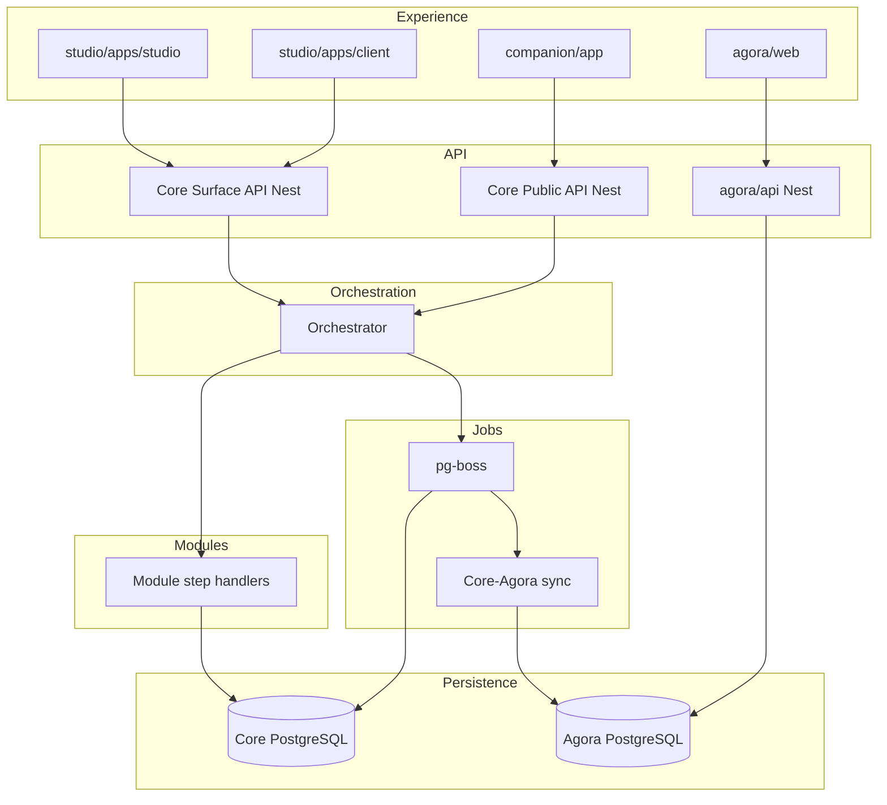
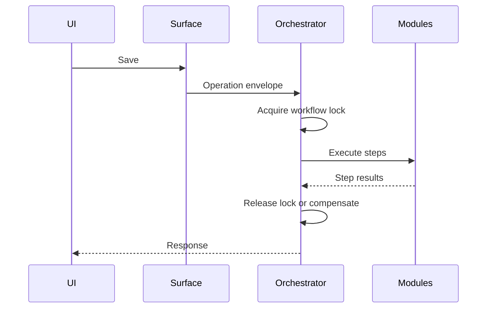
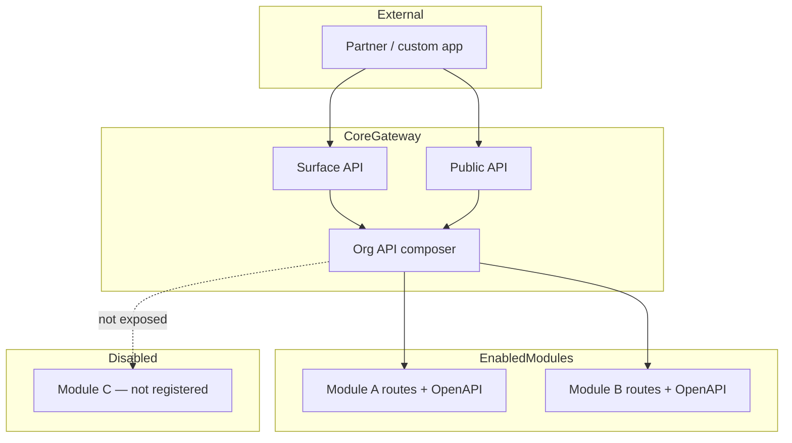
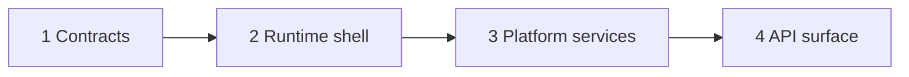

# Erganis Platform — Product Plan (Temporary)

> **Status:** Pre-PRD planning document. Single source of truth until APM-managed documents (PRD, ARCHITECTURE, etc.) are generated from `.apm/templates/`.
>
> **Do not** edit template output files (`ARCHITECTURE.md`, `PRD.md`, etc.) directly — use APM and fragment workflows. This plan will be broken into fragments when templates are ready.

---

## Table of Contents

1. [Document governance & APM](#1-document-governance--apm)
2. [Executive summary](#2-executive-summary)
3. [Terminology](#3-terminology)
4. [Vision & architectural principles](#4-vision--architectural-principles)
5. [Repository layout](#5-repository-layout)
6. [Core](#6-core)
7. [Studio](#7-studio)
8. [Erganis Agora](#8-erganis-agora)
9. [Companion](#9-companion)
10. [Module catalog](#10-module-catalog)
11. [Module system & manifests](#11-module-system--manifests)
12. [Operation envelope & orchestration](#12-operation-envelope--orchestration)
13. [API layers & contracts](#13-api-layers--contracts)
14. [Technology stack](#14-technology-stack)
15. [Cross-cutting platform capabilities](#15-cross-cutting-platform-capabilities)
16. [Explorations & spikes](#16-explorations--spikes)
17. [Feature backlog](#17-feature-backlog)
18. [Resolved decisions](#18-resolved-decisions)
19. [Open questions](#19-open-questions)
20. [Core design — needing to discuss (high priority)](#20-core-design--needing-to-discuss-high-priority)
21. [Decision log](#21-decision-log)

---

## 1. Document governance & APM

### Purpose of this document

Consolidates early brainstorming, architecture notes, stack decisions, module ideas, and backlog items into one plan for design work. **Temporary** — content will migrate to APM-managed artifacts via templates in `.apm/templates/`.

### APM workspace rules

| Rule | Detail |
|------|--------|
| **Workspace gitignored** | `.apm/_WORKSPACE/` is **not committed** by default (TODO, fragment staging, IDEAS). APM may opt in per project. |
| **Templates committed** | `.apm/templates/` and `.apm/standards/` **stay in the repo** — they define how APM generates managed docs (`ARCHITECTURE.md`, `PRD.md`, etc.). |
| **Local scratch** | `erganis/.apm/_WORKSPACE/TODO.md` — volatile APM scratch pad (repopulated by APM sessions). |
| **APM tool TODO path** | `C:\Users\croni\Projects\Angels-Project-Manager\.apm\_WORKSPACE\TODO.md` — APM application must be configured to use this (or project-specific) workspace for TODO/scratch workflows. |
| **Fragment staging** | `DOCUMENT_FRAGMENT_STAGING.md` in workspace — APM consumes; do not treat as product spec. |
| **Templates** | Source of truth for generated docs: `PRD.template.md`, `ARCHITECTURE.template.md`, `FEATURES.template.md`, etc. |

### What not to edit directly

AI and contributors should **not** hand-edit APM-generated documents (`docs/ARCHITECTURE.md`, `docs/PRD.md`, …). Edit **this plan** or workspace scratch, then promote through APM fragments.

### Related docs (kept separate)

| Document | Role |
|----------|------|
| [SUGGESTIONS.md](SUGGESTIONS.md) | Build/process improvements — not application design |
| [DEPENDENCIES.md](DEPENDENCIES.md) | Repo reference rules |
| [SUBMODULES.md](SUBMODULES.md) | Git submodule workflow |
| Submodule `README.md` files | Per-repo GitHub orientation — unchanged |

### ADR folder (removed)

**ADR** (Architecture Decision Record) is a standard pattern for logging significant technical decisions. The former `docs/adr/001-operation-envelope.md` content is merged into [§12](#12-operation-envelope--orchestration). Future formal ADRs will be created via **APM** (`ADR.template.md`), not ad-hoc folders.

---

## 2. Executive summary

**Erganis Platform** is a modular, workflow-driven ecosystem for interior design and the broader build environment.

**Four deployable children:** **Core**, **Studio**, **Agora**, **Companion**. **Core** is the universal foundation — not Studio-only.

**Three pillars:**

- **Surfaces** — workflow boundaries and user intent
- **Modules** — pluggable domain logic and data ownership
- **Orchestration** — coordinates multi-module execution into one operation

**Philosophy:** Contracts over implementation; composition over coupling; workflow-first; stable public IDs; Core builds any Erganis application.

**Long-term goal:** First-party modules, third-party modules, internal apps, and external apps share the same contracts and orchestration principles.

---

## 3. Terminology

| Term | Meaning |
|------|---------|
| **Erganis Platform** | The whole ecosystem |
| **Core** | Base runtime (`core/`, `erganis-core`) |
| **Studio** | Designer + client apps + modules (`studio/`) |
| **Erganis Agora** | Public vendor website + global catalog |
| **Agora org module** | Org-scoped vendors + trade tracking (lives in `agora/modules/`) |
| **Companion** | Mobile app (`companion/`) |
| **Guild** | Optional domain term for vendor collectives — not a repo name |
| **Surface** | Workflow boundary (not a page) |
| **Module** | Pluggable domain unit |
| **Operation envelope** | Standard payload for orchestrated actions |
| **Public ID** | Stable, API-safe identifier |
| **Internal ID** | Module-owned storage identifier |

**Avoid in UX:** "Marketplace" — use **Agora**.

---

## 4. Vision & architectural principles

### Core vision

Erganis is **modular**, not monolithic. Core provides runtime, contracts, orchestration, identity, workflow, composition, and APIs. **Business capabilities** live in **modules**.

### Principles

| Principle | Summary |
|-----------|---------|
| **Contracts over implementation** | Modules interact via contracts, not shared storage |
| **Composition over coupling** | Modules contribute data, validation, UI, workflow, jobs |
| **Workflow first** | Not CRUD-first |
| **Stable IDs** | Public IDs cross modules; internal IDs stay in module boundary |
| **Core is universal** | Studio is flagship; Agora and Companion are first-class consumers |

### Surface model

A Surface defines user intent, workflow boundary, data obligations, and save behavior (e.g. Product, Project, Purchase Order). Surfaces appear in multiple layouts.

### Composition model

Resolution order: **Core defaults → Module defaults → Organization overrides → Runtime**.

### Admin

Admins control composition priorities, layouts, module enablement, and conflict resolution. Core retains ultimate authority.

### Validation

Composable: required fields, budget rules, business rules.

### Draft support

Draft saves, recovery, autosave, session restoration.

### Search

Persistence = source of truth. Search = findability (PostgreSQL FTS v1; dedicated engine later).

### Partial failure

| Class | Behavior |
|-------|----------|
| Required | Blocks operation |
| Optional | Retry per policy; warning if exhausted |
| Advisory | Informational only |

---

## 5. Repository layout

```
erganis/                    # Erganis Platform (parent)
├── core/                   # erganis-core
├── studio/                 # erganis-studio
├── agora/                  # erganis-agora
├── companion/              # erganis-companion
└── docs/
```

### Data flow

```
studio/apps/*, companion/app  →  Core Surface/Public API  →  Core PostgreSQL
agora/web                     →  Agora API                 →  Agora PostgreSQL
Core ↔ Agora                  →  sync jobs (pg-boss)
```

### System tiers

| Tier | Location |
|------|----------|
| Core | `core/` |
| First-party modules (Studio) | `studio/modules/` |
| Third-party modules | `studio/modules/third-party/` |
| Agora service + org module | `agora/` (`api/`, `web/`, `modules/`) |

### Unified application flow



---

## 6. Core

**GitHub:** `erganis-core` · **Role:** Universal foundation for all Erganis applications.

### Folder layout

| Folder | Purpose |
|--------|---------|
| `contracts/` | OpenAPI schemas; SDK generation in `contracts/sdk/` |
| `services/` | NestJS runtime (orchestrator, APIs, module loader) |
| `data/` | PostgreSQL DAL, migrations |
| `packages/` | Shared TypeScript libraries |
| `infrastructure/` | Deploy; Docker optional for local Postgres |
| `scripts/` | Setup, migrate, update CLI |

### Responsibilities

- Runtime lifecycle and **module loader** (runs **module migrations** on enable)
- Identity, org-scoped **RBAC**
- Contract registry and **SDK generation**
- **Orchestrator** and operation envelope execution
- Workflow engine shell and **workflow locks**
- **pg-boss** job runner and PostgreSQL **event outbox**
- **FileStore** and Search adapter interfaces
- Composition resolution (themes, layouts, module enablement)
- Audit / operation log

### Planned NestJS modules (`core/services/`)

| Nest module | Responsibility |
|-------------|----------------|
| `AppModule` | Bootstrap, config |
| `AuthModule` | Identity, sessions, RBAC |
| `OrchestratorModule` | Operation envelope, locks, retries, compensation |
| `ModuleLoaderModule` | Load `erganis.module.json`; run module migrations on enable |
| `SurfaceModule` | Surface API routes |
| `PublicApiModule` | Public API routes |
| `JobModule` | pg-boss workers |
| `FileModule` | `LocalFileStore` (`ERGANIS_DATA_ROOT`) |
| `SearchModule` | PostgreSQL FTS adapter |
| `CompositionModule` | Org overrides, themes |
| `OutboxModule` | Event outbox poller |

### Contracts & SDKs

- **Source of truth:** `core/contracts/schemas/core/openapi.yaml`
- **Public API:** Generated subset (`x-audience: public`) in `schemas/public/v1/`, etc.
- **Module manifests:** `schemas/module/` — YAML → JSON compile
- **SDK outputs (planned):** TypeScript, C#, Java — **review needed** (codegen tool, publish, semver coupling)

**Rule:** Hand-written SDKs do not live in app repos.

### Cross-cutting Core tooling

- **Updater / installer / migrator** — self-hosted Windows/Linux deployments stay current
- **Visual themes** — Core defaults + org overrides
- **Users & roles** — identity, org membership, and **roles** live in **Core** (e.g. drawing approvers, RBAC). Modules reference Core users by Public ID; they do not own the user directory.
- **Dashboard / UI shell** — Core provides composition slots and layout framework so any surface can host module dashboards; joined cross-module dashboards lean on **Reports** (see [§10](#10-module-catalog)).

### Core design next step

The platform lives or dies on Core. See **[§20 — Core design (high priority)](#20-core-design--needing-to-discuss-high-priority)** for the design workshop backlog.

---

## 7. Studio

**GitHub:** `erganis-studio` · **Role:** Designer studio, client portal, first-party and third-party modules.

### Layout

```
studio/
├── apps/studio/           # Designer application
├── apps/client/           # Client portal
├── modules/               # First-party plugins
├── modules/third-party/   # External modules
└── shared/                # shadcn/ui + Tailwind, API clients
```

### Studio + Client shared database

**`apps/studio` and `apps/client` share the same Core PostgreSQL** via Core Surface API — not separate app databases.

- Client approvals, comments, selections **feed directly** into org/project data designers see
- Same data model; different **roles, layouts, and surfaces**
- **Needs refinement:** auth/RBAC split, allowed operations, orchestrator paths for client mutations, concurrency (see [§19](#19-open-questions))

### UI stack (decided)

| Layer | Choice |
|-------|--------|
| **Server** | **NestJS** (Core, Agora API, module domain handlers) |
| **Web client** | **Next.js** + **React** + **TypeScript** |
| **UI components** | **shadcn/ui** |
| **Styling** | **Tailwind CSS** |

Shared implementation lives in `studio/shared/` (components, tokens, API clients). **Studio** (`apps/studio`) and **Client** (`apps/client`) both use this stack. **Agora web** (`agora/web`) follows the same Next.js + shadcn + Tailwind pattern for consistency.

**Companion** remains React Native + TypeScript (separate mobile client; not part of this web stack decision).

**Icons:** Free vector set (e.g. Lucide) from a **separate static host** — not bundled in repos.

### Module install

Enabling/upgrading a module runs manifest-declared **migrations** and **installScripts** via Core migrator.

### Consumes

Core **Surface API** (URL or generated TypeScript SDK).

---

## 8. Erganis Agora

**GitHub:** `erganis-agora` · **Role:** Public vendor catalog + standalone website.

### Layout

```
agora/
├── web/       # Public site (search, MapLibre map)
├── api/       # NestJS + Agora PostgreSQL
├── modules/   # First-party Agora modules (org-scoped Studio bridge, trade tracking)
└── shared/
```

### Agora module ownership (decided)

The **org-scoped Agora module** (vendor list, trade account tracking, sync with public catalog) is **owned by the `agora/` repo**, not `studio/modules/`. Erganis Agora public site and the Studio-facing Agora capability share contracts and stay co-located — avoids duplicating vendor logic across two submodules.

Core still **loads** the module at runtime when enabled for an org (same mechanism as other modules); only the **source repo** changes.

### Dual model (same vendor contracts)

| Surface | Users | Database | Trade accounts |
|---------|-------|----------|----------------|
| **Erganis Agora (web)** | Public, vendors | Agora PostgreSQL (large) | Vendor onboarding links on profiles |
| **Agora module (Studio)** | Design firm staff | Core PostgreSQL (org-scoped) | Manual tracking; Documents; "Already done" |

- **Separate Agora API + database**; **sync jobs** with Core
- Vendors may exist in Studio but not on public Agora initially
- Background job: match org vendors to global Agora; offer sync
- **MapLibre** for vendor map (web; mobile via MapLibre on Companion when needed)

### Vendor onboarding profile (contract)

- `resaleCertificateEmail`
- `resaleCertificateFormUrl`
- `tradeAccountCheckUrl` (optional)

### Agora API (planned Nest modules)

`VendorModule`, `SearchModule`, `SyncModule` — sync contract with Core.

**Conflict rule (proposed):** Agora wins **public vendor fields**; Studio wins **org trade status**.

---

## 9. Companion

**GitHub:** `erganis-companion` · **Role:** Mobile app.

- Consumes **Core Public API** (subset)
- **Primary use cases:** Planner **Tasks** (daily todo check-off), field access to projects
- **MapLibre** — defer to Agora web first unless needed in Companion v1

---

## 10. Module catalog

First-party modules live primarily in `studio/modules/`. **Exception:** Agora org module in `agora/modules/`. Third-party: `studio/modules/third-party/`.

| Module | Repo | Summary |
|--------|------|---------|
| **Planner** | studio | Kanban, Gantt, **Tasks** (daily todo list), **calendar/scheduling**, vendor outreach, staff rotations, MEP *project* milestones |
| **Communications** | studio | Email (Gmail/Outlook/etc.), vendor & client correspondence; iCal link emission when enabled (feeds Planner calendar) |
| **Inventory** | studio | Products/materials; **shipment/carrier tracking** merged here |
| **Documents** | studio | Formal file vault — certs, trade docs, attachments; **not** meeting notes |
| **Notes** | studio | Meeting notes, client context, dictation, Zoom/Meet (TBD) |
| **Design** | studio | **Creativity workspace** — concepts, exploration, room compare; feeds **Presentations** |
| **Presentations** | studio | Shareable outputs (client proposals, approvals, comments); may use Design assets; not limited to client-only use cases |
| **Build** | studio | Drawings, MEP, **light schedules**, **IBC room planner**, **Tags** on drawing sets (optional **Inventory** links); **drawing approval workflow** (uses Core roles/users) |
| **Business** | studio | Running the firm — **billing, taxes**, operational finance |
| **Reports** | studio | Cross-module analytics; modules **register data emissions** for Reports to consume |
| **Agora (org module)** | **agora** | Org-scoped vendors, trade tracking, sync with public Agora catalog |

**Removed / merged (decided):** standalone Calendar → **Planner**; Day Tracker → **Planner › Tasks**; standalone Email → **Communications**; standalone shipment tracking → **Inventory**; Studio-side Agora plugin repo → **`agora/modules/`**.

**Module API rule:** External apps consume **Surface API** or **Public API** only. Routes appear when the module is **enabled for the org** ([§13](#module-extended-api)).

### Planner (includes Tasks & calendar)

- **Tasks** — daily todo list integrated with Kanban/Gantt (not a separate product; legacy "Day Tracker" name retired).
- **Calendar / scheduling** — showings, openings, events live here (no standalone Calendar module).
- When **Communications** is enabled: email-connected calendars can consume **iCal links** emitted by Communications for better integration.
- **Companion:** quick Task check-off via Public API.

### Communications

- Connect Gmail, Outlook, or other providers (OAuth and sync — module-owned).
- Pulls context from **vendors** (Agora) and **clients** (Business/CRM data as defined).
- Links to **Inventory** (e.g. track correspondence about orders/shipments).
- Links to **Notes** (meeting-related email threads).
- **iCal export/link** for Planner calendar consumption when both modules enabled.

**Email in Core vs module:** **Communications module** owns product behavior (UI, threading, vendor/client linkage). Core may still expose an optional minimal **system mail transport** interface later so apps can send operational email without enabling full Communications — see [§20](#20-core-design--needing-to-discuss-high-priority).

### Inventory (includes shipment tracking)

- Product/material lifecycle.
- **Shipment tracking** (carrier links, aggregator APIs — UPS, FedEx, USPS, AfterShip, etc.) lives here, not a separate module.
- Optional cross-link: products referenced by **Build** drawing-set **Tags** (see [Build](#build)).

### Notes vs Documents (separate modules)

| | Notes | Documents |
|---|-------|-----------|
| **Purpose** | Relational context, meetings | Formal vault |
| **Examples** | Meeting notes, dictation | Resale certs, signed PDFs |
| **Links** | Documents, Surfaces, Communications | Surfaces, Inventory, Agora |

### Design vs Presentations (separate modules)

| | Design | Presentations |
|---|--------|-----------------|
| **Purpose** | Creative exploration | Shareable deliverables |
| **Audience** | Design team (primarily) | Clients, stakeholders, internal reviews |
| **Examples** | Mood exploration, room compare concepts | Proposals, approvals, comment threads |

Design is the **creativity area**; Presentations **uses** Design assets when building client-facing outputs.

### Build

- Drawings, MEP, **light schedules** (plumbing schedules, etc.).
- **IBC room-size / occupancy planner** — sq ft, furniture, occupancy rules (International Building Code); architect/build workflows.
- **Tags on drawing sets** — label and identify items on plans/elevations/schedules. Drawing sets often specify products **not** in **Inventory**; tags should work standalone *or* **pull from Inventory** and link tagged items to `productPublicId` when a match exists. Goal: clearer drawing sets and smoother **install days** (field teams see what/where without reconciling paper vs spreadsheet).
- **Drawing approval** workflow owned here — uses **Core users & roles** for approvers; orchestrator + operation envelope for sign-off steps.
- Heavy drawing *viewers* remain Experience-layer (Studio); files in Core FileStore.

**Build ↔ Inventory:** Tag-to-product links use Public IDs and orchestrator/contracts — Build does not write Inventory tables directly. Inventory may surface “where used on drawings” via registered references.

### Business vs Reports (separate modules)

| | Business | Reports |
|---|----------|---------|
| **Purpose** | Firm operations — billing, taxes | Analytics & dashboards across modules |
| **Dashboards** | Business-owned widgets | Reports-owned widgets |
| **Data** | Own domain tables | Consumes **registered emissions** from other modules |

Modules that want Reports access expose data via a **registration/emission contract** (manifest TBD). Any app surface may *display* a dashboard widget, but **joined cross-module reporting** flows through Reports.

**Core** provides dashboard **shell/slots**; module content plugs in ([§6](#6-core)).

### Agora org module (`agora/modules/`)

- Org vendor list, trade account status, background match to public catalog.
- Co-located with Agora public site; sync jobs between Agora API DB and Core.

### IBC room-size planner (decided)

Earlier planning considered a standalone **Tools** module. **Decided:** IBC room-size / occupancy planning lives in the **Build** module (code compliance and architect workflows), not Design.

### Project features (still TBD)

| Feature | Leading placement |
|---------|-------------------|
| Room side-by-side compare | Design |
| Color scheme in deliverables | Presentations (assets from Design) |

---

## 11. Module system & manifests

- **Authoring:** `erganis.module.yaml`
- **Runtime:** `erganis.module.json` (compiled)
- **Validation:** JSON Schema in `core/contracts/schemas/module/`

On **download, enable, or upgrade**, Core runs:

- **migrations** — schema extensions
- **installScripts** — seed data, indexes

Modules may extend surfaces, add validation, contribute UI/workflow/jobs, and **register API routes** (see [§13](#13-api-layers--contracts)). Must **not** mutate another module's storage directly.

Third-party modules: `studio/modules/third-party/`. First-party Agora org module: `agora/modules/`.

**Planned manifest contribution:** `contributions.api` — OpenAPI fragment, route prefix, audience (`surface` | `public`), and required permissions. Not yet in schema; example manifest covers surfaces/operations/jobs/ui only.

### How NestJS modules work here (plain language)

**NestJS** is the long-running **server** process (Core). Think of it as a host application with a plugin system:

1. **Core starts** one Nest application (`core/services/`).
2. For each org, Core knows which Erganis modules are **enabled**.
3. The **Module Loader** reads `erganis.module.json` and imports each module's **Nest DynamicModule** (`entryPoint` in the manifest).
4. Each Erganis module registers its own handlers: HTTP routes, orchestrator step handlers, pg-boss jobs.
5. When a module is **disabled**, Core does not import it — its routes and steps are absent for that org.

**Module source layout (typical):**

```
studio/modules/inventory/
├── erganis.module.yaml
├── src/
│   ├── inventory.module.ts    # Nest DynamicModule export
│   ├── handlers/              # Orchestrator step handlers
│   ├── api/                   # HTTP controllers (Surface/Public routes)
│   └── ui/                    # React components for Studio slots
```

**Cross-repo note:** Most modules live in `studio/`; Agora org module lives in `agora/modules/`. Core must resolve module paths at deploy time (monorepo paths, installer cache, or published packages) — **design in [§20](#20-core-design--needing-to-discuss-high-priority)**.

### Orchestration — not "virtual associates," but the same idea

We are **not** using a product term "virtual associates." Practically:

- The **Orchestrator** runs one **operation** (e.g. Save Product).
- Each **step** calls **one module's handler** in order — like asking specialists in sequence.
- Modules pass **Public IDs and contract-shaped data** only; they never touch another module's database.

Orchestration **solves coordination** (who runs when, locks, rollback). It does **not** solve **packaging** (where module code lives on disk) or **UI loading** (how Next.js imports React components) — those are separate design items in §20.

### Read vs write policy (decided)

| Kind | Path | Why |
|------|------|-----|
| **Writes / workflow** | **Operation envelope** → Orchestrator → module steps | Auditing, locks, compensation, multi-module saves |
| **Reads / queries** | Module **HTTP routes** or composed Surface **`load`** | No state change; no need for full saga |

**Rule:** Anything that **changes persisted state** goes through the envelope. Reads do not bypass security — still org-scoped, module-enabled, RBAC-checked.

### Worked examples (reads vs writes)

#### Example 1 — Save a product (Inventory + optional Finance)

**Write** — operation envelope.

1. Studio UI calls `POST /surface/product/save` with envelope payload.
2. Orchestrator acquires lock on `productPublicId`.
3. Step 1: **Inventory** handler validates SKU, writes product row.
4. Step 2: **Finance** handler (optional) updates cost; failure → warning, not rollback of Inventory if marked optional.
5. Lock released; UI gets success + warnings.

Inventory does **not** call Finance's tables. Finance receives `{ productPublicId, costDelta }` in step input.

#### Example 2 — List products for a project

**Read** — direct module route (no envelope).

1. Studio calls `GET /modules/inventory/products?projectId=…` (route registered because Inventory is enabled).
2. Inventory module queries **its own** tables, returns DTOs with Public IDs.
3. If Inventory disabled → route not registered → `404` / module-not-enabled (exact TBD).

#### Example 3 — Open Project surface (Planner + Documents + Design)

**Read** — Surface **`load`** (composed).

1. Studio calls `POST /surface/project/load` with `{ projectPublicId }`.
2. Core orchestrator or Surface runtime calls each contributing module's **load** handler (read-only steps or dedicated loaders).
3. Response merges fields: Planner tasks, Document links, Design room list — one composed JSON for the UI.

**Open design item:** exact `load` composition API ([§20](#20-core-design--needing-to-discuss-high-priority)).

#### Example 4 — Approve drawing revision (Build)

**Write** — operation envelope; approval owned by **Build**.

1. Client or Studio calls `POST /surface/drawing/approve`.
2. Lock on `drawingRevisionPublicId`.
3. Build step: record revision state.
4. Workflow step: resolve approvers from **Core roles** (users live in Core).
5. Build step: record signatures / approval outcome.

#### Example 5 — Link email thread to shipment (Communications + Inventory)

**Write** — envelope with two module steps (or one module calling Public IDs only).

1. User associates thread in Communications UI.
2. Envelope step 1: Communications stores thread link metadata.
3. Step 2: Inventory stores `shipmentPublicId` ↔ thread reference via orchestrator input — **not** Communications writing Inventory tables directly.

#### Example 6 — Reports dashboard widget (read)

**Read** — Reports module route.

1. Business module **registered** an emission schema with Reports at enable time.
2. Reports `GET /modules/reports/dashboard/business-summary` aggregates registered data contracts.
3. Core dashboard **shell** in Studio layout hosts the widget component from Reports.

### Next.js vs NestJS — one platform, two jobs (decided direction)

| | **NestJS (Core)** | **Next.js (Studio / Client / Agora web)** |
|---|-------------------|-------------------------------------------|
| **Role** | Heavy backend: APIs, orchestrator, modules, jobs, PostgreSQL | UI: pages, forms, shadcn components, layouts |
| **Third-party backend extensions** | Nest **Erganis modules** loaded by Core | — |
| **Third-party frontends** | Consume **OpenAPI** (any stack) | Often Next + shadcn, not required |

**Do not** put orchestration, module domain logic, or job workers in Next API routes — Next is not the system of record.

**Why keep both:** Companion and external apps need a **stable Nest API** independent of any web deployment. Next's "light backend" fits session/cookie proxy or SSR data fetch, not the full Erganis platform server.

**Third-party clarity:** Document that **server plugins = Nest Erganis modules**; **clients = HTTP consumers** (Next recommended for Studio ecosystem because of shadcn). One OpenAPI contract; two intentional runtimes.

### Manifest gaps (revisit after catalog decisions)

Plain-language summary of what the manifest will eventually declare beyond today's schema:

| Contribution | Meaning |
|--------------|---------|
| `surfaces` / `operations` | Which workflows this module joins |
| `api` (planned) | HTTP routes + OpenAPI fragment |
| `ui` | React slots in Studio (sidebar, dashboard, etc.) |
| `jobs` | Background workers |
| `reports` (planned) | Data emissions for Reports module |
| `migrations` | DB tables this module owns |

Full schema work is **deferred** until Core design workshop ([§20](#20-core-design--needing-to-discuss-high-priority)).

---

## 12. Operation envelope & orchestration

**Priority contract** for all significant mutations.

### Decision

All mutations flow through a **standard operation envelope** executed by the Core **Orchestrator**. Modules register step handlers and compensators via manifest. Orchestrator manages **workflow locks**, **failure classes**, **optional retries**, and **compensation** (saga-lite).

### Envelope shape (summary)

```typescript
interface OperationEnvelope {
  operationId: string;
  surfaceId: string;
  action: 'load' | 'save' | 'draft' | 'archive' | 'approve' | 'sync';
  entityPublicId?: string;
  entityVersion?: number;
  initiatedBy: string;
  orgId: string;
  timestamp: string;
  payload: Record<string, unknown>;
  steps: OperationStep[];
  lock?: WorkflowLock;
  outcome?: 'success' | 'partial' | 'failed';
}
```

Steps carry `failureClass`: `required` | `optional` | `advisory`. Optional steps support **retry**; exhausted retries recorded — no silent drift.

### Lock acquisition

Pessimistic lock on entity + version during active workflow. Concurrent edits → `409 Conflict`.

### Cross-module interaction

Modules hook through orchestrator step I/O and contract events — **Public IDs only** in envelope. No cross-module SQL.

### Examples

**Save Product:** Inventory (required) → Finance (optional) → Sustainability (advisory).

**Drawing approval:** Build submit → workflow assign reviewers → Build sign-off.

### Save orchestration sequence



**Next:** JSON Schema in `core/contracts/schemas/`; worked examples for Save Product and drawing approval.

---

## 13. API layers & contracts

| API | Consumers |
|-----|-----------|
| **Surface API** | Studio apps (studio, client), **external apps** integrating with an org's Erganis instance |
| **Module Contract API** | Core runtime ↔ modules (internal only — orchestrator step handlers, not HTTP for third parties) |
| **Public API** | Companion, partners, **external apps** (stable, narrower subset) |
| **Agora API** | Agora web, vendor portal |

| Contract type | Purpose |
|---------------|---------|
| Data | Entity schemas |
| Command | Mutations |
| Event | Notifications |
| UI | Composition contributions |

**Integrations:** Inbound (external → Erganis) and outbound (Erganis → external) via Surface/Public API and webhooks.

### Module-extended API

Core exposes a **composed, org-scoped API** — not a single fixed OpenAPI document for every deployment.

When a module is **enabled for an organization**, Core:

1. **Registers** the module's HTTP routes (Nest dynamic modules via module loader)
2. **Merges** the module's OpenAPI paths and schemas into the API surface visible to that org
3. **Enforces** org RBAC and manifest-declared module permissions on those routes

When a module is **disabled** (or not installed), its routes are not registered, its paths are omitted from org-visible API discovery, and calls to those endpoints fail (e.g. `404` or explicit *module not enabled* — exact behavior TBD).

This is how **modules add functionality to the API** without every capability living in Core itself. First-party Studio modules, third-party modules in `studio/modules/third-party/`, and future marketplace modules all use the same mechanism.

**External apps** — custom tools, partner integrations, or separate deployables that "plug into" an org's Erganis instance — consume **Surface API** and/or **Public API** like first-party apps. They only receive endpoints and contract shapes for modules **enabled for that org**. A partner building against Inventory cannot call Inventory routes until the design firm enables the Inventory module.



**Mutations** from external apps still flow through the **operation envelope** and orchestrator where applicable — modules extend commands and surfaces, not bypass Core workflow rules.

**SDK implication:** Generated SDKs may be **core baseline + optional module packages**, or a composed spec per org at build time — see open questions.

---

## 14. Technology stack

### Decided

| Tier | Stack |
|------|-------|
| **Server** | **NestJS**, TypeScript, PostgreSQL 16, pg-boss |
| **Web client** | **Next.js**, React, TypeScript, **shadcn/ui**, **Tailwind CSS** |
| **Mobile** | React Native, TypeScript, MapLibre (Companion) |

### Stack table

| Layer | Component | Technology | Swap boundary |
|-------|-----------|------------|---------------|
| Experience | Studio designer + client | React, Next.js, TS, shadcn/ui, Tailwind | `studio/shared` |
| Experience | Agora web | Next.js, React, TS, shadcn/ui, Tailwind | `agora/web` |
| Experience | Companion | React Native, TypeScript, MapLibre | `companion/` |
| UI icons | Icon assets | Lucide (TBD); separate static host | CDN / asset URL |
| Surface | Surface runtime | TypeScript in Core | Surface contract |
| API | Core gateway | **NestJS** | OpenAPI |
| API | Agora service | **NestJS** | Agora OpenAPI |
| Orchestration | Orchestrator | Nest module in Core | Operation envelope |
| Module domain | Studio modules | Nest dynamic modules | Module Contract API |
| Persistence | Core DB | **PostgreSQL 16** | DAL interfaces |
| Persistence | Agora DB | **PostgreSQL 16** | Agora DAL |
| Jobs | Job runner | **pg-boss** | Job queue interface |
| Events | Outbox | PostgreSQL + poller | Event contract |
| Search | v1 | PostgreSQL full-text | Search adapter → Meilisearch |
| Files | v1 | **Local filesystem** (`ERGANIS_DATA_ROOT`) | FileStore → S3 |
| Maps | Geo | **MapLibre** | Tile provider adapter |
| Identity | Auth | Core Nest, org RBAC | All apps |
| Composition | Overrides | Core PostgreSQL | Composition API |
| Tooling | Updater | `core/scripts/` | CLI |

### PostgreSQL vs Redis

**v1: PostgreSQL only** (pg-boss, outbox, FTS). Redis deferred. Native Windows/Linux; Docker optional.

### Deploy

Windows and Linux native; optional Docker Compose for local Postgres only.

### Local file storage (v1)

| Content | Path |
|---------|------|
| Documents / certs | `{dataRoot}/{orgId}/documents/` |
| Drawings | `{dataRoot}/{orgId}/drawings/` |
| Presentations | `{dataRoot}/{orgId}/presentations/` |
| Reports | `{dataRoot}/{orgId}/reports/` |

S3 adapter later behind same `FileStore` interface.

### MapLibre

Web: `maplibre-gl` + free tiles (OpenFreeMap / self-hosted OSM). Mobile: `@maplibre/maplibre-react-native`.

---

## 15. Cross-cutting platform capabilities

| Capability | Notes |
|------------|-------|
| **Updater / installer / migrator** | Version check, install, schema/data migration for self-hosted |
| **Visual themes** | Core defaults + org overrides |
| **Drawing approval** | Pipeline workflow — module vs Planner/Build TBD |
| **Jobs** | Core infrastructure; modules register handlers in manifest |
| **Failure modes** | Manifest compatibility, validation, lock conflicts, partial outcomes, Agora sync lag |

### Golden path

User → Surface → Operation envelope → Orchestrator (lock) → Module steps → Result (unlock)

---

## 16. Explorations & spikes

### Architecture drawing viewers

**Status:** Exploration — not final.

| Stack | Notes |
|-------|-------|
| three.js + @three/dxf-loader | WebGL DXF in browser |
| dxf-parser + SVG | Lighter 2D |
| xeokit-sdk | BIM/3D |
| Autodesk Forge Viewer | Hosted alternative |

- Files in `FileStore` at `{dataRoot}/{orgId}/drawings/`
- Viewers in Studio (selectively Client)
- Approvals use operation envelope + locks

**Next steps:** Evaluation criteria; spike 2D DXF first; defer Forge unless acceptable.

### Architecture drawing spikes (backlog)

- [ ] three.js + @three/dxf-loader
- [ ] dxf-parser + SVG
- [ ] xeokit-sdk
- [ ] Note Autodesk Forge Viewer as hosted alternative

---

## 17. Feature backlog

### Planner
- [ ] Kanban, Gantt, vendor outreach, staff rotations
- [ ] **Tasks** — daily todo list (Companion check-off)
- [ ] Calendar / scheduling (showings, openings, events)
- [ ] iCal consumption from Communications when both enabled
- [ ] MEP project milestones, responsibility + room layering

### Communications
- [ ] Gmail / Outlook (or provider) connection
- [ ] Vendor & client correspondence views
- [ ] Inventory thread association
- [ ] Notes / meeting email linkage
- [ ] iCal link emission for Planner

### Inventory
- [ ] Product/material tracking
- [ ] Shipment / carrier tracking (aggregator API research)

### Documents
- [ ] Document vault — resale certs, trade docs
- [ ] Formal files only — not meeting notes

### Notes
- [ ] Meeting notes, client context, audio dictation
- [ ] Zoom / Google Meet integration (scope TBD)
- [ ] Meeting workspace — quick access to Presentations, floor plans, Documents

### Design
- [ ] Creativity workspace — concepts, exploration
- [ ] Room side-by-side compare (candidate)

### Presentations
- [ ] Shareable proposals, comments, item approval
- [ ] Client / stakeholder delivery
- [ ] Use Design assets in presentations

### Build
- [ ] Drawings, MEP, light schedules (plumbing schedules, etc.)
- [ ] IBC room-size / occupancy planner
- [ ] **Tags** on drawing sets — standalone labels or linked to Inventory products; install-day clarity
- [ ] Drawing approval pipeline (Core roles for approvers)

### Business
- [ ] Billing, taxes, firm operations
- [ ] Business-owned dashboards

### Reports
- [ ] Cross-module report definitions
- [ ] Module data-emission registration
- [ ] Reports-owned dashboards; joined analytics

### Agora org module (`agora/modules/`)
- [ ] Org vendor list, trade tracking, background vendor match

### Erganis Agora (web)
- [ ] Public vendor search, profiles, MapLibre map

### Core
- [ ] Updater, installer, migrator (incl. module DB migrations)
- [ ] Visual themes, dashboard/UI composition shell
- [ ] Users, orgs, roles (approvals, RBAC)
- [ ] Multi-language SDK pipeline

### Studio shared UI
- [x] Next.js + shadcn/ui + Tailwind CSS (`studio/shared/`)
- [ ] Icon asset host

### Studio + Client
- [ ] Refine shared DB engagement model

### APM / process
- [ ] Fragment update/versioning support for managed fragment workflows

---

## 18. Resolved decisions

| Area | Decision |
|------|----------|
| Ecosystem name | **Erganis Platform** |
| Base layer | **Core** (`core/`, `erganis-core`) |
| Submodules | `core/`, `studio/`, `agora/`, `companion/` |
| Studio apps | `apps/studio/`, `apps/client/`; `modules/`; `modules/third-party/` |
| Public vendor site | **Erganis Agora**; avoid "marketplace" in UX |
| Agora architecture | Separate Agora API + DB; sync jobs; **org module in `agora/modules/`** |
| Trade accounts | Manual in Agora org module; Documents; background match from public Agora |
| Manifest | YAML authoring → JSON runtime |
| Stack | NestJS (server), Next.js + shadcn + Tailwind (web client), PostgreSQL, pg-boss, LocalFileStore v1, MapLibre, OpenAPI-first |
| Core role | Universal foundation — not Studio-only |
| Studio + Client data | Same Core PostgreSQL (**engagement model TBD**) |
| Module install | DB migrations on enable via Core migrator |
| Studio UI | Next.js + shadcn/ui + Tailwind in `studio/shared/` |
| Icons | Hosted separately from code repos |
| Schemas | OpenAPI-first; JSON Schema for data |
| Permissions | Org-scoped RBAC |
| Workflows | Config-first; visual builder deferred |
| Rollback | Saga-lite + optional retry + workflow locks |
| Jobs/events v1 | pg-boss + PostgreSQL outbox; Redis deferred |
| Module API extension | Modules register Surface/Public routes when enabled per org; external apps consume composed API |
| Read vs write | Writes → operation envelope; reads → module routes or Surface `load` |
| Planner scope | Tasks (daily todos), calendar/scheduling, Kanban, Gantt — one module |
| Communications | Email module; vendor/client comms; iCal for Planner |
| Inventory scope | Includes shipment tracking |
| Business vs Reports | Separate modules; Reports consumes registered data emissions |
| Design vs Presentations | Separate; Design = creativity, Presentations = shareable outputs |
| Build scope | Drawings, MEP, light schedules, **IBC room planner**, **drawing-set Tags** (optional Inventory links), drawing approval workflow |
| Users & roles | Owned by **Core**; modules reference by Public ID |
| Dashboard shell | Core composition framework; module widgets; joined data via Reports |
| Nest + Next split | Nest = Core/server/modules; Next = web UI (shadcn); not dual business logic |

---

## 19. Open questions

### Status key

| Symbol | Meaning |
|--------|---------|
| **Open** | Needs design discussion |
| **Partial** | Direction set; details remain |
| **Answered** | Decided — see [§18](#18-resolved-decisions) |

| # | Topic | Status |
|---|-------|--------|
| 1 | Operation envelope workshop — Save Product + drawing approval examples | **Partial** — policy set; schemas/worked specs in [§20](#20-core-design--needing-to-discuss-high-priority) |
| 2 | Agora sync conflicts — Agora wins public fields; Studio wins org trade? | **Open** |
| 3 | Documents v1 — org vault only vs project-linked attachments? | **Open** |
| 4 | Companion maps v1 — defer MapLibre to Agora web? | **Open** |
| 5 | Multi-language SDKs — codegen, publish, version sync? | **Open** |
| 6 | Icon asset host — self-hosted vs CDN; Lucide vs Tabler vs Phosphor? | **Open** |
| 7 | Drawing viewer stack — 2D DXF vs BIM first? | **Open** |
| 8 | Studio + Client shared DB — RBAC, orchestrator paths, concurrency? | **Open** |
| 9 | Email in Core vs Communications module | **Answered** — Communications module; optional Core transport TBD ([§20](#20-core-design--needing-to-discuss-high-priority)) |
| 10 | Shipment tracking placement | **Answered** — Inventory |
| 11 | Notes vs Calendar boundary | **Answered** — Notes separate; calendar in Planner |
| 12 | Mood board / color scheme placement | **Partial** — Design creates; Presentations delivers |
| 13 | Room side-by-side compare | **Partial** — likely Design |
| 14 | Day Tracker / Tasks placement | **Answered** — Planner › Tasks |
| 15 | Erganis Planner naming | **Open** — "Planner" working name |
| 16 | Room size / IBC planner | **Answered** — Build module |
| 17 | Erganis Reports vs Business | **Answered** — separate modules |
| 18 | Drawing approval ownership | **Answered** — Build module + Core roles |
| 19 | External app auth — OAuth, API keys, session delegation? | **Open** |
| 20 | Module API manifest — `contributions.api` shape; disabled-module response? | **Open** — [§20](#20-core-design--needing-to-discuss-high-priority) |
| 21 | SDK for module-extended API — composed spec vs core + module packages? | **Open** |
| 22 | Module packaging — how Core loads `studio/` and `agora/modules/` at deploy? | **Open** — [§20](#20-core-design--needing-to-discuss-high-priority) |
| 23 | Surface `load` composition — multi-module project screen? | **Open** — [§20](#20-core-design--needing-to-discuss-high-priority) |
| 24 | Module UI loading in Next — build-time vs dynamic imports for third-party UI? | **Open** — [§20](#20-core-design--needing-to-discuss-high-priority) |
| 25 | Reports data-emission manifest shape | **Open** |
| 26 | Core optional system mail transport vs Communications-only email | **Open** — [§20](#20-core-design--needing-to-discuss-high-priority) |

Use `Ex: TODO` in specs where behavior is not yet finalized.

---

## 20. Core design — needing to discuss (high priority)

> **This is the most important design work on the platform.** Everything else (modules, Studio UI, Agora, Companion) assumes Core is correct. Schedule dedicated workshops here before implementing domain modules.

### Design phases (recommended order)



| Phase | Deliverables |
|-------|----------------|
| **1 — Contracts** | Operation envelope JSON Schema; Public ID model; Core OpenAPI baseline; module manifest v1 (`api`, `reports` emissions) |
| **2 — Runtime shell** | Auth; org + **users + roles**; module loader lifecycle; orchestrator + locks + operation log; Core + module migrator |
| **3 — Platform services** | FileStore; pg-boss + outbox; search adapter; composition resolver; **dashboard/UI shell** |
| **4 — API surface** | Surface API gateway; Public API subset; org API composer (enabled modules); SDK pipeline |

### Workshop topics (discuss next)

#### A. Operation envelope (blocking)

- JSON Schema for envelope + steps
- Worked specs: **Save Product** (Inventory + optional Finance), **Drawing approve** (Build + Core roles)
- When is `draft` vs `save` vs `approve`?
- Partial failure UX contract

#### B. Module loader & packaging (blocking)

- How Core resolves modules from `studio/modules/` and `agora/modules/` in **dev** vs **installed** deployments
- Options: monorepo path config, installer module cache, published `@erganis/module-*` packages
- Enable / disable / upgrade lifecycle; compatibility matrix (`erganisCoreVersion`)
- Table ownership convention (prefix vs schema-per-module)

#### C. Identity & authorization (blocking)

- **Users, orgs, roles in Core** (decided) — flesh out role model for Build approvals, client portal users, module permissions
- Studio vs Client: which surfaces and envelope actions each role may invoke
- External app auth (API keys, OAuth, delegated sessions)

#### D. Surface runtime (blocking)

- **`load` composition** — how Project surface merges Planner + Documents + Design (read path)
- **`save` orchestration** — write path (already directional)
- Validation composition across modules

#### E. API composer (blocking)

- `contributions.api` manifest shape
- Merge OpenAPI per org; Surface vs Public audience
- Response when module disabled (`404` vs structured error)
- SDK strategy: baseline + optional module packages

#### F. Dashboard & UI composition (important)

- Core provides **layout slots** and navigation shell (decided direction)
- Modules register dashboard widgets and Studio UI slots
- **Reports** owns joined analytics; single-module dashboards stay in owning module
- How Next.js **imports** module UI (build-time workspace graph vs dynamic — affects third-party modules)

#### G. Communications vs Core email transport (discuss)

| Approach | Pros | Cons |
|----------|------|------|
| **Communications module only** | Clear product boundary; OAuth/UI/threading in one place | Apps without Communications build their own email |
| **+ Core minimal transport** | Core can send system/ops email (password reset, job alerts) without enabling Communications | Two email paths to maintain |
| **Email entirely in Core** | One integration point | Bloated Core; optional module story weaker |

**Current decision:** **Communications module** for product email. **Open:** whether Core exposes a thin `EmailTransport` interface for operational mail and for external apps that only need Core (no full Communications). Low risk if the interface is small and Communications implements it too.

#### H. Cross-cutting services

- FileStore paths and permissions
- Event outbox + module event subscriptions
- Search: PostgreSQL FTS v1 adapter interface
- Updater / installer / migrator for self-hosted

#### I. First vertical slice (pick one)

Candidates to validate loader + envelope + one Surface end-to-end:

- **Documents** (simpler writes), or
- **Inventory** (Save Product multi-step story)

### Suggested next conversation order

1. Module loader & packaging (unblocks everything else)
2. Operation envelope schemas + two worked examples
3. Users/roles + Client portal RBAC
4. Surface `load` composition
5. API composer + `contributions.api`
6. Core email transport vs Communications-only
7. First vertical slice module choice

### Plain-language reminder

| Term | Means |
|------|-------|
| **Core** | The server brain — auth, database orchestration, module hosting |
| **Module** | Plugin (Nest + optional React) adding a business domain |
| **Surface** | A workflow screen contract (e.g. Project, Product) — not one React page |
| **Operation envelope** | Standard "do this action" package for **writes** across modules |
| **Orchestrator** | Core component that runs envelope steps in order with locks |
| **Public ID** | Stable ID modules use to reference each other's entities |
| **Surface API** | HTTP API Studio/Client call |
| **Public API** | Smaller HTTP API for Companion and partners |

---

## 21. Decision log

| Date | Decision |
|------|----------|
| 2025-06 | Erganis Platform naming; Core as base layer |
| 2025-06 | Four submodules: core, studio, agora, companion |
| 2025-06 | Agora: separate API/DB + sync; Studio plugin for trade tracking |
| 2025-06 | NestJS, PostgreSQL, pg-boss, LocalFileStore v1, MapLibre |
| 2025-06 | Web client: Next.js + shadcn/ui + Tailwind (`studio/shared/`, Agora web) |
| 2025-06 | Module manifest YAML → JSON; OpenAPI-first |
| 2025-06 | Operation envelope; workflow locks; optional retry |
| 2025-06 | Studio + Client share Core DB; module migrations on enable |
| 2025-06 | UI: shadcn + Tailwind; icons hosted separately |
| 2025-06 | Consolidated planning into `erganis-product-plan.md`; `.apm/_WORKSPACE/` gitignored |
| 2025-06 | Module catalog reshuffle: Planner+Tasks+Calendar, Communications, Inventory+tracking, Business/Reports split, Agora module in `agora/` |
| 2025-06 | Users/roles in Core; Build owns drawing approval; read vs write API policy |
| 2025-06 | Core design workshop backlog captured in §20 |
| 2025-06 | IBC room-size / occupancy planner in **Build** module |
| 2025-06 | Build **Tags** on drawing sets; optional Inventory links for install-day workflows |
