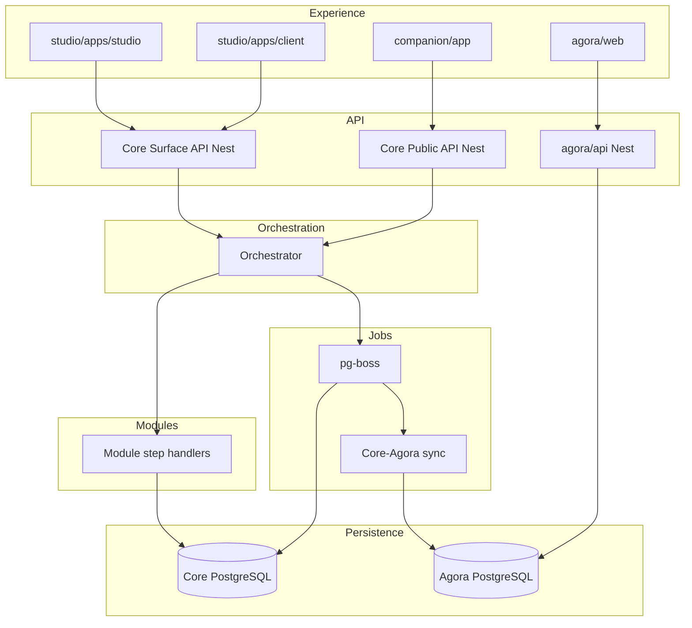
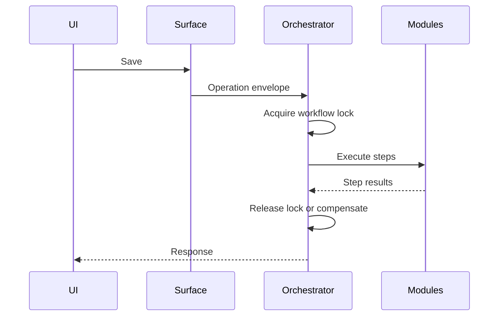

# Erganis Architecture Specification (v27)

---

## Table of Contents
1. Executive Summary
2. Dictionary
3. Resolved Decisions & Remaining Questions
4. Example Placeholder Convention
5. Spec-Driven Development Note
6. Application Flow & Stack (Unified)
7. Architecture Model
8. Repository Layout
9. System Tiers
10. Core Responsibilities
11. Erganis Agora
12. Core Concepts
13. Contract & Reference Model
14. Identity Model
15. Surface Model
16. Save Orchestration
17. Operation Model
18. Partial Failure Model
19. Workflow & Trigger System
20. Jobs & Scheduling
21. Sync vs Async Model
22. Composition Model
23. Module System
24. API Layers
25. Tech Stack by Tier
26. Supporting Platform Layers
27. Golden Path Example
28. Failure Modes
29. Decision Log

---

## 1. Executive Summary

Erganis Platform is a modular, workflow-driven ecosystem designed to support extensible application development through structured contracts, orchestrated workflows, and composable user interfaces.

The **Erganis Platform** comprises four deployable children: **Core**, **Studio**, **Agora**, and **Companion**. **Core** is the universal foundation — not Studio-only.

Three foundational pillars:

- **Surfaces**: Define workflow boundaries and user intent
- **Modules**: Encapsulate domain logic and data ownership
- **Orchestration**: Coordinates multi-module execution into a single operation

### Goals

- Enable independent module development
- Maintain strict data integrity
- Support flexible UI composition
- Provide consistent behavior across all entry points (UI, API, integrations)

### Philosophy

- Contracts over implementation
- Composition over coupling
- Workflow-first (not CRUD-first)
- Stable identifiers across systems
- Separation of internal vs external concerns

---

## 2. Dictionary

| Term | Meaning |
|------|--------|
| Erganis Platform | The whole ecosystem |
| Core | Base runtime layer (`core/` repo) |
| Studio | Designer + client apps and modules (`studio/` repo) |
| Agora | Public vendor catalog + website (`agora/` repo) |
| Companion | Mobile app (`companion/` repo) |
| Surface | Workflow boundary |
| Module | Pluggable domain unit |
| Operation | User-triggered action |
| Step | Module participation in an operation |
| Orchestrator | Coordination layer in Core |
| Operation envelope | Standard payload for orchestrated actions |
| Contract | Interface definition |
| Public ID | Stable external identifier |
| Internal ID | Storage identifier |
| Layout | UI structure |
| Composition | Layered configuration |

---

## 3. Resolved Decisions & Remaining Questions

### Resolved

| Topic | Decision |
|-------|----------|
| Schemas | OpenAPI-first in `core/contracts/`; JSON Schema for data contracts |
| Module manifest | YAML authoring → JSON runtime; JSON Schema validation |
| Versioning | Semver for Core, contracts, modules; compatible range in manifest |
| Permissions | Org-scoped RBAC; surface-scoped where needed |
| Workflows | Config-first; visual builder deferred |
| Search | PostgreSQL full-text v1; dedicated engine when scale requires |
| Files | LocalFileStore v1; S3-compatible adapter later |
| Rollback | Saga-lite + compensation; optional step retry; workflow locks |
| Core vs modules | Core = runtime, orchestrator, identity, contracts, jobs; modules = domain |
| Composition storage | Core PostgreSQL, org-scoped tables |
| API framework | NestJS |
| Jobs/events v1 | pg-boss + PostgreSQL outbox; Redis deferred |
| Agora | Separate API + PostgreSQL; sync jobs with Core |

See [docs/adr/001-operation-envelope.md](adr/001-operation-envelope.md) for operation envelope detail.

### Remaining (non-blocking)

- Operation envelope worked examples (Save Product, drawing approval)
- Agora sync conflict rules (public fields vs org trade status)
- Documents plugin v1 scope
- Companion MapLibre in v1 or defer

---

## 4. Example Placeholder Convention

Use `Ex: TODO` when schema, API, or behavior is not yet finalized.

---

## 5. Spec-Driven Development Note

This document supports human readability, AI-assisted generation, and enforceable architectural constraints.

---

## 6. Application Flow & Stack (Unified)



### Key Insight

All Core mutation flows converge at the **Orchestrator**, ensuring consistency.

---

## 7. Architecture Model

| Stack | Description | Tech | Swap boundary |
|------|------------|------|---------------|
| Experience | Studio, Agora web, Companion | React, Next.js, RN, TS | App repos; SDK |
| Surface | Workflow layer | TypeScript (Core) | Surface contract |
| API | Core + Agora gateways | NestJS | OpenAPI |
| Orchestration | Coordination, locks, retries | Nest module | Operation envelope |
| Module domain | Business logic | Nest dynamic modules | Module Contract API |
| Persistence | Core + Agora data | PostgreSQL 16 | DAL interfaces |
| Events | Cross-service notify | PostgreSQL outbox | Event contract |
| Workflow | Automation | Config + Core engine | Workflow schema |
| Jobs | Async work | pg-boss | Job queue interface |
| Search | Findability | PostgreSQL FTS → Meilisearch | Search adapter |
| Files | Binary storage | LocalFileStore → S3 | FileStore interface |
| Maps | Geo display | MapLibre | Geo provider adapter |
| Integration | External systems | Webhooks, HTTP | Integration contract |

Full stack reference: [docs/STACK.md](STACK.md).

---

## 8. Repository Layout

```
erganis/                    # Erganis Platform (parent)
├── core/                   # erganis-core
├── studio/                 # erganis-studio
├── agora/                  # erganis-agora
├── companion/              # erganis-companion
└── docs/
```

---

## 9. System Tiers

| Tier | Description | Location |
|------|-------------|----------|
| Core | Runtime, contracts, orchestration | `core/` |
| First-party | Official modules | `studio/modules/` |
| Third-party | Extensions | `studio/modules/third-party/` |
| Agora | Global vendor catalog (separate service) | `agora/` |

---

## 10. Core Responsibilities

Core is the **universal foundation** for all Erganis applications.

- Runtime lifecycle and module loader
- Identity management and org-scoped RBAC
- Contract registry and SDK generation
- Orchestration and operation envelope execution
- Workflow engine shell and workflow locks
- Job runner (pg-boss) and event outbox
- FileStore and Search adapter interfaces
- Composition resolution and org overrides
- Audit/logging

Studio is the primary UI consumer; Companion uses Public API only; Agora runs a separate Nest service synced via jobs.

---

## 11. Erganis Agora

### Dual model

| Surface | Database | Trade accounts |
|---------|----------|----------------|
| **Erganis Agora (web)** | Agora PostgreSQL | Vendor onboarding links on public profiles |
| **Studio Agora plugin** | Core PostgreSQL (org-scoped) | Manual tracking; Documents plugin; background match from global Agora |

- Same vendor interface shapes in Core contracts
- Sync jobs propagate vendor profile updates
- Public Agora: search, MapLibre map, vendor self-service
- Studio plugin: org vendor list, "Requires trade account for prices", "Already done", cert apply

Use **Agora** in product language; avoid "marketplace" in UX.

---

## 12. Core Concepts

- Data, Surface, Module, Operation, Layout

---

## 13. Contract & Reference Model

| Type | Purpose |
|------|--------|
| Data | Entity schemas |
| Command | Mutation instructions |
| Event | State change notifications |
| UI | Composition contributions |

SDKs generated in `core/contracts/sdk/` from OpenAPI.

---

## 14. Identity Model

- **Internal IDs**: module-owned, storage-oriented
- **Public IDs**: stable, cross-module, API-safe

Operation envelopes reference Public IDs only; modules resolve internal IDs within their boundary.

---

## 15. Surface Model

Surface = workflow boundary

### Properties

- ID, Obligations, Participants, Operations

### Operations

- Load, Save, Draft, Archive, Approve, Sync

A Surface is not a page — it can appear in multiple layouts.

---

## 16. Save Orchestration



---

## 17. Operation Model

See [docs/adr/001-operation-envelope.md](adr/001-operation-envelope.md).

| Field | Description |
|------|------------|
| operationId | Unique operation identifier |
| surfaceId | Target surface |
| action | load, save, draft, archive, approve, sync |
| steps[] | Module steps with stepId, moduleId, status, failureClass |
| outcome | success, partial, failed |
| lock | Entity lock for concurrent edit prevention |

Optional step failures support **retry** before recording partial outcome.

---

## 18. Partial Failure Model

| Class | Behavior |
|-------|----------|
| Required | Failure blocks operation; compensation runs |
| Optional | Retry per policy; warning if exhausted |
| Advisory | Informational only |

---

## 19. Workflow & Trigger System

Event → Rule → Action (config-first)

Workflows acquire **locks** on affected entries for the duration of the pipeline.

---

## 20. Jobs & Scheduling

- **pg-boss** on PostgreSQL (Core and Agora each run workers)
- Modules register job handlers via manifest
- Examples: Agora sync, vendor match, reminders, search reindex, report generation

Jobs are **Core infrastructure**, not a user-facing plugin.

---

## 21. Sync vs Async Model

- Sync: user-facing operations through Orchestrator
- Async: jobs, outbox delivery, cross-service sync

---

## 22. Composition Model

Resolution order: Core defaults → Module defaults → Organization overrides → Runtime

Stored in Core PostgreSQL (org_module_enablement, org_composition_overrides, org_layout_preferences, org_theme_overrides).

---

## 23. Module System

- Manifest: `erganis.module.yaml` → compiled `erganis.module.json`
- Modules extend surfaces, add validation, contribute data/UI/workflow/jobs
- Must not mutate another module's storage directly
- Third-party modules in `studio/modules/third-party/`

---

## 24. API Layers

| API | Consumers |
|-----|-----------|
| Surface API | Studio apps |
| Module Contract API | Core runtime ↔ modules |
| Public API | Companion, partners |
| Agora API | Agora web, vendor portal |

---

## 25. Tech Stack by Tier

| Component | Technology |
|-----------|------------|
| Studio apps | React, Next.js, TypeScript |
| Agora web | React, Next.js, TypeScript |
| Companion | React Native, TypeScript, MapLibre |
| Core + Agora API | NestJS, TypeScript |
| Database | PostgreSQL 16 |
| Jobs | pg-boss |
| Files v1 | Local filesystem |
| Maps | MapLibre |

See [docs/STACK.md](STACK.md).

---

## 26. Supporting Platform Layers

- **Files**: LocalFileStore v1; `{dataRoot}/{orgId}/…`
- **Security**: Core auth, RBAC
- **Observability**: Ex: TODO
- **Search**: PostgreSQL FTS v1
- **Integrations**: Inbound/outbound via Public API and webhooks

---

## 27. Golden Path Example

User → Surface → Operation envelope → Orchestrator (lock) → Module steps → Result (unlock)

---

## 28. Failure Modes

- Dependency / manifest compatibility failures
- Validation failures (required vs optional)
- Workflow lock conflicts (concurrent edit blocked)
- Optional step exhaustion after retries (partial outcome)
- Agora sync lag or conflict

---

## 29. Decision Log

| Date | Decision |
|------|----------|
| 2025-06 | Rename platform → core; studio-portal → studio; id-companion → companion; add agora |
| 2025-06 | Erganis Platform = ecosystem; Core = base layer |
| 2025-06 | Agora: separate API/DB + sync; Studio Agora plugin for trade tracking |
| 2025-06 | NestJS, PostgreSQL, pg-boss, LocalFileStore v1, MapLibre |
| 2025-06 | Module manifest YAML → JSON; OpenAPI-first contracts |
| 2025-06 | Operation envelope ADR; workflow locks; optional retry |
