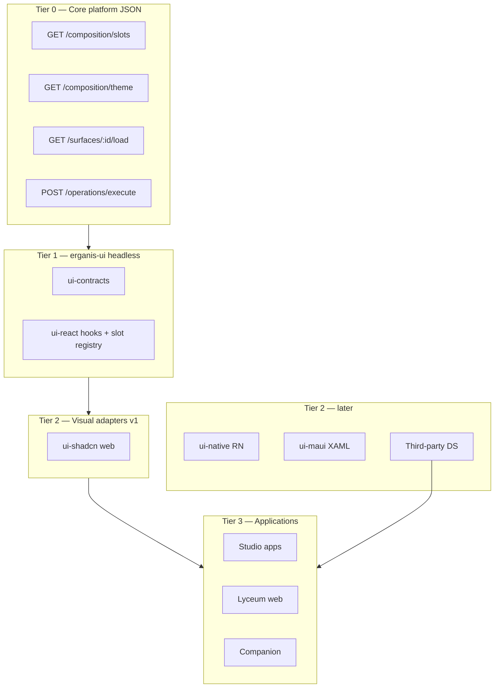

# Erganis UI — Architecture

> **Repo:** `erganis-ui` · **Path:** `ui/`  
> **Core phase:** C16 · **Product plan:** [§6 Core](../../../docs/erganis-product-plan.md#6-core)  
> **Core reference:** [CORE-ARCHITECTURE §0.5](../../core/docs/temp/CORE-ARCHITECTURE.md)

Multi-platform UI libraries that bind **Core composition contracts** to visual components.

> **v1 implementation:** **TypeScript only** (`ui-contracts`, `ui-react`, `ui-shadcn`). MAUI and React Native are documented for later — no GitHub packages until UI5/UI6.

---

## OpenAPI-equivalent for UI

| HTTP / data | UI structure |
|-------------|----------------|
| **OpenAPI** (`core/contracts/schemas/core/`) | REST paths, request/response bodies |
| **JSON Schema envelope** | Operation mutations |
| **JSON Schema composition** ([`core/contracts/schemas/composition/`](../../core/contracts/schemas/composition/README.md)) | **Layout, theme, slots** — the UI contract layer |

Module developers declare layout in **`contributions.layout`** pointing to `*.layout.json` files validated against **`ui-layout.schema.json`**. The layout tree describes regions (`grid`, `stack`, `tabs`, `panel`), **component** refs, **platform slot** outlets, and **data bindings** to Surface load steps — without embedding Shadcn or React in the schema.

TypeScript types are generated into `@erganis/ui-contracts`; `@erganis/ui-react` renders the tree; `@erganis/ui-shadcn` supplies default visuals.

---

## Design principles

1. **Contracts over components** — shared JSON Schema and types; visuals are swappable.
2. **Core stays framework-free** — no React/Shadcn in `core/services/`.
3. **Reference implementations, not requirements** — Shadcn is the default web DS; third parties may bring MUI, Vue, or custom stacks implementing the same interfaces.
4. **Same wiring for 1st and 3rd party** — manifest `contributions.ui` + headless hooks.

---

## Three tiers



| Tier | Owner | Contains |
|------|-------|----------|
| **0** | Core (`core/services/`) | HTTP APIs + JSON; C10/C12 theme/slots |
| **1** | `erganis-ui` | Types, hooks (`useSurfaceLoad`, `useTheme`, `useOperation`), module UI registry |
| **2** | `erganis-ui` per package | Pixels: Shadcn, XAML, RN widgets |
| **3** | Studio, Lyceum, etc. | Pages, routing, app-specific layout |

---

## Package dependency rules

| Package | Depends on | Must NOT depend on |
|---------|------------|-------------------|
| `ui-contracts` | `@erganis/platform`, JSON Schema | React, Shadcn, MAUI |
| `ui-react` | `ui-contracts`, API client | Shadcn |
| `ui-shadcn` | `ui-react`, shadcn, Tailwind | Studio app code |
| `ui-native` | `ui-contracts`, React Native | Shadcn |
| `ui-maui` | C# types from contracts, HttpClient SDK | React |

---

## Design tokens

Single source in `ui/tokens/erganis.tokens.json`. Build outputs:

- CSS variables → Shadcn / Tailwind (`ui-shadcn`)
- `ErganisTokens.xaml` → MAUI resource dictionary (`ui-maui`)
- RN theme object (`ui-native`)

Core **C12** org theme overrides merge at runtime via `GET /composition/theme` — all adapters apply overrides on top of base tokens.

---

## Module UI wiring

1. Manifest **`contributions.ui`**: `{ slot, component }` — mount nav/widgets in platform slots.
2. Manifest **`contributions.layout`**: `{ surfaceId, path }` — page layout JSON per surface.
3. Author **`*.layout.json`** — validated against `ui-layout.schema.json` ([examples](../../core/contracts/schemas/composition/examples/product.layout.json)).
4. Module exports React components referenced in layout (`component` field).
5. **`ui-react`** resolves layout tree + Surface load bindings; **`ui-shadcn`** renders with theme from Core C12.

Components accept typed props from `@erganis/ui-react`; Surface load supplies data; envelope supplies saves.

---

## Platform-specific notes

### Web (Shadcn) — reference implementation

```typescript
// Tier 1 — headless
const { data, save } = useSurface('inventory', 'product', { orgSlug, productId });

// Tier 2 — shell
<ThemeProvider orgSlug={orgSlug}>
  <Shell>
    <SlotOutlet slot="shell.sidebar" />
    <SlotOutlet slot="shell.main" />
  </Shell>
</ThemeProvider>
```

### MAUI / XAML — documented, not in v1 repo

*(Deferred to UI6 — no GitHub package until MAUI desktop is scheduled.)*

- `ErganisThemeResourceDictionary.xaml` from tokens
- `SlotShell` — named regions matching Core slot ids
- Same layout JSON contract; MAUI adapter renders nodes to XAML

### React Native (Companion) — documented, not in v1 repo

*(Deferred to UI5.)*

---

## Third-party custom UI

Require:

1. Contract compliance — slot ids, theme token keys, surface/envelope shapes
2. Optional use of `ui-react` headless layer

May skip Erganis visual packages entirely if they call Core APIs and implement slot/surface semantics in their stack.

---

## Versioning

| Artifact | Coupling |
|----------|----------|
| `ui-contracts` | Lockstep with Core when theme/slot schema changes |
| `ui-shadcn`, `ui-maui`, `ui-native` | Independent semver within monorepo |
| Design tokens | Minor when adding tokens; major when renaming |

---

## Implementation phases (UI repo)

| Phase | Delivers | GitHub |
|-------|----------|--------|
| **UI0** | `@erganis/ui-contracts` + layout schema codegen | Create **`erganis-ui`** repo |
| **UI1** | `@erganis/ui-react` — hooks + layout renderer | Same repo |
| **UI2** | `@erganis/ui-shadcn` — Shell, SlotOutlet, ThemeProvider | Same repo |
| **UI3** | Studio S0 integration | — |
| **UI4** | Lyceum web integration | — |
| **UI5** | `@erganis/ui-native` (Companion) | *Later — doc only until scheduled* |
| **UI6** | `@erganis/ui-maui` (optional desktop) | *Later — doc only until scheduled* |

Tracked with Core **C16** and Studio **S0**. **Do not** add `erganis-ui` to `create-repos` until UI0 starts.

---

## Related documents

- [CORE-ARCHITECTURE.md §0](../../core/docs/temp/CORE-ARCHITECTURE.md) — platform model
- [CORE-IMPLEMENTATION-PLAN.md §C16](../../core/docs/temp/CORE-IMPLEMENTATION-PLAN.md#c16--ui-composition-erganis-ui-coordination)
- [STUDIO-IMPLEMENTATION-PLAN.md §S0](../../studio/docs/STUDIO-IMPLEMENTATION-PLAN.md#s0--studio-web-shell)
